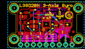
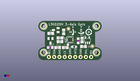
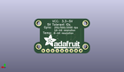
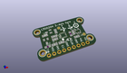

Contents
========

* [PROJ-ADAF-1032-STAN-01>Adafruit L3GD20 Breakout PCB](#proj-adaf-1032-stan-01adafruit-l3gd20-breakout-pcb)
	* [Images](#images)
	* [Interactive BOM](#interactive-bom)
	* [OOMP Parts](#oomp-parts)
	* [Tags](#tags)
  
![][im]
# PROJ-ADAF-1032-STAN-01>Adafruit L3GD20 Breakout PCB

- ID: PROJ-ADAF-1032-STAN-01
- Hex ID: PRA1032
- Name: Adafruit L3GD20 Breakout PCB
- Description: 

## Images
  
  

|eagleImage|kicadPcb3dFront|kicadPcb3dBack|kicadPcb3d|
| :---: | :---: | :---: | :---: |
|||||

## Interactive BOM

- Interactive BOM page: [ibom.html](kicad/bom/ibom.html)

## OOMP Parts
  

|OOMP Parts|
| :---: |
|<table><tr><td>test</td><td>test</td><td>test</td></tr></table>|
|<table><tr><td>test</td><td>test</td><td>test</td></tr></table>|
|<table><tr><td>test</td><td>test</td><td>test</td></tr></table>|
|<table><tr><td>test</td><td>test</td><td>test</td></tr></table>|
|UNMATCHED-UNMATCHED-X-UNMATCHED-01, D1, 17.145, 6.476999999999999, 180|
|UNMATCHED-UNMATCHED-X-UNMATCHED-01, IC1, 23.622, 9.652, 0|
|UNMATCHED-UNMATCHED-X-UNMATCHED-01, IC2, 15.239999999999998, 9.906, 90|
|UNMATCHED-UNMATCHED-X-UNMATCHED-01, JP1, 15.239999999999998, 1.5239999999999998, 0|
|UNMATCHED-UNMATCHED-X-UNMATCHED-01, Q1, 8.382, 14.604999999999999, 90|
|UNMATCHED-UNMATCHED-X-UNMATCHED-01, Q2, 5.842, 9.398, 180|
|<table><tr><td>test</td><td>test</td><td>test</td></tr></table>|
|RESE-UNMATCHED-X-O103-01, R3, 5.715, 6.095999999999999, 0|
|<table><tr><td>test</td><td>test</td><td>test</td></tr></table>|
|<table><tr><td>test</td><td>test</td><td>test</td></tr></table>|
|RESE-UNMATCHED-X-O103-01, R6, 19.177, 9.398, 270|
|<table><tr><td>test</td><td>test</td><td>test</td></tr></table>|

## Tags

- hexID: PRA1032
- oompType: PROJ
- oompSize: ADAF
- oompColor: 1032
- oompDesc: STAN
- oompIndex: 01
- oompName: Adafruit L3GD20 Breakout PCB
- sources: All source files from https://github.com/adafruit/Adafruit-L3GD20-Breakout-PCB (source licence details in srcLicense.md)
- linkBuyPage: http://www.adafruit.com/products/1032
- oompPart: CAPC-0805-X-NF100-V50, C1, 10.413999999999998, 10.795, 0
- oompPart: CAPC-0805-X-UF10-V25, C3, 21.081999999999997, 9.779, 90
- oompPart: CAPC-0805-X-NF100-V50, C4, 12.191999999999998, 13.716, 270
- oompPart: CAPC-0805-X-UF10-V25, C5, 21.717, 6.604, 0
- oompPart: UNMATCHED-UNMATCHED-X-UNMATCHED-01, D1, 17.145, 6.476999999999999, 180
- oompPart: UNMATCHED-UNMATCHED-X-UNMATCHED-01, IC1, 23.622, 9.652, 0
- oompPart: UNMATCHED-UNMATCHED-X-UNMATCHED-01, IC2, 15.239999999999998, 9.906, 90
- oompPart: UNMATCHED-UNMATCHED-X-UNMATCHED-01, JP1, 15.239999999999998, 1.5239999999999998, 0
- oompPart: UNMATCHED-UNMATCHED-X-UNMATCHED-01, Q1, 8.382, 14.604999999999999, 90
- oompPart: UNMATCHED-UNMATCHED-X-UNMATCHED-01, Q2, 5.842, 9.398, 180
- oompPart: RESE-0805-X-O103-01, R2, 5.968999999999999, 12.953999999999999, 0
- oompPart: RESE-UNMATCHED-X-O103-01, R3, 5.715, 6.095999999999999, 0
- oompPart: RESE-0805-X-O103-01, R4, 9.270999999999999, 6.095999999999999, 0
- oompPart: RESE-0805-X-O103-01, R5, 10.413999999999998, 9.017, 180
- oompPart: RESE-UNMATCHED-X-O103-01, R6, 19.177, 9.398, 270
- oompPart: RESE-0805-X-O103-01, R7, 12.953999999999999, 6.095999999999999, 0
- oompPart: SKIP-UNMATCHED-X-UNMATCHED-01, U$11, 27.94, 16.509999999999998, 0
- oompPart: SKIP-UNMATCHED-X-UNMATCHED-01, U$12, 2.54, 16.509999999999998, 0
- oompPart: SKIP-UNMATCHED-X-UNMATCHED-01, U$13, 2.54, 3.6829999999999994, 0
- oompPart: SKIP-UNMATCHED-X-UNMATCHED-01, U$14, 27.94, 3.6829999999999994, 0
- oompPart: SKIP-UNMATCHED-X-UNMATCHED-01, U$15, 14.477999999999998, 15.239999999999998, 0
- oompPart: SKIP-UNMATCHED-X-UNMATCHED-01, U$16, 26.034999999999997, 6.731, 0
- rawPart: 

[im]: kicadPcb3d_450.png
