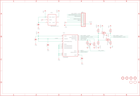

Contents
========

* [PRA1032 > Adafruit L3GD20 Breakout PCB](#pra1032--adafruit-l3gd20-breakout-pcb)
	* [Schematic](#schematic)
	* [PCB](#pcb)
	* [Interactive BOM](#interactive-bom)
	* [OOMP Parts](#oomp-parts)
	* [Images](#images)
	* [Tags](#tags)
  
![][im]
# PRA1032 > Adafruit L3GD20 Breakout PCB

- ID: PROJ-ADAF-1032-STAN-01
- Hex ID: PRA1032
- Name: Adafruit
- Description: Adafruit
- Long Link: [http://oom.lt/PROJ-ADAF-1032-STAN-01](http://oom.lt/PROJ-ADAF-1032-STAN-01)
- Short Link: [http://oom.lt/PRA1032](http://oom.lt/PRA1032)

## Schematic
  

## PCB
  

## Interactive BOM

- Interactive BOM page: [ibom.html](https://htmlpreview.github.io/?https://github.com/oomlout/oomlout_OOMP_projects/blob/main/PROJ-ADAF-1032-STAN-01/kicad/bom/ibom.html)

## OOMP Parts
  

|OOMP ID|Name|Identifier|
| :---: | :---: | :---: |
|[CAPC-0805-X-NF100-V50](https://github.com/oomlout/oomlout_OOMP_parts/tree/main/CAPC-0805-X-NF100-V50/)|[SMD (0805) 100 nF Capacitor (Ceramic) 50v](https://github.com/oomlout/oomlout_OOMP_parts/tree/main/CAPC-0805-X-NF100-V50/)|[C1, C4](https://github.com/oomlout/oomlout_OOMP_parts/tree/main/CAPC-0805-X-NF100-V50/)|
|[CAPC-0805-X-UF10-V10](https://github.com/oomlout/oomlout_OOMP_parts/tree/main/CAPC-0805-X-UF10-V10/)|[SMD (0805) 10 uF Capacitor (Ceramic) 10v](https://github.com/oomlout/oomlout_OOMP_parts/tree/main/CAPC-0805-X-UF10-V10/)|[C3, C5](https://github.com/oomlout/oomlout_OOMP_parts/tree/main/CAPC-0805-X-UF10-V10/)|
|[DIOD-S323-X-K4148-01](https://github.com/oomlout/oomlout_OOMP_parts/tree/main/DIOD-S323-X-K4148-01/)|[SMD (SOD-323) Diode](https://github.com/oomlout/oomlout_OOMP_parts/tree/main/DIOD-S323-X-K4148-01/)|[D1](https://github.com/oomlout/oomlout_OOMP_parts/tree/main/DIOD-S323-X-K4148-01/)|
|[VREG-SO235-X-KMIC5225-V33D](https://github.com/oomlout/oomlout_OOMP_parts/tree/main/VREG-SO235-X-KMIC5225-V33D/)|[SMD (SOT-23-5) MIC5225 Voltage Regulator 3.3v](https://github.com/oomlout/oomlout_OOMP_parts/tree/main/VREG-SO235-X-KMIC5225-V33D/)|[IC1](https://github.com/oomlout/oomlout_OOMP_parts/tree/main/VREG-SO235-X-KMIC5225-V33D/)|
|UNMATCHED-UNMATCHED-X-UNMATCHED-01||IC2|
|[HEAD-I01-X-PI09-01](https://github.com/oomlout/oomlout_OOMP_parts/tree/main/HEAD-I01-X-PI09-01/)|[2.54 mm 9 Pin Header](https://github.com/oomlout/oomlout_OOMP_parts/tree/main/HEAD-I01-X-PI09-01/)|[JP1](https://github.com/oomlout/oomlout_OOMP_parts/tree/main/HEAD-I01-X-PI09-01/)|
|[MOSN-SO23-X-KBSS138-01](https://github.com/oomlout/oomlout_OOMP_parts/tree/main/MOSN-SO23-X-KBSS138-01/)|[SMD (SOT-23) BSS138 N-Ch. MOSFET](https://github.com/oomlout/oomlout_OOMP_parts/tree/main/MOSN-SO23-X-KBSS138-01/)|[Q1, Q2](https://github.com/oomlout/oomlout_OOMP_parts/tree/main/MOSN-SO23-X-KBSS138-01/)|
|[RESE-0805-X-O103-01](https://github.com/oomlout/oomlout_OOMP_parts/tree/main/RESE-0805-X-O103-01/)|[SMD (0805) 10k Ohm Resistor](https://github.com/oomlout/oomlout_OOMP_parts/tree/main/RESE-0805-X-O103-01/)|[R2, R3, R4, R5, R6, R7](https://github.com/oomlout/oomlout_OOMP_parts/tree/main/RESE-0805-X-O103-01/)|

## Images
  
  

|bominteractivefront|bominteractiveback|kicadPcb3d|kicadPcb3dFront|kicadPcb3dBack|kicadSchem|eagleImage|eagleSchemImage|pcbdraw|pcbdrawback|
| :---: | :---: | :---: | :---: | :---: | :---: | :---: | :---: | :---: | :---: |
|||||||||||

## Tags

- hexID: PRA1032
- oompType: PROJ
- oompSize: ADAF
- oompColor: 1032
- oompDesc: STAN
- oompIndex: 01
- oompName: Adafruit L3GD20 Breakout PCB
- sources: All source files from https://github.com/adafruit/Adafruit-L3GD20-Breakout-PCB (source licence details in srcLicense.md)
- linkBuyPage: http://www.adafruit.com/products/1032
- oompID: PROJ-ADAF-1032-STAN-01
- oompParts: C1,CAPC-0805-X-NF100-V50
- oompParts: C3,CAPC-0805-X-UF10-V10
- oompParts: C4,CAPC-0805-X-NF100-V50
- oompParts: C5,CAPC-0805-X-UF10-V10
- oompParts: D1,DIOD-S323-X-K4148-01
- oompParts: IC1,VREG-SO235-X-KMIC5225-V33D
- oompParts: IC2,UNMATCHED-UNMATCHED-X-UNMATCHED-01
- oompParts: JP1,HEAD-I01-X-PI09-01
- oompParts: Q1,MOSN-SO23-X-KBSS138-01
- oompParts: Q2,MOSN-SO23-X-KBSS138-01
- oompParts: R2,RESE-0805-X-O103-01
- oompParts: R3,RESE-0805-X-O103-01
- oompParts: R4,RESE-0805-X-O103-01
- oompParts: R5,RESE-0805-X-O103-01
- oompParts: R6,RESE-0805-X-O103-01
- oompParts: R7,RESE-0805-X-O103-01
- rawParts: C1,0.1uF,CAP_CERAMIC0805-NOOUTLINE,0805-NO,Ceramic Capacitors,,
- rawParts: C3,10uF,CAP_CERAMIC0805-NOOUTLINE,0805-NO,Ceramic Capacitors,,
- rawParts: C4,0.1uF,CAP_CERAMIC0805-NOOUTLINE,0805-NO,Ceramic Capacitors,,
- rawParts: C5,10uF,CAP_CERAMIC0805-NOOUTLINE,0805-NO,Ceramic Capacitors,,
- rawParts: D1,1N4148,DIODESOD-323F,SOD-323F,Diode,,
- rawParts: IC1,MIC5225-3.3,LP298XS,SOT23-5L,,,
- rawParts: IC2,LGD20H,GYRO_L3GD20H,L3GD20H_LGA16L,L3GD20H - 3 Axis Gyro,,
- rawParts: JP1,,HEADER-1X976MIL,1X09_ROUND_76,PIN HEADER,,
- rawParts: Q1,BSS138,MOSFET-NREFLOW,SOT23,N-Channel Mosfet,,
- rawParts: Q2,BSS138,MOSFET-NREFLOW,SOT23,N-Channel Mosfet,,
- rawParts: R2,10K,RESISTOR0805_NOOUTLINE,0805-NO,Resistors,,
- rawParts: R3,10K,RESISTOR_0805MP,_0805MP,Resistors,,
- rawParts: R4,10K,RESISTOR0805_NOOUTLINE,0805-NO,Resistors,,
- rawParts: R5,10K,RESISTOR0805_NOOUTLINE,0805-NO,Resistors,,
- rawParts: R6,10K,RESISTOR_0805MP,_0805MP,Resistors,,
- rawParts: R7,10K,RESISTOR0805_NOOUTLINE,0805-NO,Resistors,,
- rawParts: U$11,MOUNTINGHOLE2.0,MOUNTINGHOLE2.0,MOUNTINGHOLE_2.0_PLATED,Mounting Hole,EXCLUDE,
- rawParts: U$12,MOUNTINGHOLE2.0,MOUNTINGHOLE2.0,MOUNTINGHOLE_2.0_PLATED,Mounting Hole,EXCLUDE,
- rawParts: U$13,MOUNTINGHOLE2.0,MOUNTINGHOLE2.0,MOUNTINGHOLE_2.0_PLATED,Mounting Hole,EXCLUDE,
- rawParts: U$14,MOUNTINGHOLE2.0,MOUNTINGHOLE2.0,MOUNTINGHOLE_2.0_PLATED,Mounting Hole,EXCLUDE,
- rawParts: U$15,FIDUCIAL,FIDUCIAL,FIDUCIAL_1MM,For use by pick and place machines to calibrate the vision/machine, 1mm,,
- rawParts: U$16,FIDUCIAL,FIDUCIAL,FIDUCIAL_1MM,For use by pick and place machines to calibrate the vision/machine, 1mm,,

[im]: kicadPcb3d_450.png
