Contents
========

* [PRA1059 > Adafruit Flora Ultimate GPS](#pra1059--adafruit-flora-ultimate-gps)
	* [Schematic](#schematic)
	* [PCB](#pcb)
	* [Interactive BOM](#interactive-bom)
	* [OOMP Parts](#oomp-parts)
	* [Images](#images)
	* [Tags](#tags)
  
![][im]
# PRA1059 > Adafruit Flora Ultimate GPS

- ID: PROJ-ADAF-1059-STAN-01
- Hex ID: PRA1059
- Name: Adafruit
- Description: Adafruit
- Long Link: [http://oom.lt/PROJ-ADAF-1059-STAN-01](http://oom.lt/PROJ-ADAF-1059-STAN-01)
- Short Link: [http://oom.lt/PRA1059](http://oom.lt/PRA1059)

## Schematic
  
[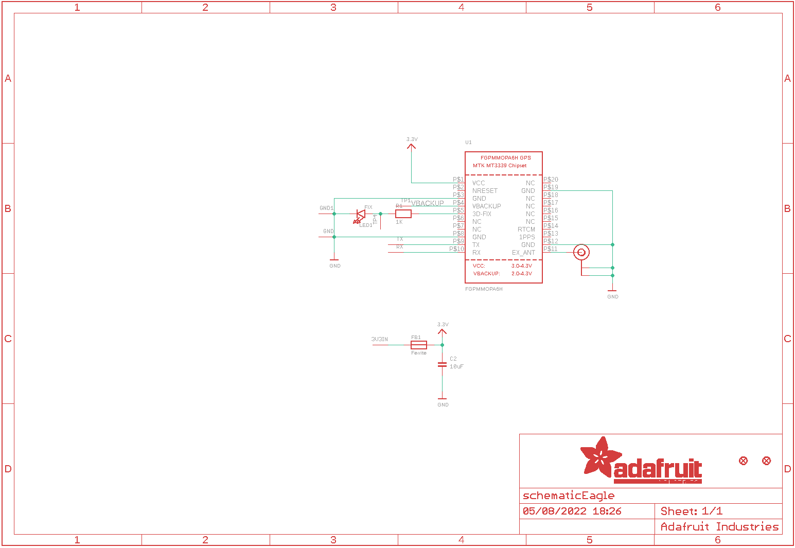](eagleSchemImage.png)
## PCB
  
[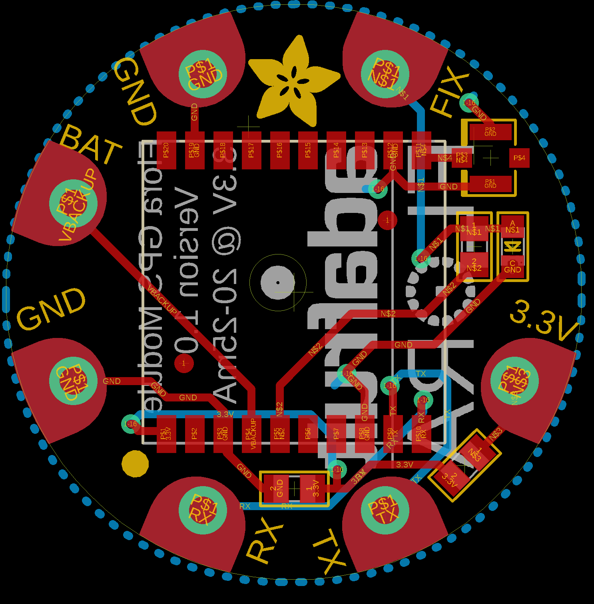](eagleImage.png)
## Interactive BOM

- Interactive BOM page: [ibom.html](https://htmlpreview.github.io/?https://github.com/oomlout/oomlout_OOMP_projects/blob/main/PROJ-ADAF-1059-STAN-01/kicad/bom/ibom.html)

## OOMP Parts
  

|OOMP ID|Name|Identifier|
| :---: | :---: | :---: |
|[CAPC-0805-X-UF10-V10](https://github.com/oomlout/oomlout_OOMP_parts/tree/main/CAPC-0805-X-UF10-V10/)|[SMD (0805) 10 uF Capacitor (Ceramic) 10v](https://github.com/oomlout/oomlout_OOMP_parts/tree/main/CAPC-0805-X-UF10-V10/)|[C2](https://github.com/oomlout/oomlout_OOMP_parts/tree/main/CAPC-0805-X-UF10-V10/)|
|FERB-0805-X-UNMATCHED-01||FB1|
|[LEDS-0805-G-STAN-01](https://github.com/oomlout/oomlout_OOMP_parts/tree/main/LEDS-0805-G-STAN-01/)|[SMD (0805) Green LED](https://github.com/oomlout/oomlout_OOMP_parts/tree/main/LEDS-0805-G-STAN-01/)|[LED1](https://github.com/oomlout/oomlout_OOMP_parts/tree/main/LEDS-0805-G-STAN-01/)|
|[RESE-0805-X-O102-01](https://github.com/oomlout/oomlout_OOMP_parts/tree/main/RESE-0805-X-O102-01/)|[SMD (0805) 1k Ohm Resistor](https://github.com/oomlout/oomlout_OOMP_parts/tree/main/RESE-0805-X-O102-01/)|[R1](https://github.com/oomlout/oomlout_OOMP_parts/tree/main/RESE-0805-X-O102-01/)|
|UNMATCHED-UNMATCHED-X-UNMATCHED-01||U$20, U1|

## Images
  
  

|bominteractivefront|bominteractiveback|kicadPcb3d|kicadPcb3dFront|kicadPcb3dBack|eagleImage|eagleSchemImage|pcbdraw|pcbdrawback|
| :---: | :---: | :---: | :---: | :---: | :---: | :---: | :---: | :---: |
|[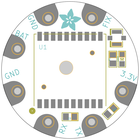](bomFront.png)|[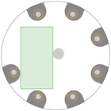](bomBack.png)|[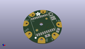](kicadPcb3d.png)|[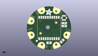](kicadPcb3dFront.png)|[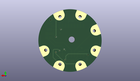](kicadPcb3dBack.png)|[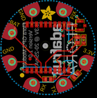](eagleImage.png)|[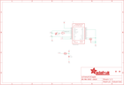](eagleSchemImage.png)|[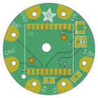](pcbdraw.png)|[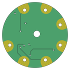](pcbdrawBack.png)|

## Tags

- hexID: PRA1059
- oompType: PROJ
- oompSize: ADAF
- oompColor: 1059
- oompDesc: STAN
- oompIndex: 01
- oompName: Adafruit Flora Ultimate GPS
- sources: All source files from https://github.com/adafruit/Adafruit-Flora-Ultimate-GPS (source licence details in srcLicense.md)
- linkBuyPage: http://www.adafruit.com/products/1059
- oompID: PROJ-ADAF-1059-STAN-01
- oompParts: C2,CAPC-0805-X-UF10-V10
- oompParts: FB1,FERB-0805-X-UNMATCHED-01
- oompParts: LED1,LEDS-0805-G-STAN-01
- oompParts: R1,RESE-0805-X-O102-01
- oompParts: U$20,UNMATCHED-UNMATCHED-X-UNMATCHED-01
- oompParts: U1,UNMATCHED-UNMATCHED-X-UNMATCHED-01
- rawParts: 3V3IN,SEWTAP-2.0IN,SEWTAP-2.0IN,SEWINGTAP_2.0,,,
- rawParts: C2,10uF,CAP_CERAMIC0805,0805,Ceramic Capacitors,,
- rawParts: FB1,Ferrite,FERRITE0805,0805,Ferrite Bead,,
- rawParts: FID1,FIDUCIAL,FIDUCIAL,FIDUCIAL_1MM,Fiducial Alignment Points,,
- rawParts: FID2,FIDUCIAL,FIDUCIAL,FIDUCIAL_1MM,Fiducial Alignment Points,,
- rawParts: GND,SEWTAP-2.0IN,SEWTAP-2.0IN,SEWINGTAP_2.0,,,
- rawParts: GND1,SEWTAP-2.0IN,SEWTAP-2.0IN,SEWINGTAP_2.0,,,
- rawParts: LED1,FIX,LED0805,CHIPLED_0805,LED,,
- rawParts: R1,1K,RESISTOR0805,0805,Resistors,,
- rawParts: RX,SEWTAP-2.0IN,SEWTAP-2.0IN,SEWINGTAP_2.0,,,
- rawParts: TP1,SEWTAP-2.0IN,SEWTAP-2.0IN,SEWINGTAP_2.0,,,
- rawParts: TP4,SEWTAP-2.0IN,SEWTAP-2.0IN,SEWINGTAP_2.0,,,
- rawParts: TX,SEWTAP-2.0IN,SEWTAP-2.0IN,SEWINGTAP_2.0,,,
- rawParts: U$20,U.FL,U.FL,U.FL,U.FL Antenna Connector,,
- rawParts: U1,FGPMMOPA6H,GPS_FGPMMOPA6H,FGPMMOPA6H,GPS Module - MTK MT3339 Chipset, -165dBm sensitivity, 22 channels, 10Hz, auto-select external antenna options,,

[im]: kicadPcb3d_450.png
