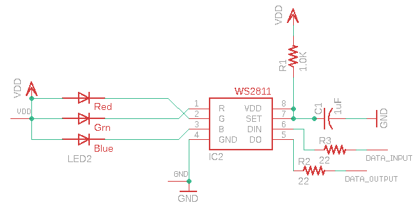

Contents
========

* [PRA1060 > Adafruit](#pra1060--adafruit)
	* [Schematic](#schematic)
	* [Interactive BOM](#interactive-bom)
	* [OOMP Parts](#oomp-parts)
	* [Images](#images)
	* [Tags](#tags)
  
![][im]
# PRA1060 > Adafruit

- ID: PROJ-ADAF-1060-STAN-01
- Hex ID: PRA1060
- Name: Adafruit
- Description: Adafruit
- Long Link: [http://oom.lt/PROJ-ADAF-1060-STAN-01](http://oom.lt/PROJ-ADAF-1060-STAN-01)
- Short Link: [http://oom.lt/PRA1060](http://oom.lt/PRA1060)

## Schematic
  

## Interactive BOM

- Interactive BOM page: [ibom.html](https://htmlpreview.github.io/?https://github.com/oomlout/oomlout_OOMP_projects/blob/main/PROJ-ADAF-1060-STAN-01/kicad/bom/ibom.html)

## OOMP Parts
  

|OOMP Parts|
| :---: |
|C1,CAPC-0805-X-UF1-01,C1,1uF,C-USC0805K,C0805K,CAPACITOR, American symbol,,|
|DATA_INPUT,UNMATCHED-UNMATCHED-X-UNMATCHED-01,DATA_INPUT,SEWTAP0.5IN,SEWTAP0.5IN,SEWINGTAP_0.5,,,|
|DATA_OUTPUT,UNMATCHED-UNMATCHED-X-UNMATCHED-01,DATA_OUTPUT,SEWTAP0.5IN,SEWTAP0.5IN,SEWINGTAP_0.5,,,|
|GND,UNMATCHED-UNMATCHED-X-UNMATCHED-01,GND,SEWTAP0.5IN,SEWTAP0.5IN,SEWINGTAP_0.5,,,|
|IC2,UNMATCHED-UNMATCHED-X-UNMATCHED-01,IC2,WS2811-SOP8,WS2811-SOP8,SO08-SKINNYPADS,,,|
|LED2,UNMATCHED-UNMATCHED-X-UNMATCHED-01,LED2,RGBLED5050,RGBLED5050,RGBLED5050,For 5050 RGB LEDs, the order of the LEDs may vary from one manufacturer to another!,,|
|R1,RESE-0805-X-UNMATCHED-01,R1,1.0K,R-US_R0805,R0805,RESISTOR, American symbol,,|
|R2,RESE-0805-X-O21-01,R2,22,R-US_R0805,R0805,RESISTOR, American symbol,,|
|R3,RESE-0805-X-O21-01,R3,22,R-US_R0805,R0805,RESISTOR, American symbol,,|
|VDD,UNMATCHED-UNMATCHED-X-UNMATCHED-01,VDD,SEWTAP0.5IN,SEWTAP0.5IN,SEWINGTAP_0.5,,,|

## Images
  
  

|kicadPcb3d|kicadPcb3dFront|kicadPcb3dBack|eagleImage|eagleSchemImage|
| :---: | :---: | :---: | :---: | :---: |
||||||

## Tags

- hexID: PRA1060
- oompType: PROJ
- oompSize: ADAF
- oompColor: 1060
- oompDesc: STAN
- oompIndex: 01
- oompName: Adafruit Flora Smart NeoPixel
- sources: All source files from https://github.com/adafruit/Adafruit-Flora-Smart-NeoPixel (source licence details in srcLicense.md)
- linkBuyPage: http://www.adafruit.com/products/1060
- oompID: PROJ-ADAF-1060-STAN-01
- oompParts: C1,CAPC-0805-X-UF1-01
- oompParts: DATA_INPUT,UNMATCHED-UNMATCHED-X-UNMATCHED-01
- oompParts: DATA_OUTPUT,UNMATCHED-UNMATCHED-X-UNMATCHED-01
- oompParts: GND,UNMATCHED-UNMATCHED-X-UNMATCHED-01
- oompParts: IC2,UNMATCHED-UNMATCHED-X-UNMATCHED-01
- oompParts: LED2,UNMATCHED-UNMATCHED-X-UNMATCHED-01
- oompParts: R1,RESE-0805-X-UNMATCHED-01
- oompParts: R2,RESE-0805-X-O21-01
- oompParts: R3,RESE-0805-X-O21-01
- oompParts: VDD,UNMATCHED-UNMATCHED-X-UNMATCHED-01
- rawParts: C1,1uF,C-USC0805K,C0805K,CAPACITOR, American symbol,,
- rawParts: DATA_INPUT,SEWTAP0.5IN,SEWTAP0.5IN,SEWINGTAP_0.5,,,
- rawParts: DATA_OUTPUT,SEWTAP0.5IN,SEWTAP0.5IN,SEWINGTAP_0.5,,,
- rawParts: GND,SEWTAP0.5IN,SEWTAP0.5IN,SEWINGTAP_0.5,,,
- rawParts: IC2,WS2811-SOP8,WS2811-SOP8,SO08-SKINNYPADS,,,
- rawParts: LED2,RGBLED5050,RGBLED5050,RGBLED5050,For 5050 RGB LEDs, the order of the LEDs may vary from one manufacturer to another!,,
- rawParts: R1,1.0K,R-US_R0805,R0805,RESISTOR, American symbol,,
- rawParts: R2,22,R-US_R0805,R0805,RESISTOR, American symbol,,
- rawParts: R3,22,R-US_R0805,R0805,RESISTOR, American symbol,,
- rawParts: VDD,SEWTAP0.5IN,SEWTAP0.5IN,SEWINGTAP_0.5,,,

[im]: kicadPcb3d_450.png
