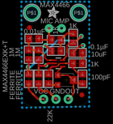
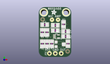
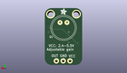

Contents
========

* [PROJ-ADAF-1063-STAN-01>Adafruit MAX4466 Electret Mic Amplifier PCBs](#proj-adaf-1063-stan-01adafruit-max4466-electret-mic-amplifier-pcbs)
	* [Images](#images)
	* [Interactive BOM](#interactive-bom)
	* [Tags](#tags)
  
![][im]
# PROJ-ADAF-1063-STAN-01>Adafruit MAX4466 Electret Mic Amplifier PCBs

- ID: PROJ-ADAF-1063-STAN-01
- Hex ID: PRA1063
- Name: Adafruit MAX4466 Electret Mic Amplifier PCBs
- Description: 

## Images
  
  

|eagleImage|kicadPcb3dFront|kicadPcb3dBack|kicadPcb3d|
| :---: | :---: | :---: | :---: |
|||||

## Interactive BOM

- Interactive BOM page: [ibom.html](kicad/bom/ibom.html)

## Tags

- hexID: PRA1063
- oompType: PROJ
- oompSize: ADAF
- oompColor: 1063
- oompDesc: STAN
- oompIndex: 01
- oompName: Adafruit MAX4466 Electret Mic Amplifier PCBs
- sources: All source files from https://github.com/adafruit/Adafruit-MAX4466-Electret-Mic-Amplifier-PCBs (source licence details in srcLicense.md)
- linkBuyPage: http://www.adafruit.com/products/1063
- oompPart: CAPC-0805-X-NF100-V50, C1, 7.112, 11.43, 180
- oompPart: CAPC-0805-X-NF10-01, C2, 2.54, 13.97, 180
- oompPart: CAPE-0805-X-PF100-01, C3, 12.572999999999999, 5.715, 90
- oompPart: CAPC-0805-X-UF10-V25, C4, 11.557, 11.049, 180
- oompPart: UNMATCHED-0805-X-UNMATCHED-01, FB1, 3.556, 5.715, 90
- oompPart: UNMATCHED-0805-X-UNMATCHED-01, FB2, 1.5239999999999998, 5.715, 270
- oompPart: SKIP-UNMATCHED-X-UNMATCHED-01, FID1, 12.446, 2.413, 0
- oompPart: SKIP-UNMATCHED-X-UNMATCHED-01, FID2, 1.651, 16.256, 0
- oompPart: UNMATCHED-UNMATCHED-X-UNMATCHED-01, JP1, 7.112, 1.5239999999999998, 0
- oompPart: UNMATCHED-UNMATCHED-X-UNMATCHED-01, Q1, 6.985, 14.097000000000001, M0
- oompPart: RESE-0805-X-O102-01, R1, 7.112, 13.716, 0
- oompPart: RESE-0805-X-O102-01, R2, 10.668, 14.097000000000001, 270
- oompPart: RESE-0805-X-O105-01, R3, 3.556, 10.668, 90
- oompPart: RESE-0805-X-O105-01, R4, 1.5239999999999998, 10.668, 270
- oompPart: RESE-0805-X-O102-01, R5, 11.557, 8.889999999999999, 180
- oompPart: RESE-0805-X-O223-01, R7, 5.588, 5.715, 270
- oompPart: SKIP-UNMATCHED-X-UNMATCHED-01, U$11, 2.1590000000000003, 19.304, 0
- oompPart: SKIP-UNMATCHED-X-UNMATCHED-01, U$14, 11.811, 19.304, 0
- oompPart: UNMATCHED-UNMATCHED-X-UNMATCHED-01, U1, 7.619999999999999, 8.889999999999999, 270
- oompPart: ERROR, VR1 TC33X-2-104E (100K), 0, 0, 0
- rawPart: 

[im]: kicadPcb3d_450.png
