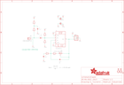

Contents
========

* [PRA1063 > Adafruit MAX4466 Electret Mic Amplifier PCBs](#pra1063--adafruit-max4466-electret-mic-amplifier-pcbs)
	* [Schematic](#schematic)
	* [PCB](#pcb)
	* [Interactive BOM](#interactive-bom)
	* [OOMP Parts](#oomp-parts)
	* [Images](#images)
	* [Tags](#tags)
  
![][im]
# PRA1063 > Adafruit MAX4466 Electret Mic Amplifier PCBs

- ID: PROJ-ADAF-1063-STAN-01
- Hex ID: PRA1063
- Name: Adafruit
- Description: Adafruit
- Long Link: [http://oom.lt/PROJ-ADAF-1063-STAN-01](http://oom.lt/PROJ-ADAF-1063-STAN-01)
- Short Link: [http://oom.lt/PRA1063](http://oom.lt/PRA1063)

## Schematic
  

## PCB
  

## Interactive BOM

- Interactive BOM page: [ibom.html](https://htmlpreview.github.io/?https://github.com/oomlout/oomlout_OOMP_projects/blob/main/PROJ-ADAF-1063-STAN-01/kicad/bom/ibom.html)

## OOMP Parts
  

|OOMP Parts|
| :---: |
|CAPC-0805-X-UF1D-01 C1|
|CAPC-0805-X-UNMATCHED-01 C2|
|CAPC-0805-X-PF100-01 C3|
|[CAPC-0805-X-UF10-V10  SMD (0805) 10 uF Capacitor (Ceramic) 10v  C4](https://github.com/oomlout/oomlout_OOMP_parts/tree/main/CAPC-0805-X-UF10-V10/)|
|FERB-0805-X-UNMATCHED-01 FB1, FB2|
|[HEAD-I01-X-PI03-01  2.54 mm 3 Pin Header  JP1](https://github.com/oomlout/oomlout_OOMP_parts/tree/main/HEAD-I01-X-PI03-01/)|
|UNMATCHED-UNMATCHED-X-UNMATCHED-01 Q1, U1, VR1|
|[RESE-0805-X-O102-01  SMD (0805) 1k Ohm Resistor  R1, R2, R5](https://github.com/oomlout/oomlout_OOMP_parts/tree/main/RESE-0805-X-O102-01/)|
|RESE-0805-X-O105-01 R3, R4|
|[RESE-0805-X-O223-01  SMD (0805) 22k Ohm Resistor  R7](https://github.com/oomlout/oomlout_OOMP_parts/tree/main/RESE-0805-X-O223-01/)|

## Images
  
  

|kicadPcb3d|kicadPcb3dFront|kicadPcb3dBack|eagleImage|eagleSchemImage|
| :---: | :---: | :---: | :---: | :---: |
||||||

## Tags

- hexID: PRA1063
- oompType: PROJ
- oompSize: ADAF
- oompColor: 1063
- oompDesc: STAN
- oompIndex: 01
- oompName: Adafruit MAX4466 Electret Mic Amplifier PCBs
- sources: All source files from https://github.com/adafruit/Adafruit-MAX4466-Electret-Mic-Amplifier-PCBs (source licence details in srcLicense.md)
- linkBuyPage: http://www.adafruit.com/products/1063
- oompID: PROJ-ADAF-1063-STAN-01
- oompParts: C1,CAPC-0805-X-UF1D-01
- oompParts: C2,CAPC-0805-X-UNMATCHED-01
- oompParts: C3,CAPC-0805-X-PF100-01
- oompParts: C4,CAPC-0805-X-UF10-V10
- oompParts: FB1,FERB-0805-X-UNMATCHED-01
- oompParts: FB2,FERB-0805-X-UNMATCHED-01
- oompParts: JP1,HEAD-I01-X-PI03-01
- oompParts: Q1,UNMATCHED-UNMATCHED-X-UNMATCHED-01
- oompParts: R1,RESE-0805-X-O102-01
- oompParts: R2,RESE-0805-X-O102-01
- oompParts: R3,RESE-0805-X-O105-01
- oompParts: R4,RESE-0805-X-O105-01
- oompParts: R5,RESE-0805-X-O102-01
- oompParts: R7,RESE-0805-X-O223-01
- oompParts: U1,UNMATCHED-UNMATCHED-X-UNMATCHED-01
- oompParts: VR1,UNMATCHED-UNMATCHED-X-UNMATCHED-01
- rawParts: C1,0.1µF,CAP_CERAMIC0805,0805,Ceramic Capacitors,,
- rawParts: C2,0.01uF,CAP_CERAMIC0805,0805,Ceramic Capacitors,,
- rawParts: C3,100pF,CAP_CERAMIC0805,0805,Ceramic Capacitors,,
- rawParts: C4,10uF,CAP_CERAMIC0805,0805,Ceramic Capacitors,,
- rawParts: FB1,FERRITE,FERRITE0805,0805,Ferrite Bead,,
- rawParts: FB2,FERRITE,FERRITE0805,0805,Ferrite Bead,,
- rawParts: FID1,FIDUCIAL,FIDUCIAL,FIDUCIAL_1MM,Fiducial Alignment Points,,
- rawParts: FID2,FIDUCIAL,FIDUCIAL,FIDUCIAL_1MM,Fiducial Alignment Points,,
- rawParts: JP1,,HEADER-1X376MIL,1X03_ROUND_76,PIN HEADER,,
- rawParts: Q1,CMA-4544PF-W,ELECTRET,ELECTRET_9.7,Electret microphone,,
- rawParts: R1,1K,RESISTOR0805,0805,Resistors,,
- rawParts: R2,1K,RESISTOR0805,0805,Resistors,,
- rawParts: R3,1M,RESISTOR0805,0805,Resistors,,
- rawParts: R4,1M,RESISTOR0805,0805,Resistors,,
- rawParts: R5,1K,RESISTOR0805,0805,Resistors,,
- rawParts: R7,22K,RESISTOR0805,0805,Resistors,,
- rawParts: U$11,MOUNTINGHOLE2.5,MOUNTINGHOLE2.5,MOUNTINGHOLE_2.5_PLATED,Mounting Hole,,
- rawParts: U$14,MOUNTINGHOLE2.5,MOUNTINGHOLE2.5,MOUNTINGHOLE_2.5_PLATED,Mounting Hole,,
- rawParts: U1,MAX4466EXK+T,MAX4466,SC70-5,MAX4466 - Microphone Pre-Amp,,
- rawParts: VR1,TC33X-2-104E (100K),TRIMPOTTC33X-2,TRIMPOT_BOURNS_TC33X-2,3-Pin SMT Trimpots,,

[im]: kicadPcb3d_450.png
