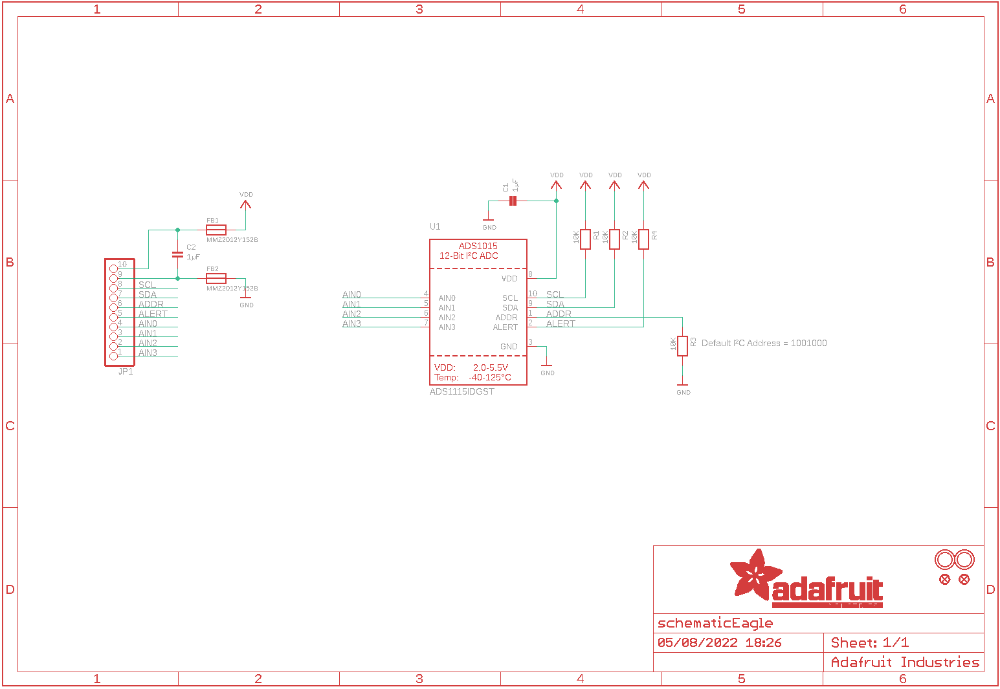
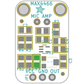
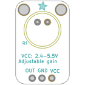
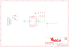
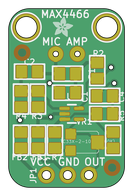
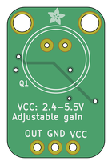

Contents
========

* [PRA1083 > ADS1X15 Breakout Board PCBs](#pra1083--ads1x15-breakout-board-pcbs)
	* [Schematic](#schematic)
	* [PCB](#pcb)
	* [Interactive BOM](#interactive-bom)
	* [OOMP Parts](#oomp-parts)
	* [Images](#images)
	* [Tags](#tags)
  
![][im]
# PRA1083 > ADS1X15 Breakout Board PCBs

- ID: PROJ-ADAF-1083-STAN-01
- Hex ID: PRA1083
- Name: Adafruit
- Description: Adafruit
- Long Link: [http://oom.lt/PROJ-ADAF-1083-STAN-01](http://oom.lt/PROJ-ADAF-1083-STAN-01)
- Short Link: [http://oom.lt/PRA1083](http://oom.lt/PRA1083)

## Schematic
  

## PCB
  

## Interactive BOM

- Interactive BOM page: [ibom.html](https://htmlpreview.github.io/?https://github.com/oomlout/oomlout_OOMP_projects/blob/main/PROJ-ADAF-1083-STAN-01/kicad/bom/ibom.html)

## OOMP Parts
  

|OOMP Parts|
| :---: |
|[CAPC-0805-X-UF1-V25  SMD (0805) 1 uF Capacitor (Ceramic) 25v  C1, C2](https://github.com/oomlout/oomlout_OOMP_parts/tree/main/CAPC-0805-X-UF1-V25/)|
|FERB-0805-X-UNMATCHED-01 FB1, FB2|
|[HEAD-I01-X-PI10-01  2.54 mm 10 Pin Header  JP1](https://github.com/oomlout/oomlout_OOMP_parts/tree/main/HEAD-I01-X-PI10-01/)|
|[RESE-0805-X-O103-01  SMD (0805) 10k Ohm Resistor  R1, R2, R3, R4](https://github.com/oomlout/oomlout_OOMP_parts/tree/main/RESE-0805-X-O103-01/)|
|UNMATCHED-UNMATCHED-X-UNMATCHED-01 U1|

## Images
  
  

|bominteractivefront|bominteractiveback|kicadPcb3d|kicadPcb3dFront|kicadPcb3dBack|eagleImage|eagleSchemImage|pcbdraw|pcbdrawback|
| :---: | :---: | :---: | :---: | :---: | :---: | :---: | :---: | :---: |
||||||||||

## Tags

- hexID: PRA1083
- oompType: PROJ
- oompSize: ADAF
- oompColor: 1083
- oompDesc: STAN
- oompIndex: 01
- oompName: ADS1X15 Breakout Board PCBs
- sources: All source files from https://github.com/adafruit/ADS1X15-Breakout-Board-PCBs (source licence details in srcLicense.md)
- linkBuyPage: http://www.adafruit.com/products/1083
- oompID: PROJ-ADAF-1083-STAN-01
- oompParts: C1,CAPC-0805-X-UF1-V25
- oompParts: C2,CAPC-0805-X-UF1-V25
- oompParts: FB1,FERB-0805-X-UNMATCHED-01
- oompParts: FB2,FERB-0805-X-UNMATCHED-01
- oompParts: JP1,HEAD-I01-X-PI10-01
- oompParts: R1,RESE-0805-X-O103-01
- oompParts: R2,RESE-0805-X-O103-01
- oompParts: R3,RESE-0805-X-O103-01
- oompParts: R4,RESE-0805-X-O103-01
- oompParts: U1,UNMATCHED-UNMATCHED-X-UNMATCHED-01
- rawParts: C1,1µF,CAP_CERAMIC0805,0805,Ceramic Capacitors,,
- rawParts: C2,1µF,CAP_CERAMIC0805,0805,Ceramic Capacitors,,
- rawParts: FB1,MMZ2012Y152B,FERRITE0805,0805,Ferrite Bead,,
- rawParts: FB2,MMZ2012Y152B,FERRITE0805,0805,Ferrite Bead,,
- rawParts: FID1,FIDUCIAL,FIDUCIAL,FIDUCIAL_1MM,Fiducial Alignment Points,,
- rawParts: FID2,FIDUCIAL,FIDUCIAL,FIDUCIAL_1MM,Fiducial Alignment Points,,
- rawParts: JP1,,HEADER-1X1070MIL,1X10_ROUND70,PIN HEADER,,
- rawParts: R1,10K,RESISTOR0805,0805,Resistors,,
- rawParts: R2,10K,RESISTOR0805,0805,Resistors,,
- rawParts: R3,10K,RESISTOR0805,0805,Resistors,,
- rawParts: R4,10K,RESISTOR0805,0805,Resistors,,
- rawParts: U$13,MOUNTINGHOLE2.5,MOUNTINGHOLE2.5,MOUNTINGHOLE_2.5_PLATED,Mounting Hole,,
- rawParts: U$14,MOUNTINGHOLE2.5,MOUNTINGHOLE2.5,MOUNTINGHOLE_2.5_PLATED,Mounting Hole,,
- rawParts: U1,ADS1115IDGST,ADC_ADS1015,MSOP10,ADS1015 - 12-bit 4-Channel I2C ADC with Internal PGA,,

[im]: kicadPcb3d_450.png
