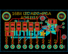
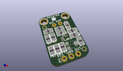

Contents
========

* [PROJ-ADAF-1083-STAN-01>ADS1X15 Breakout Board PCBs](#proj-adaf-1083-stan-01ads1x15-breakout-board-pcbs)
	* [Images](#images)
	* [Interactive BOM](#interactive-bom)
	* [Tags](#tags)
  
![][im]
# PROJ-ADAF-1083-STAN-01>ADS1X15 Breakout Board PCBs

- ID: PROJ-ADAF-1083-STAN-01
- Hex ID: PRA1083
- Name: ADS1X15 Breakout Board PCBs
- Description: 

## Images
  
  

|eagleImage|kicadPcb3dFront|kicadPcb3dBack|kicadPcb3d|
| :---: | :---: | :---: | :---: |
|||||

## Interactive BOM

- Interactive BOM page: [ibom.html](kicad/bom/ibom.html)

## Tags

- hexID: PRA1083
- oompType: PROJ
- oompSize: ADAF
- oompColor: 1083
- oompDesc: STAN
- oompIndex: 01
- oompName: ADS1X15 Breakout Board PCBs
- sources: All source files from https://github.com/adafruit/ADS1X15-Breakout-Board-PCBs (source licence details in srcLicense.md)
- linkBuyPage: http://www.adafruit.com/products/1083

[im]: kicadPcb3d_450.png
