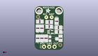

Contents
========

* [PROJ-ADAF-1083-STAN-01>ADS1X15 Breakout Board PCBs](#proj-adaf-1083-stan-01ads1x15-breakout-board-pcbs)
	* [Images](#images)
	* [Interactive BOM](#interactive-bom)
	* [OOMP Parts](#oomp-parts)
	* [Tags](#tags)
  
![][im]
# PROJ-ADAF-1083-STAN-01>ADS1X15 Breakout Board PCBs

- ID: PROJ-ADAF-1083-STAN-01
- Hex ID: PRA1083
- Name: ADS1X15 Breakout Board PCBs
- Description: 

## Images
  
  

|eagleImage|kicadPcb3dFront|kicadPcb3dBack|kicadPcb3d|
| :---: | :---: | :---: | :---: |
|||||

## Interactive BOM

- Interactive BOM page: [ibom.html](kicad/bom/ibom.html)

## OOMP Parts
  

|OOMP Parts|
| :---: |
|CAPC-0805-X-UNMATCHED-01, C1, 21.59, 12.191999999999998, 0,C1, 1uF, 0805, microbuilder, (0.85, 0.48), R0|
|CAPC-0805-X-UNMATCHED-01, C2, 3.8099999999999996, 7.112, 0,C2, 1uF, 0805, microbuilder, (0.15, 0.28), R0|
|UNMATCHED-0805-X-UNMATCHED-01, FB1, 2.794, 10.16, 90,FB1, MMZ2012Y152B, 0805, microbuilder, (0.11, 0.4), R90|
|UNMATCHED-0805-X-UNMATCHED-01, FB2, 5.08, 10.16, 90,FB2, MMZ2012Y152B, 0805, microbuilder, (0.2, 0.4), R90|
|<table><tr><td></td><td> JP1</td><td>[HEAD-I01-X-PI10-01 2.54 mm 10 Pin Header](https://github.com/oomlout/oomlout_OOMP_parts/tree/main/HEAD-I01-X-PI10-01/)</td><td>[H10](https://github.com/oomlout/oomlout_OOMP_parts/tree/main/HEAD-I01-X-PI10-01/)</td></tr></table>|
|<table><tr><td></td><td> R1</td><td>[RESE-0805-X-O103-01 SMD (0805) 10k Ohm Resistor](https://github.com/oomlout/oomlout_OOMP_parts/tree/main/RESE-0805-X-O103-01/)</td><td>[R85103](https://github.com/oomlout/oomlout_OOMP_parts/tree/main/RESE-0805-X-O103-01/)</td></tr></table>|
|<table><tr><td></td><td> R2</td><td>[RESE-0805-X-O103-01 SMD (0805) 10k Ohm Resistor](https://github.com/oomlout/oomlout_OOMP_parts/tree/main/RESE-0805-X-O103-01/)</td><td>[R85103](https://github.com/oomlout/oomlout_OOMP_parts/tree/main/RESE-0805-X-O103-01/)</td></tr></table>|
|<table><tr><td></td><td> R3</td><td>[RESE-0805-X-O103-01 SMD (0805) 10k Ohm Resistor](https://github.com/oomlout/oomlout_OOMP_parts/tree/main/RESE-0805-X-O103-01/)</td><td>[R85103](https://github.com/oomlout/oomlout_OOMP_parts/tree/main/RESE-0805-X-O103-01/)</td></tr></table>|
|<table><tr><td></td><td> R4</td><td>[RESE-0805-X-O103-01 SMD (0805) 10k Ohm Resistor](https://github.com/oomlout/oomlout_OOMP_parts/tree/main/RESE-0805-X-O103-01/)</td><td>[R85103](https://github.com/oomlout/oomlout_OOMP_parts/tree/main/RESE-0805-X-O103-01/)</td></tr></table>|
|UNMATCHED-UNMATCHED-X-UNMATCHED-01, U1, 21.59, 9.398, 270,U1, ADS1115IDGST, MSOP10, microbuilder, (0.85, 0.37), R270|

## Tags

- hexID: PRA1083
- oompType: PROJ
- oompSize: ADAF
- oompColor: 1083
- oompDesc: STAN
- oompIndex: 01
- oompName: ADS1X15 Breakout Board PCBs
- sources: All source files from https://github.com/adafruit/ADS1X15-Breakout-Board-PCBs (source licence details in srcLicense.md)
- linkBuyPage: http://www.adafruit.com/products/1083
- oompPart: CAPC-0805-X-UNMATCHED-01, C1, 21.59, 12.191999999999998, 0
- oompPart: CAPC-0805-X-UNMATCHED-01, C2, 3.8099999999999996, 7.112, 0
- oompPart: UNMATCHED-0805-X-UNMATCHED-01, FB1, 2.794, 10.16, 90
- oompPart: UNMATCHED-0805-X-UNMATCHED-01, FB2, 5.08, 10.16, 90
- oompPart: SKIP-UNMATCHED-X-UNMATCHED-01, FID1, 26.416, 5.842, 180
- oompPart: SKIP-UNMATCHED-X-UNMATCHED-01, FID2, 17.525999999999996, 13.589, 180
- oompPart: HEAD-I01-X-PI10-01, JP1, 13.97, 1.778, 180
- oompPart: RESE-0805-X-O103-01, R1, 7.619999999999999, 10.16, 270
- oompPart: RESE-0805-X-O103-01, R2, 10.16, 10.16, 270
- oompPart: RESE-0805-X-O103-01, R3, 12.7, 10.16, 90
- oompPart: RESE-0805-X-O103-01, R4, 15.239999999999998, 10.16, 270
- oompPart: SKIP-UNMATCHED-X-UNMATCHED-01, U$13, 25.4, 14.477999999999998, 180
- oompPart: SKIP-UNMATCHED-X-UNMATCHED-01, U$14, 2.54, 14.477999999999998, 180
- oompPart: UNMATCHED-UNMATCHED-X-UNMATCHED-01, U1, 21.59, 9.398, 270
- rawPart: C1, 1uF, 0805, microbuilder, (0.85, 0.48), R0
- rawPart: C2, 1uF, 0805, microbuilder, (0.15, 0.28), R0
- rawPart: FB1, MMZ2012Y152B, 0805, microbuilder, (0.11, 0.4), R90
- rawPart: FB2, MMZ2012Y152B, 0805, microbuilder, (0.2, 0.4), R90
- rawPart: FID1, FIDUCIAL, FIDUCIAL_1MM, microbuilder, (1.04, 0.23), R180
- rawPart: FID2, FIDUCIAL, FIDUCIAL_1MM, microbuilder, (0.69, 0.535), R180
- rawPart: JP1, 1X10_ROUND70, microbuilder, (0.55, 0.07), R180
- rawPart: R1, 10K, 0805, microbuilder, (0.3, 0.4), R270
- rawPart: R2, 10K, 0805, microbuilder, (0.4, 0.4), R270
- rawPart: R3, 10K, 0805, microbuilder, (0.5, 0.4), R90
- rawPart: R4, 10K, 0805, microbuilder, (0.6, 0.4), R270
- rawPart: U$13, MOUNTINGHOLE2.5, MOUNTINGHOLE_2.5_PLATED, microbuilder, (1, 0.57), R180
- rawPart: U$14, MOUNTINGHOLE2.5, MOUNTINGHOLE_2.5_PLATED, microbuilder, (0.1, 0.57), R180
- rawPart: U1, ADS1115IDGST, MSOP10, microbuilder, (0.85, 0.37), R270
- oompID: PROJ-ADAF-1083-STAN-01

[im]: kicadPcb3d_450.png
