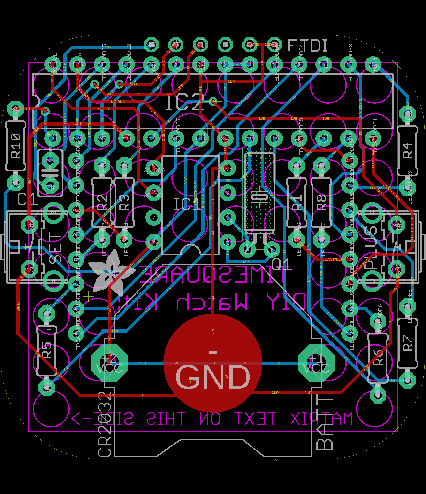
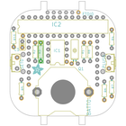
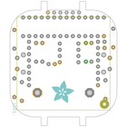
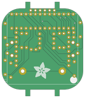

Contents
========

* [PRA1106 > TIMESQUARE DIY Watch Kit](#pra1106--timesquare-diy-watch-kit)
	* [Schematic](#schematic)
	* [PCB](#pcb)
	* [Interactive BOM](#interactive-bom)
	* [OOMP Parts](#oomp-parts)
	* [Images](#images)
	* [Tags](#tags)
  
![][im]
# PRA1106 > TIMESQUARE DIY Watch Kit

- ID: PROJ-ADAF-1106-STAN-01
- Hex ID: PRA1106
- Name: Adafruit
- Description: Adafruit
- Long Link: [http://oom.lt/PROJ-ADAF-1106-STAN-01](http://oom.lt/PROJ-ADAF-1106-STAN-01)
- Short Link: [http://oom.lt/PRA1106](http://oom.lt/PRA1106)

## Schematic
  

## PCB
  

## Interactive BOM

- Interactive BOM page: [ibom.html](https://htmlpreview.github.io/?https://github.com/oomlout/oomlout_OOMP_projects/blob/main/PROJ-ADAF-1106-STAN-01/kicad/bom/ibom.html)

## OOMP Parts
  

|OOMP Parts|
| :---: |
|UNMATCHED-UNMATCHED-X-UNMATCHED-01 BATT, IC1, IC2, PLUS, Q1, SET|
|CAPX-UNMATCHED-X-NF100-01 C1|
|LEDS-UNMATCHED-G-STAN-01 LED1|
|RESE-UNMATCHED-X-O470-01 R1, R2, R3, R4, R5, R6, R7, R8|
|RESE-UNMATCHED-X-O103-01 R10|

## Images
  
  

|bominteractivefront|bominteractiveback|kicadPcb3d|kicadPcb3dFront|kicadPcb3dBack|eagleImage|eagleSchemImage|pcbdraw|pcbdrawback|
| :---: | :---: | :---: | :---: | :---: | :---: | :---: | :---: | :---: |
||||||||||

## Tags

- hexID: PRA1106
- oompType: PROJ
- oompSize: ADAF
- oompColor: 1106
- oompDesc: STAN
- oompIndex: 01
- oompName: TIMESQUARE DIY Watch Kit
- sources: All source files from https://github.com/adafruit/TIMESQUARE-DIY-Watch-Kit (source licence details in srcLicense.md)
- linkBuyPage: http://www.adafruit.com/products/1106
- oompID: PROJ-ADAF-1106-STAN-01
- oompParts: BATT,UNMATCHED-UNMATCHED-X-UNMATCHED-01
- oompParts: C1,CAPX-UNMATCHED-X-NF100-01
- oompParts: IC1,UNMATCHED-UNMATCHED-X-UNMATCHED-01
- oompParts: IC2,UNMATCHED-UNMATCHED-X-UNMATCHED-01
- oompParts: LED1,LEDS-UNMATCHED-G-STAN-01
- oompParts: PLUS,UNMATCHED-UNMATCHED-X-UNMATCHED-01
- oompParts: Q1,UNMATCHED-UNMATCHED-X-UNMATCHED-01
- oompParts: R1,RESE-UNMATCHED-X-O470-01
- oompParts: R2,RESE-UNMATCHED-X-O470-01
- oompParts: R3,RESE-UNMATCHED-X-O470-01
- oompParts: R4,RESE-UNMATCHED-X-O470-01
- oompParts: R5,RESE-UNMATCHED-X-O470-01
- oompParts: R6,RESE-UNMATCHED-X-O470-01
- oompParts: R7,RESE-UNMATCHED-X-O470-01
- oompParts: R8,RESE-UNMATCHED-X-O470-01
- oompParts: R10,RESE-UNMATCHED-X-O103-01
- oompParts: SET,UNMATCHED-UNMATCHED-X-UNMATCHED-01
- rawParts: BATT,CR2032,CR2032THM,CR2032-THRU,,,,,,
- rawParts: C1,0.1uF,C-US025-025X050,C025-025X050,CAPACITOR, American symbol,,,,,
- rawParts: FTDI,DNP,PINHD-1X6CLEAN,1X06-CLEAN,PIN HEADER,,,,,
- rawParts: IC1,DS1337,DS1337,DIL08-ROUND,DS1337 - Maxim RTC without battery backup,,,,,
- rawParts: IC2,ATMEGA168PROUND,ATMEGA168PROUND,DIL28-3-ROUND,MICROCONTROLLER,,,,,
- rawParts: LED1,BL-M15881B,SEGMENT_8X8_ROWCATHODEBL-M15,SEGMENT_BL-M15A881,8x8 LED Segment Displays: Row = Cathode,,,,,
- rawParts: PLUS,,31-XXSKINNY,B3F-31XX-SKINNIER,OMRON SWITCH,,,,,
- rawParts: Q1,32.768KHz,CRYSTALTC38H,TC38H,CRYSTAL,,,unknown,unknown,
- rawParts: R1,47,R-US_0204/7,0204/7,RESISTOR, American symbol,,,,,
- rawParts: R2,47,R-US_0204/7,0204/7,RESISTOR, American symbol,,,,,
- rawParts: R3,47,R-US_0204/7,0204/7,RESISTOR, American symbol,,,,,
- rawParts: R4,47,R-US_0204/7,0204/7,RESISTOR, American symbol,,,,,
- rawParts: R5,47,R-US_0204/7,0204/7,RESISTOR, American symbol,,,,,
- rawParts: R6,47,R-US_0204/7,0204/7,RESISTOR, American symbol,,,,,
- rawParts: R7,47,R-US_0204/7,0204/7,RESISTOR, American symbol,,,,,
- rawParts: R8,47,R-US_0204/7,0204/7,RESISTOR, American symbol,,,,,
- rawParts: R10,10K,R-US_0204/7,0204/7,RESISTOR, American symbol,,,,,
- rawParts: SET,,31-XXSKINNY,B3F-31XX-SKINNIER,OMRON SWITCH,,,,,

[im]: kicadPcb3d_450.png
