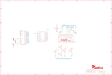

Contents
========

* [PRA1110 > Adafruit 16x2 LCD Pi Plate](#pra1110--adafruit-16x2-lcd-pi-plate)
	* [Schematic](#schematic)
	* [PCB](#pcb)
	* [Interactive BOM](#interactive-bom)
	* [OOMP Parts](#oomp-parts)
	* [Images](#images)
	* [Tags](#tags)
  
![][im]
# PRA1110 > Adafruit 16x2 LCD Pi Plate

- ID: PROJ-ADAF-1110-STAN-01
- Hex ID: PRA1110
- Name: Adafruit
- Description: Adafruit
- Long Link: [http://oom.lt/PROJ-ADAF-1110-STAN-01](http://oom.lt/PROJ-ADAF-1110-STAN-01)
- Short Link: [http://oom.lt/PRA1110](http://oom.lt/PRA1110)

## Schematic
  

## PCB
  

## Interactive BOM

- Interactive BOM page: [ibom.html](https://htmlpreview.github.io/?https://github.com/oomlout/oomlout_OOMP_projects/blob/main/PROJ-ADAF-1110-STAN-01/kicad/bom/ibom.html)

## OOMP Parts
  

|OOMP Parts|
| :---: |
|UNMATCHED-UNMATCHED-X-UNMATCHED-01 BLUE, DOWN, GREEN, IC1, LEFT, RED, RIGHT, SELECT, TM1, U$1, U$4, UP|

## Images
  
  

|kicadPcb3d|kicadPcb3dFront|kicadPcb3dBack|eagleImage|eagleSchemImage|
| :---: | :---: | :---: | :---: | :---: |
||||||

## Tags

- hexID: PRA1110
- oompType: PROJ
- oompSize: ADAF
- oompColor: 1110
- oompDesc: STAN
- oompIndex: 01
- oompName: Adafruit 16x2 LCD Pi Plate
- sources: All source files from https://github.com/adafruit/Adafruit-16x2-LCD-Pi-Plate (source licence details in srcLicense.md)
- linkBuyPage: http://www.adafruit.com/products/1110
- oompID: PROJ-ADAF-1110-STAN-01
- oompParts: BLUE,UNMATCHED-UNMATCHED-X-UNMATCHED-01
- oompParts: DOWN,UNMATCHED-UNMATCHED-X-UNMATCHED-01
- oompParts: GREEN,UNMATCHED-UNMATCHED-X-UNMATCHED-01
- oompParts: IC1,UNMATCHED-UNMATCHED-X-UNMATCHED-01
- oompParts: LEFT,UNMATCHED-UNMATCHED-X-UNMATCHED-01
- oompParts: RED,UNMATCHED-UNMATCHED-X-UNMATCHED-01
- oompParts: RIGHT,UNMATCHED-UNMATCHED-X-UNMATCHED-01
- oompParts: SELECT,UNMATCHED-UNMATCHED-X-UNMATCHED-01
- oompParts: TM1,UNMATCHED-UNMATCHED-X-UNMATCHED-01
- oompParts: U$1,UNMATCHED-UNMATCHED-X-UNMATCHED-01
- oompParts: U$4,UNMATCHED-UNMATCHED-X-UNMATCHED-01
- oompParts: UP,UNMATCHED-UNMATCHED-X-UNMATCHED-01
- rawParts: A0,,SOLDERJUMPER_2WAY,SOLDERJUMPER_2WAY_OPEN_NOPASTE,2-Way Solder Jumper,,
- rawParts: A1,,SOLDERJUMPER_2WAY,SOLDERJUMPER_2WAY_OPEN_NOPASTE,2-Way Solder Jumper,,
- rawParts: A2,,SOLDERJUMPER_2WAY,SOLDERJUMPER_2WAY_OPEN_NOPASTE,2-Way Solder Jumper,,
- rawParts: BLUE,220,R-US_0207/10,0207/10,RESISTOR, American symbol,,
- rawParts: DOWN,,10-XX,B3F-10XX,OMRON SWITCH,,
- rawParts: GREEN,330,R-US_0207/10,0207/10,RESISTOR, American symbol,,
- rawParts: IC1,MCP23017SP2,MCP23017SP2,DIL28-3-ROUND,http://ww1.microchip.com/downloads/en/DeviceDoc/21952a.pdf,,
- rawParts: LEFT,,10-XX,B3F-10XX,OMRON SWITCH,,
- rawParts: RED,220,R-US_0207/10,0207/10,RESISTOR, American symbol,,
- rawParts: RIGHT,,10-XX,B3F-10XX,OMRON SWITCH,,
- rawParts: SELECT,,10-XX,B3F-10XX,OMRON SWITCH,,
- rawParts: TM1,10K,TRIM,6MM,,,
- rawParts: U$1,HD44780LCD_RGBLONGPINS,HD44780LCD_RGBLONGPINS,LCD1602-RGB,,,
- rawParts: U$4,RASPBERRYPI_BB,RASPBERRYPI_BB,RASBERRYPI_SHIELD,,,
- rawParts: UP,,10-XX,B3F-10XX,OMRON SWITCH,,

[im]: kicadPcb3d_450.png
