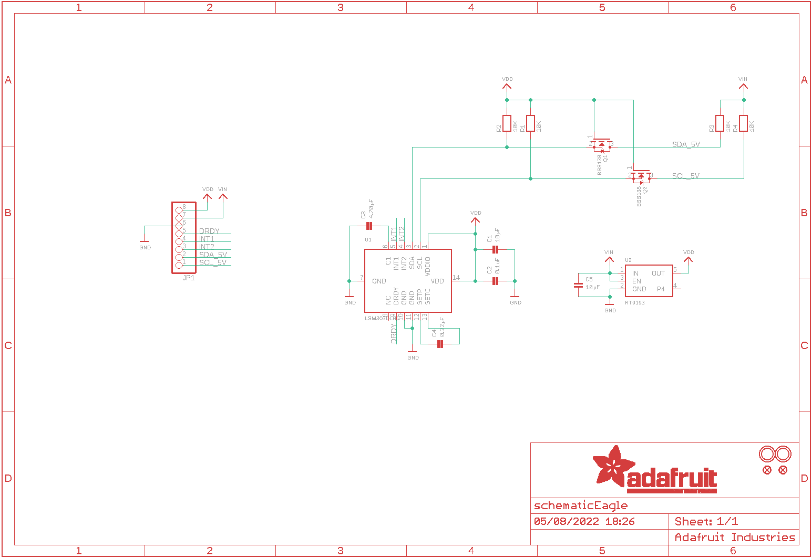
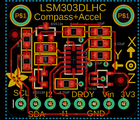

Contents
========

* [PRA1120 > Adafruit](#pra1120--adafruit)
	* [Schematic](#schematic)
	* [Interactive BOM](#interactive-bom)
	* [OOMP Parts](#oomp-parts)
	* [Images](#images)
	* [Tags](#tags)
  
![][im]
# PRA1120 > Adafruit

- ID: PROJ-ADAF-1120-STAN-01
- Hex ID: PRA1120
- Name: Adafruit
- Description: Adafruit
- Long Link: [http://oom.lt/PROJ-ADAF-1120-STAN-01](http://oom.lt/PROJ-ADAF-1120-STAN-01)
- Short Link: [http://oom.lt/PRA1120](http://oom.lt/PRA1120)

## Schematic
  

## Interactive BOM

- Interactive BOM page: [ibom.html](https://htmlpreview.github.io/?https://github.com/oomlout/oomlout_OOMP_projects/blob/main/PROJ-ADAF-1120-STAN-01/kicad/bom/ibom.html)

## OOMP Parts
  

|OOMP Parts|
| :---: |
|C1,CAPC-0805-X-UNMATCHED-01,C1,10µF,CAP_CERAMIC_0805,_0805,Ceramic Capacitors,,|
|C2,CAPC-0805-X-NF100-V50,C2,0.1uF,CAP_CERAMIC_0805,_0805,Ceramic Capacitors,,|
|C3,CAPC-0805-X-UNMATCHED-01,C3,4.70µF,CAP_CERAMIC_0805,_0805,Ceramic Capacitors,,|
|C4,CAPC-0805-X-UNMATCHED-01,C4,0.22µF,CAP_CERAMIC_0805,_0805,Ceramic Capacitors,,|
|C5,CAPC-0805-X-UNMATCHED-01,C5,10µF,CAP_CERAMIC_0805,_0805,Ceramic Capacitors,,|
|JP1,HEAD-I01-X-PI08-01,FID1,FIDUCIAL,FIDUCIAL,FIDUCIAL_1MM,Fiducial Alignment Points,,|
|Q1,MOSN-SO23-X-KBSS138-01,FID2,FIDUCIAL,FIDUCIAL,FIDUCIAL_1MM,Fiducial Alignment Points,,|
|Q2,MOSN-SO23-X-KBSS138-01,JP1,,HEADER-1X876MIL,1X08_ROUND_76,PIN HEADER,,|
|R1,RESE-0805-X-O103-01,Q1,BSS138,MOSFET-NWIDE,SOT23-WIDE,N-Channel Mosfet,,|
|R2,RESE-0805-X-O103-01,Q2,BSS138,MOSFET-NWIDE,SOT23-WIDE,N-Channel Mosfet,,|
|R3,RESE-0805-X-O103-01,R1,10K,RESISTOR_0805,_0805,Resistors,,|
|R4,RESE-0805-X-O103-01,R2,10K,RESISTOR_0805,_0805,Resistors,,|
|U$3,UNMATCHED-UNMATCHED-X-UNMATCHED-01,R3,10K,RESISTOR_0805,_0805,Resistors,,|
|U$4,UNMATCHED-UNMATCHED-X-UNMATCHED-01,R4,10K,RESISTOR_0805,_0805,Resistors,,|
|U1,UNMATCHED-UNMATCHED-X-UNMATCHED-01,U$3,MOUNTINGHOLE2.5,MOUNTINGHOLE2.5,MOUNTINGHOLE_2.5_PLATED,Mounting Hole,,|
|U2,UNMATCHED-SO235-X-UNMATCHED-01,U$4,MOUNTINGHOLE2.5,MOUNTINGHOLE2.5,MOUNTINGHOLE_2.5_PLATED,Mounting Hole,,|

## Images
  
  

|kicadPcb3d|kicadPcb3dFront|kicadPcb3dBack|eagleImage|eagleSchemImage|
| :---: | :---: | :---: | :---: | :---: |
||||||

## Tags

- hexID: PRA1120
- oompType: PROJ
- oompSize: ADAF
- oompColor: 1120
- oompDesc: STAN
- oompIndex: 01
- oompName: Adafruit LSM303 PCB
- sources: All source files from https://github.com/adafruit/Adafruit-LSM303-PCB (source licence details in srcLicense.md)
- linkBuyPage: http://www.adafruit.com/products/1120
- oompID: PROJ-ADAF-1120-STAN-01
- oompParts: C1,CAPC-0805-X-UNMATCHED-01
- oompParts: C2,CAPC-0805-X-NF100-V50
- oompParts: C3,CAPC-0805-X-UNMATCHED-01
- oompParts: C4,CAPC-0805-X-UNMATCHED-01
- oompParts: C5,CAPC-0805-X-UNMATCHED-01
- oompParts: JP1,HEAD-I01-X-PI08-01
- oompParts: Q1,MOSN-SO23-X-KBSS138-01
- oompParts: Q2,MOSN-SO23-X-KBSS138-01
- oompParts: R1,RESE-0805-X-O103-01
- oompParts: R2,RESE-0805-X-O103-01
- oompParts: R3,RESE-0805-X-O103-01
- oompParts: R4,RESE-0805-X-O103-01
- oompParts: U$3,UNMATCHED-UNMATCHED-X-UNMATCHED-01
- oompParts: U$4,UNMATCHED-UNMATCHED-X-UNMATCHED-01
- oompParts: U1,UNMATCHED-UNMATCHED-X-UNMATCHED-01
- oompParts: U2,UNMATCHED-SO235-X-UNMATCHED-01
- rawParts: C1,10µF,CAP_CERAMIC_0805,_0805,Ceramic Capacitors,,
- rawParts: C2,0.1uF,CAP_CERAMIC_0805,_0805,Ceramic Capacitors,,
- rawParts: C3,4.70µF,CAP_CERAMIC_0805,_0805,Ceramic Capacitors,,
- rawParts: C4,0.22µF,CAP_CERAMIC_0805,_0805,Ceramic Capacitors,,
- rawParts: C5,10µF,CAP_CERAMIC_0805,_0805,Ceramic Capacitors,,
- rawParts: FID1,FIDUCIAL,FIDUCIAL,FIDUCIAL_1MM,Fiducial Alignment Points,,
- rawParts: FID2,FIDUCIAL,FIDUCIAL,FIDUCIAL_1MM,Fiducial Alignment Points,,
- rawParts: JP1,,HEADER-1X876MIL,1X08_ROUND_76,PIN HEADER,,
- rawParts: Q1,BSS138,MOSFET-NWIDE,SOT23-WIDE,N-Channel Mosfet,,
- rawParts: Q2,BSS138,MOSFET-NWIDE,SOT23-WIDE,N-Channel Mosfet,,
- rawParts: R1,10K,RESISTOR_0805,_0805,Resistors,,
- rawParts: R2,10K,RESISTOR_0805,_0805,Resistors,,
- rawParts: R3,10K,RESISTOR_0805,_0805,Resistors,,
- rawParts: R4,10K,RESISTOR_0805,_0805,Resistors,,
- rawParts: U$3,MOUNTINGHOLE2.5,MOUNTINGHOLE2.5,MOUNTINGHOLE_2.5_PLATED,Mounting Hole,,
- rawParts: U$4,MOUNTINGHOLE2.5,MOUNTINGHOLE2.5,MOUNTINGHOLE_2.5_PLATED,Mounting Hole,,
- rawParts: U1,LSM303DLHC,LSM303DLHC,LGA14,LSM303DLHC 3-Axis I2C Accelerometer and 3-Axis Magnetometer,,
- rawParts: U2,RT9193,VREG_SOT23-5,SOT23-5,SOT23-5 Fixed Voltage Regulators,,

[im]: kicadPcb3d_450.png
