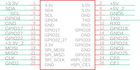

Contents
========

* [PRA1135 > Adafruit](#pra1135--adafruit)
	* [Images](#images)
	* [Tags](#tags)
  
![][im]
# PRA1135 > Adafruit

- ID: PROJ-ADAF-1135-STAN-01
- Hex ID: PRA1135
- Name: Adafruit
- Description: Adafruit

## Images
  
  

|kicadPcb3d|kicadPcb3dFront|kicadPcb3dBack|eagleImage|eagleSchemImage|
| :---: | :---: | :---: | :---: | :---: |
||||||

## Tags

- hexID: PRA1135
- oompType: PROJ
- oompSize: ADAF
- oompColor: 1135
- oompDesc: STAN
- oompIndex: 01
- oompName: Adafruit Perma Proto Pi PCBs
- sources: All source files from https://github.com/adafruit/Adafruit-Perma-Proto-Pi-PCBs (source licence details in srcLicense.md)
- linkBuyPage: http://www.adafruit.com/products/1135
- oompID: PROJ-ADAF-1135-STAN-01
- oompParts: JP1,UNMATCHED-UNMATCHED-UNMATCHED-UNMATCHED-UNMATCHED
- rawParts: JP1,,RASBERRYPI_IDC,RASBERRYPI_IDC,Rasberry PI IDC Header,,

[im]: kicadPcb3d_450.png
