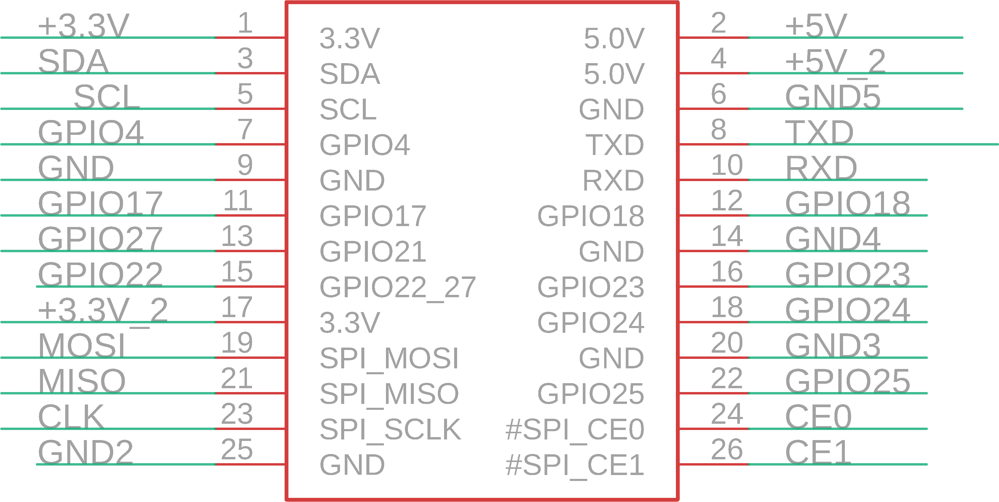

Contents
========

* [PRA1135 > Adafruit Perma Proto Pi PCBs](#pra1135--adafruit-perma-proto-pi-pcbs)
	* [Schematic](#schematic)
	* [PCB](#pcb)
	* [Interactive BOM](#interactive-bom)
	* [OOMP Parts](#oomp-parts)
	* [Images](#images)
	* [Tags](#tags)
  
![][im]
# PRA1135 > Adafruit Perma Proto Pi PCBs

- ID: PROJ-ADAF-1135-STAN-01
- Hex ID: PRA1135
- Name: Adafruit
- Description: Adafruit
- Long Link: [http://oom.lt/PROJ-ADAF-1135-STAN-01](http://oom.lt/PROJ-ADAF-1135-STAN-01)
- Short Link: [http://oom.lt/PRA1135](http://oom.lt/PRA1135)

## Schematic
  

## PCB
  

## Interactive BOM

- Interactive BOM page: [ibom.html](https://htmlpreview.github.io/?https://github.com/oomlout/oomlout_OOMP_projects/blob/main/PROJ-ADAF-1135-STAN-01/kicad/bom/ibom.html)

## OOMP Parts
  

|OOMP Parts|
| :---: |
|HEAD-I01-X-UNMATCHED-01 JP1|

## Images
  
  

|kicadPcb3d|kicadPcb3dFront|kicadPcb3dBack|eagleImage|eagleSchemImage|
| :---: | :---: | :---: | :---: | :---: |
||||||

## Tags

- hexID: PRA1135
- oompType: PROJ
- oompSize: ADAF
- oompColor: 1135
- oompDesc: STAN
- oompIndex: 01
- oompName: Adafruit Perma Proto Pi PCBs
- sources: All source files from https://github.com/adafruit/Adafruit-Perma-Proto-Pi-PCBs (source licence details in srcLicense.md)
- linkBuyPage: http://www.adafruit.com/products/1135
- oompID: PROJ-ADAF-1135-STAN-01
- oompParts: JP1,HEAD-I01-X-UNMATCHED-01
- rawParts: JP1,,RASBERRYPI_IDC,RASBERRYPI_IDC,Rasberry PI IDC Header,,

[im]: kicadPcb3d_450.png
