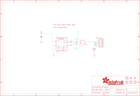

Contents
========

* [PRA1164 > Adafruit INA169 Breakout PCB](#pra1164--adafruit-ina169-breakout-pcb)
	* [Schematic](#schematic)
	* [PCB](#pcb)
	* [Interactive BOM](#interactive-bom)
	* [OOMP Parts](#oomp-parts)
	* [Images](#images)
	* [Tags](#tags)
  
![][im]
# PRA1164 > Adafruit INA169 Breakout PCB

- ID: PROJ-ADAF-1164-STAN-01
- Hex ID: PRA1164
- Name: Adafruit
- Description: Adafruit
- Long Link: [http://oom.lt/PROJ-ADAF-1164-STAN-01](http://oom.lt/PROJ-ADAF-1164-STAN-01)
- Short Link: [http://oom.lt/PRA1164](http://oom.lt/PRA1164)

## Schematic
  

## PCB
  

## Interactive BOM

- Interactive BOM page: [ibom.html](https://htmlpreview.github.io/?https://github.com/oomlout/oomlout_OOMP_projects/blob/main/PROJ-ADAF-1164-STAN-01/kicad/bom/ibom.html)

## OOMP Parts
  

|OOMP Parts|
| :---: |
|CAPC-0805-X-UF1D-01 C1|
|[TERS-35D-L-PI02-01  3.5 mm 2 Pin Blue Screw Terminal  J1](https://github.com/oomlout/oomlout_OOMP_parts/tree/main/TERS-35D-L-PI02-01/)|
|[HEAD-I01-X-PI05-01  2.54 mm 5 Pin Header  JP1](https://github.com/oomlout/oomlout_OOMP_parts/tree/main/HEAD-I01-X-PI05-01/)|
|[RESE-0805-X-O103-01  SMD (0805) 10k Ohm Resistor  R1](https://github.com/oomlout/oomlout_OOMP_parts/tree/main/RESE-0805-X-O103-01/)|
|UNMATCHED-UNMATCHED-X-UNMATCHED-01 RSHUNT|
|UNMATCHED-SO235-X-UNMATCHED-01 U1|

## Images
  
  

|kicadPcb3d|kicadPcb3dFront|kicadPcb3dBack|eagleImage|eagleSchemImage|
| :---: | :---: | :---: | :---: | :---: |
||||||

## Tags

- hexID: PRA1164
- oompType: PROJ
- oompSize: ADAF
- oompColor: 1164
- oompDesc: STAN
- oompIndex: 01
- oompName: Adafruit INA169 Breakout PCB
- sources: All source files from https://github.com/adafruit/Adafruit-INA169-Breakout-PCB (source licence details in srcLicense.md)
- linkBuyPage: http://www.adafruit.com/products/1164
- oompID: PROJ-ADAF-1164-STAN-01
- oompParts: C1,CAPC-0805-X-UF1D-01
- oompParts: J1,TERS-35D-L-PI02-01
- oompParts: JP1,HEAD-I01-X-PI05-01
- oompParts: R1,RESE-0805-X-O103-01
- oompParts: RSHUNT,UNMATCHED-UNMATCHED-X-UNMATCHED-01
- oompParts: U1,UNMATCHED-SO235-X-UNMATCHED-01
- rawParts: C1,0.1µF,CAP_CERAMIC0805,0805,Ceramic Capacitors,,
- rawParts: FID1,FIDUCIAL,FIDUCIAL,FIDUCIAL_1MM,Fiducial Alignment Points,EXCLUDE,
- rawParts: FID2,FIDUCIAL,FIDUCIAL,FIDUCIAL_1MM,Fiducial Alignment Points,EXCLUDE,
- rawParts: J1,,TERMBLOCK_1X2,TERMBLOCK_1X2-3.5MM,3.5mm Terminal block,,
- rawParts: JP1,,HEADER-1X570MIL,1X05_ROUND_70,PIN HEADER,,
- rawParts: R1,10K,RESISTOR_DUAL,0805-THM,Flip Flop resistor,,
- rawParts: RSHUNT,0.1/1% (PT2512FK-070R1L),RESISTOR2512,2512,Resistors,,
- rawParts: U$7,MOUNTINGHOLE2.5,MOUNTINGHOLE2.5,MOUNTINGHOLE_2.5_PLATED,Mounting Hole,,
- rawParts: U$8,MOUNTINGHOLE2.5,MOUNTINGHOLE2.5,MOUNTINGHOLE_2.5_PLATED,Mounting Hole,,
- rawParts: U$9,MOUNTINGHOLE2.5,MOUNTINGHOLE2.5,MOUNTINGHOLE_2.5_PLATED,Mounting Hole,,
- rawParts: U$10,MOUNTINGHOLE2.5,MOUNTINGHOLE2.5,MOUNTINGHOLE_2.5_PLATED,Mounting Hole,,
- rawParts: U1,INA169,INA169,SOT23-5,INA169 - High-Side Measurement Current Shunt Monitor,,

[im]: kicadPcb3d_450.png
