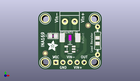

Contents
========

* [PROJ-ADAF-1164-STAN-01>Adafruit INA169 Breakout PCB](#proj-adaf-1164-stan-01adafruit-ina169-breakout-pcb)
	* [Images](#images)
	* [Interactive BOM](#interactive-bom)
	* [OOMP Parts](#oomp-parts)
	* [Tags](#tags)
  
![][im]
# PROJ-ADAF-1164-STAN-01>Adafruit INA169 Breakout PCB

- ID: PROJ-ADAF-1164-STAN-01
- Hex ID: PRA1164
- Name: Adafruit INA169 Breakout PCB
- Description: 

## Images
  
  

|eagleImage|kicadPcb3dFront|kicadPcb3dBack|kicadPcb3d|
| :---: | :---: | :---: | :---: |
|||||

## Interactive BOM

- Interactive BOM page: [ibom.html](kicad/bom/ibom.html)

## OOMP Parts
  

|OOMP Parts|
| :---: |
|<table><tr><td></td><td> C1</td><td>[CAPC-0805-X-NF100-V50 SMD (0805) 100 nF Capacitor (Ceramic) 50v](https://github.com/oomlout/oomlout_OOMP_parts/tree/main/CAPC-0805-X-NF100-V50/)</td><td>[C85N100](https://github.com/oomlout/oomlout_OOMP_parts/tree/main/CAPC-0805-X-NF100-V50/)</td></tr></table>|
|UNMATCHED-UNMATCHED-X-UNMATCHED-01, J1, 11.403000054, 17.376000045999998, 180,J1, TERMBLOCK_1X2-3.5MM, microbuilder, (0.44893701, 0.68409449), R180|
|<table><tr><td></td><td> JP1</td><td>[HEAD-I01-X-PI05-01 2.54 mm 5 Pin Header](https://github.com/oomlout/oomlout_OOMP_parts/tree/main/HEAD-I01-X-PI05-01/)</td><td>[H05](https://github.com/oomlout/oomlout_OOMP_parts/tree/main/HEAD-I01-X-PI05-01/)</td></tr></table>|
|<table><tr><td></td><td> R1</td><td>[RESE-0805-X-O103-01 SMD (0805) 10k Ohm Resistor](https://github.com/oomlout/oomlout_OOMP_parts/tree/main/RESE-0805-X-O103-01/)</td><td>[R85103](https://github.com/oomlout/oomlout_OOMP_parts/tree/main/RESE-0805-X-O103-01/)</td></tr></table>|
|ERROR, RSHUNT 0.1/1% (PT2512FK-070R1L), 0, 0, 0,RSHUNT, 0.1/1%, (PT2512FK-070R1L), 2512, microbuilder, (0.45, 0.45311024), R0|
|UNMATCHED-UNMATCHED-X-UNMATCHED-01, U1, 11.43, 7.365999999999999, 90,U1, INA169, SOT23-5, microbuilder, (0.45, 0.29), R90|

## Tags

- hexID: PRA1164
- oompType: PROJ
- oompSize: ADAF
- oompColor: 1164
- oompDesc: STAN
- oompIndex: 01
- oompName: Adafruit INA169 Breakout PCB
- sources: All source files from https://github.com/adafruit/Adafruit-INA169-Breakout-PCB (source licence details in srcLicense.md)
- linkBuyPage: http://www.adafruit.com/products/1164
- oompPart: CAPC-0805-X-NF100-V50, C1, 5.334, 12.118999892, 180
- oompPart: SKIP-UNMATCHED-X-UNMATCHED-01, FID1, 17.931999949999998, 15.95700009, 0
- oompPart: SKIP-UNMATCHED-X-UNMATCHED-01, FID2, 2.54, 5.842, 0
- oompPart: UNMATCHED-UNMATCHED-X-UNMATCHED-01, J1, 11.403000054, 17.376000045999998, 180
- oompPart: HEAD-I01-X-PI05-01, JP1, 11.43, 2.54, 0
- oompPart: RESE-0805-X-O103-01, R1, 21.336, 10.413999999999998, 90
- oompPart: ERROR, RSHUNT 0.1/1% (PT2512FK-070R1L), 0, 0, 0
- oompPart: SKIP-UNMATCHED-X-UNMATCHED-01, U$7, 20.32, 2.54, 0
- oompPart: SKIP-UNMATCHED-X-UNMATCHED-01, U$8, 2.54, 2.54, 0
- oompPart: SKIP-UNMATCHED-X-UNMATCHED-01, U$9, 2.54, 18.429999969999997, 0
- oompPart: SKIP-UNMATCHED-X-UNMATCHED-01, U$10, 20.32, 18.429999969999997, 0
- oompPart: UNMATCHED-UNMATCHED-X-UNMATCHED-01, U1, 11.43, 7.365999999999999, 90
- rawPart: C1, 0.1uF, 0805, microbuilder, (0.21, 0.47712598), R180
- rawPart: FID1, FIDUCIAL, FIDUCIAL_1MM, microbuilder, (0.70598425, 0.62822835), R0
- rawPart: FID2, FIDUCIAL, FIDUCIAL_1MM, microbuilder, (0.1, 0.23), R0
- rawPart: J1, TERMBLOCK_1X2-3.5MM, microbuilder, (0.44893701, 0.68409449), R180
- rawPart: JP1, 1X05_ROUND_70, microbuilder, (0.45, 0.1), R0
- rawPart: R1, 10K, 0805-THM, microbuilder, (0.84, 0.41), R90
- rawPart: RSHUNT, 0.1/1%, (PT2512FK-070R1L), 2512, microbuilder, (0.45, 0.45311024), R0
- rawPart: U$7, MOUNTINGHOLE2.5, MOUNTINGHOLE_2.5_PLATED, microbuilder, (0.8, 0.1), R0
- rawPart: U$8, MOUNTINGHOLE2.5, MOUNTINGHOLE_2.5_PLATED, microbuilder, (0.1, 0.1), R0
- rawPart: U$9, MOUNTINGHOLE2.5, MOUNTINGHOLE_2.5_PLATED, microbuilder, (0.1, 0.72559055), R0
- rawPart: U$10, MOUNTINGHOLE2.5, MOUNTINGHOLE_2.5_PLATED, microbuilder, (0.8, 0.72559055), R0
- rawPart: U1, INA169, SOT23-5, microbuilder, (0.45, 0.29), R90
- oompID: PROJ-ADAF-1164-STAN-01

[im]: kicadPcb3d_450.png
