Contents
========

* [PRA1222 > Adafruit Gemma PCB](#pra1222--adafruit-gemma-pcb)
	* [Schematic](#schematic)
	* [PCB](#pcb)
	* [Interactive BOM](#interactive-bom)
	* [OOMP Parts](#oomp-parts)
	* [Images](#images)
	* [Tags](#tags)
  
![][im]
# PRA1222 > Adafruit Gemma PCB

- ID: PROJ-ADAF-1222-STAN-01
- Hex ID: PRA1222
- Name: Adafruit 1222
- Description: Adafruit 1222
- Long Link: [http://oom.lt/PROJ-ADAF-1222-STAN-01](http://oom.lt/PROJ-ADAF-1222-STAN-01)
- Short Link: [http://oom.lt/PRA1222](http://oom.lt/PRA1222)

## Schematic
  
[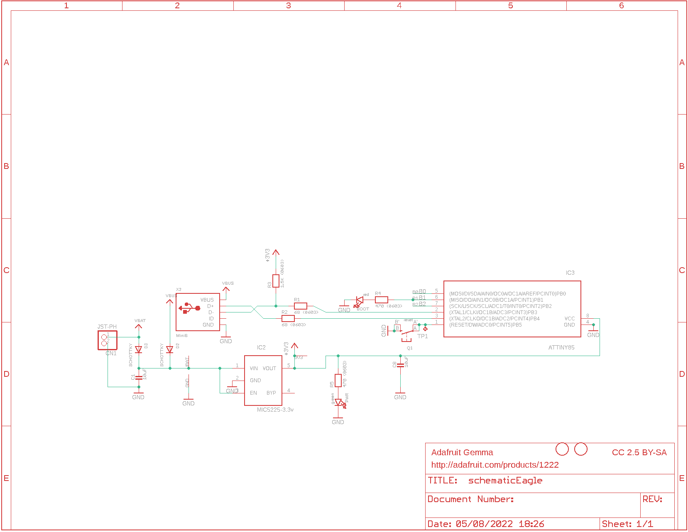](eagleSchemImage.png)
## PCB
  
[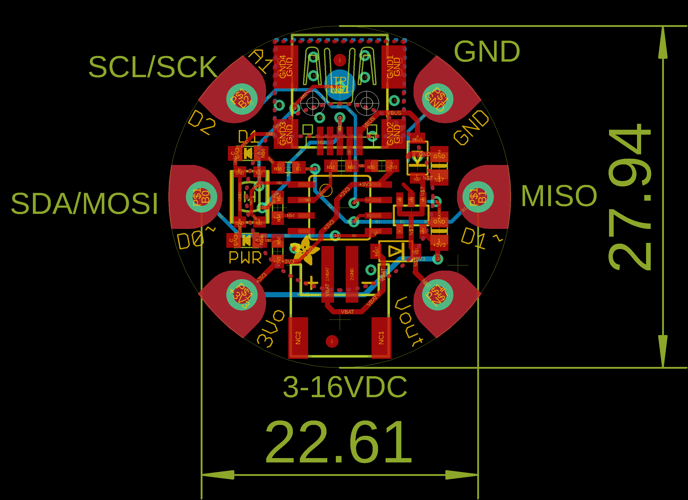](eagleImage.png)
## Interactive BOM

- Interactive BOM page: [ibom.html](https://htmlpreview.github.io/?https://github.com/oomlout/oomlout_OOMP_projects/blob/main/PROJ-ADAF-1222-STAN-01/kicad/bom/ibom.html)

## OOMP Parts
  

|OOMP ID|Name|Identifier|
| :---: | :---: | :---: |
|[LEDS-0805-R-STAN-01](https://github.com/oomlout/oomlout_OOMP_parts/tree/main/LEDS-0805-R-STAN-01/)|[SMD (0805) Red LED](https://github.com/oomlout/oomlout_OOMP_parts/tree/main/LEDS-0805-R-STAN-01/)|[BOOT](https://github.com/oomlout/oomlout_OOMP_parts/tree/main/LEDS-0805-R-STAN-01/)|
|[CAPC-0805-X-UF10-V10](https://github.com/oomlout/oomlout_OOMP_parts/tree/main/CAPC-0805-X-UF10-V10/)|[SMD (0805) 10 uF Capacitor (Ceramic) 10v](https://github.com/oomlout/oomlout_OOMP_parts/tree/main/CAPC-0805-X-UF10-V10/)|[C1, C8](https://github.com/oomlout/oomlout_OOMP_parts/tree/main/CAPC-0805-X-UF10-V10/)|
|UNMATCHED-UNMATCHED-X-UNMATCHED-01||CN1, IC3, TP1, X2|
|DIOD-S123-X-UNMATCHED-01||D2, D3|
|[VREG-SO235-X-KMIC5225-V33D](https://github.com/oomlout/oomlout_OOMP_parts/tree/main/VREG-SO235-X-KMIC5225-V33D/)|[SMD (SOT-23-5) MIC5225 Voltage Regulator 3.3v](https://github.com/oomlout/oomlout_OOMP_parts/tree/main/VREG-SO235-X-KMIC5225-V33D/)|[IC2](https://github.com/oomlout/oomlout_OOMP_parts/tree/main/VREG-SO235-X-KMIC5225-V33D/)|
|[LEDS-0805-G-STAN-01](https://github.com/oomlout/oomlout_OOMP_parts/tree/main/LEDS-0805-G-STAN-01/)|[SMD (0805) Green LED](https://github.com/oomlout/oomlout_OOMP_parts/tree/main/LEDS-0805-G-STAN-01/)|[PWR](https://github.com/oomlout/oomlout_OOMP_parts/tree/main/LEDS-0805-G-STAN-01/)|
|[BUTA-4628-X-STAN-01](https://github.com/oomlout/oomlout_OOMP_parts/tree/main/BUTA-4628-X-STAN-01/)|[SMD (4628) Pushbutton (Tactile)](https://github.com/oomlout/oomlout_OOMP_parts/tree/main/BUTA-4628-X-STAN-01/)|[Q1](https://github.com/oomlout/oomlout_OOMP_parts/tree/main/BUTA-4628-X-STAN-01/)|
|RESE-0603-X-UNMATCHED-01||R1, R2, R3, R4, R5|

## Images
  
  

|bominteractivefront|bominteractiveback|kicadPcb3d|kicadPcb3dFront|kicadPcb3dBack|kicadSchem|eagleImage|eagleSchemImage|pcbdraw|pcbdrawback|
| :---: | :---: | :---: | :---: | :---: | :---: | :---: | :---: | :---: | :---: |
|[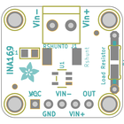](bomFront.png)|[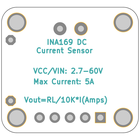](bomBack.png)||[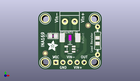](kicadPcb3dFront.png)|[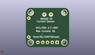](kicadPcb3dBack.png)|[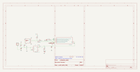](kicadSchem.png)|[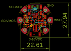](eagleImage.png)|[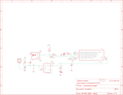](eagleSchemImage.png)|[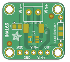](pcbdraw.png)|[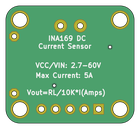](pcbdrawBack.png)|

## Tags

- hexID: PRA1222
- oompType: PROJ
- oompSize: ADAF
- oompColor: 1222
- oompDesc: STAN
- oompIndex: 01
- oompName: Adafruit Gemma PCB
- sources: All source files from https://github.com/adafruit/Adafruit-Gemma-PCB (source licence details in srcLicense.md)
- linkBuyPage: http://www.adafruit.com/products/1222
- oompID: PROJ-ADAF-1222-STAN-01
- oompParts: BOOT,LEDS-0805-R-STAN-01
- oompParts: C1,CAPC-0805-X-UF10-V10
- oompParts: C8,CAPC-0805-X-UF10-V10
- oompParts: CN1,UNMATCHED-UNMATCHED-X-UNMATCHED-01
- oompParts: D2,DIOD-S123-X-UNMATCHED-01
- oompParts: D3,DIOD-S123-X-UNMATCHED-01
- oompParts: IC2,VREG-SO235-X-KMIC5225-V33D
- oompParts: IC3,UNMATCHED-UNMATCHED-X-UNMATCHED-01
- oompParts: PWR,LEDS-0805-G-STAN-01
- oompParts: Q1,BUTA-4628-X-STAN-01
- oompParts: R1,RESE-0603-X-UNMATCHED-01
- oompParts: R2,RESE-0603-X-UNMATCHED-01
- oompParts: R3,RESE-0603-X-UNMATCHED-01
- oompParts: R4,RESE-0603-X-UNMATCHED-01
- oompParts: R5,RESE-0603-X-UNMATCHED-01
- oompParts: TP1,UNMATCHED-UNMATCHED-X-UNMATCHED-01
- oompParts: X2,UNMATCHED-UNMATCHED-X-UNMATCHED-01
- rawParts: 3V3,SEWTAP-2.0IN,SEWTAP-2.0IN,SEWINGTAP_2.0,,,
- rawParts: B0,SEWTAP-2.0IN,SEWTAP-2.0IN,SEWINGTAP_2.0,,,
- rawParts: B1,SEWTAP-2.0IN,SEWTAP-2.0IN,SEWINGTAP_2.0,,,
- rawParts: B2,SEWTAP-2.0IN,SEWTAP-2.0IN,SEWINGTAP_2.0,,,
- rawParts: BOOT,red,LED0805_NOOUTLINE,CHIPLED_0805_NOOUTLINE,LED,,
- rawParts: C1,10uF,CAP_CERAMIC0805-NOOUTLINE,0805-NO,Ceramic Capacitors,,
- rawParts: C8,10uF,CAP_CERAMIC0805-NOOUTLINE,0805-NO,Ceramic Capacitors,,
- rawParts: CN1,JST-PH,JST_2PIN-SMT-RA,JST-PH-2-SMT-RA,JST 2-Pin Connectors of various flavors,,
- rawParts: D2,SCHOTTKY,DIODE_SOD-123FL,SOD-123FL,Diode,,
- rawParts: D3,SCHOTTKY,DIODE_SOD-123FL,SOD-123FL,Diode,,
- rawParts: GND,SEWTAP-2.0IN,SEWTAP-2.0IN,SEWINGTAP_2.0,,,
- rawParts: IC2,MIC5225-3.3v,LP298XS,SOT23-5L,,,
- rawParts: IC3,ATTINY85,ATTINY85V-10S,SOIC8,MICROCONTROLLER,,
- rawParts: PWR,green,LED0805_NOOUTLINE,CHIPLED_0805_NOOUTLINE,LED,,
- rawParts: Q1,reset,SWITCH_TACT_SMT4.6X2.8,BTN_KMR2_4.6X2.8,SMT Tact Switches,,
- rawParts: R1,68 (0603),RESISTOR_0603_NOOUT,0603-NO,Resistors,,
- rawParts: R2,68 (0603),RESISTOR_0603_NOOUT,0603-NO,Resistors,,
- rawParts: R3,1.5K (0603),RESISTOR_0603_NOOUT,0603-NO,Resistors,,
- rawParts: R4,470 (0603),RESISTOR_0603_NOOUT,0603-NO,Resistors,,
- rawParts: R5,470 (0603),RESISTOR_0603_NOOUT,0603-NO,Resistors,,
- rawParts: TP1,TPB2,54,TPB2,54,B2,54,Test pad,,
- rawParts: U$1,FIDUCIAL,FIDUCIAL,FIDUCIAL_1MM,For use by pick and place machines to calibrate the vision/machine, 1mm,,
- rawParts: U$6,FIDUCIAL,FIDUCIAL,FIDUCIAL_1MM,For use by pick and place machines to calibrate the vision/machine, 1mm,,
- rawParts: VBAT,SEWTAP-2.0IN,SEWTAP-2.0IN,SEWINGTAP_2.0,,,
- rawParts: X2,MiniB,USB_MEDIUM,USB-MINI_MEDIUM,USB Connectors,,

[im]: kicadPcb3d_450.png
