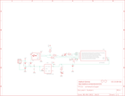

Contents
========

* [PRA1222 > Adafruit](#pra1222--adafruit)
	* [Schematic](#schematic)
	* [Interactive BOM](#interactive-bom)
	* [OOMP Parts](#oomp-parts)
	* [Images](#images)
	* [Tags](#tags)
  
![][im]
# PRA1222 > Adafruit

- ID: PROJ-ADAF-1222-STAN-01
- Hex ID: PRA1222
- Name: Adafruit
- Description: Adafruit
- Long Link: [http://oom.lt/PROJ-ADAF-1222-STAN-01](http://oom.lt/PROJ-ADAF-1222-STAN-01)
- Short Link: [http://oom.lt/PRA1222](http://oom.lt/PRA1222)

## Schematic
  

## Interactive BOM

- Interactive BOM page: [ibom.html](https://htmlpreview.github.io/?https://github.com/oomlout/oomlout_OOMP_projects/blob/main/PROJ-ADAF-1222-STAN-01/kicad/bom/ibom.html)

## OOMP Parts
  

|OOMP Parts|
| :---: |
|3V3,UNMATCHED-UNMATCHED-UNMATCHED-UNMATCHED-UNMATCHED,3V3,SEWTAP-2.0IN,SEWTAP-2.0IN,SEWINGTAP_2.0,,,|
|B0,UNMATCHED-UNMATCHED-UNMATCHED-UNMATCHED-UNMATCHED,B0,SEWTAP-2.0IN,SEWTAP-2.0IN,SEWINGTAP_2.0,,,|
|B1,UNMATCHED-UNMATCHED-UNMATCHED-UNMATCHED-UNMATCHED,B1,SEWTAP-2.0IN,SEWTAP-2.0IN,SEWINGTAP_2.0,,,|
|B2,UNMATCHED-UNMATCHED-UNMATCHED-UNMATCHED-UNMATCHED,B2,SEWTAP-2.0IN,SEWTAP-2.0IN,SEWINGTAP_2.0,,,|
|BOOT,UNMATCHED-UNMATCHED-UNMATCHED-UNMATCHED-UNMATCHED,BOOT,red,LED0805_NOOUTLINE,CHIPLED_0805_NOOUTLINE,LED,,|
|C1,UNMATCHED-UNMATCHED-UNMATCHED-UNMATCHED-UNMATCHED,C1,10uF,CAP_CERAMIC0805-NOOUTLINE,0805-NO,Ceramic Capacitors,,|
|C8,UNMATCHED-UNMATCHED-UNMATCHED-UNMATCHED-UNMATCHED,C8,10uF,CAP_CERAMIC0805-NOOUTLINE,0805-NO,Ceramic Capacitors,,|
|CN1,UNMATCHED-UNMATCHED-UNMATCHED-UNMATCHED-UNMATCHED,CN1,JST-PH,JST_2PIN-SMT-RA,JST-PH-2-SMT-RA,JST 2-Pin Connectors of various flavors,,|
|D2,UNMATCHED-UNMATCHED-UNMATCHED-UNMATCHED-UNMATCHED,D2,SCHOTTKY,DIODE_SOD-123FL,SOD-123FL,Diode,,|
|D3,UNMATCHED-UNMATCHED-UNMATCHED-UNMATCHED-UNMATCHED,D3,SCHOTTKY,DIODE_SOD-123FL,SOD-123FL,Diode,,|
|GND,UNMATCHED-UNMATCHED-UNMATCHED-UNMATCHED-UNMATCHED,GND,SEWTAP-2.0IN,SEWTAP-2.0IN,SEWINGTAP_2.0,,,|
|IC2,UNMATCHED-UNMATCHED-UNMATCHED-UNMATCHED-UNMATCHED,IC2,MIC5225-3.3v,LP298XS,SOT23-5L,,,|
|IC3,UNMATCHED-UNMATCHED-UNMATCHED-UNMATCHED-UNMATCHED,IC3,ATTINY85,ATTINY85V-10S,SOIC8,MICROCONTROLLER,,|
|PWR,UNMATCHED-UNMATCHED-UNMATCHED-UNMATCHED-UNMATCHED,PWR,green,LED0805_NOOUTLINE,CHIPLED_0805_NOOUTLINE,LED,,|
|Q1,UNMATCHED-UNMATCHED-UNMATCHED-UNMATCHED-UNMATCHED,Q1,reset,SWITCH_TACT_SMT4.6X2.8,BTN_KMR2_4.6X2.8,SMT Tact Switches,,|
|R1,UNMATCHED-UNMATCHED-UNMATCHED-UNMATCHED-UNMATCHED,R1,68 (0603),RESISTOR_0603_NOOUT,0603-NO,Resistors,,|
|R2,UNMATCHED-UNMATCHED-UNMATCHED-UNMATCHED-UNMATCHED,R2,68 (0603),RESISTOR_0603_NOOUT,0603-NO,Resistors,,|
|R3,UNMATCHED-UNMATCHED-UNMATCHED-UNMATCHED-UNMATCHED,R3,1.5K (0603),RESISTOR_0603_NOOUT,0603-NO,Resistors,,|
|R4,UNMATCHED-UNMATCHED-UNMATCHED-UNMATCHED-UNMATCHED,R4,470 (0603),RESISTOR_0603_NOOUT,0603-NO,Resistors,,|
|R5,UNMATCHED-UNMATCHED-UNMATCHED-UNMATCHED-UNMATCHED,R5,470 (0603),RESISTOR_0603_NOOUT,0603-NO,Resistors,,|
|TP1,UNMATCHED-UNMATCHED-UNMATCHED-UNMATCHED-UNMATCHED,TP1,TPB2,54,TPB2,54,B2,54,Test pad,,|
|VBAT,UNMATCHED-UNMATCHED-UNMATCHED-UNMATCHED-UNMATCHED,U$1,FIDUCIAL,FIDUCIAL,FIDUCIAL_1MM,For use by pick and place machines to calibrate the vision/machine, 1mm,,|
|X2,UNMATCHED-UNMATCHED-UNMATCHED-UNMATCHED-UNMATCHED,U$6,FIDUCIAL,FIDUCIAL,FIDUCIAL_1MM,For use by pick and place machines to calibrate the vision/machine, 1mm,,|

## Images
  
  

|kicadPcb3d|kicadPcb3dFront|kicadPcb3dBack|eagleImage|eagleSchemImage|
| :---: | :---: | :---: | :---: | :---: |
||||||

## Tags

- hexID: PRA1222
- oompType: PROJ
- oompSize: ADAF
- oompColor: 1222
- oompDesc: STAN
- oompIndex: 01
- oompName: Adafruit Gemma PCB
- sources: All source files from https://github.com/adafruit/Adafruit-Gemma-PCB (source licence details in srcLicense.md)
- linkBuyPage: http://www.adafruit.com/products/1222
- oompID: PROJ-ADAF-1222-STAN-01
- oompParts: 3V3,UNMATCHED-UNMATCHED-UNMATCHED-UNMATCHED-UNMATCHED
- oompParts: B0,UNMATCHED-UNMATCHED-UNMATCHED-UNMATCHED-UNMATCHED
- oompParts: B1,UNMATCHED-UNMATCHED-UNMATCHED-UNMATCHED-UNMATCHED
- oompParts: B2,UNMATCHED-UNMATCHED-UNMATCHED-UNMATCHED-UNMATCHED
- oompParts: BOOT,UNMATCHED-UNMATCHED-UNMATCHED-UNMATCHED-UNMATCHED
- oompParts: C1,UNMATCHED-UNMATCHED-UNMATCHED-UNMATCHED-UNMATCHED
- oompParts: C8,UNMATCHED-UNMATCHED-UNMATCHED-UNMATCHED-UNMATCHED
- oompParts: CN1,UNMATCHED-UNMATCHED-UNMATCHED-UNMATCHED-UNMATCHED
- oompParts: D2,UNMATCHED-UNMATCHED-UNMATCHED-UNMATCHED-UNMATCHED
- oompParts: D3,UNMATCHED-UNMATCHED-UNMATCHED-UNMATCHED-UNMATCHED
- oompParts: GND,UNMATCHED-UNMATCHED-UNMATCHED-UNMATCHED-UNMATCHED
- oompParts: IC2,UNMATCHED-UNMATCHED-UNMATCHED-UNMATCHED-UNMATCHED
- oompParts: IC3,UNMATCHED-UNMATCHED-UNMATCHED-UNMATCHED-UNMATCHED
- oompParts: PWR,UNMATCHED-UNMATCHED-UNMATCHED-UNMATCHED-UNMATCHED
- oompParts: Q1,UNMATCHED-UNMATCHED-UNMATCHED-UNMATCHED-UNMATCHED
- oompParts: R1,UNMATCHED-UNMATCHED-UNMATCHED-UNMATCHED-UNMATCHED
- oompParts: R2,UNMATCHED-UNMATCHED-UNMATCHED-UNMATCHED-UNMATCHED
- oompParts: R3,UNMATCHED-UNMATCHED-UNMATCHED-UNMATCHED-UNMATCHED
- oompParts: R4,UNMATCHED-UNMATCHED-UNMATCHED-UNMATCHED-UNMATCHED
- oompParts: R5,UNMATCHED-UNMATCHED-UNMATCHED-UNMATCHED-UNMATCHED
- oompParts: TP1,UNMATCHED-UNMATCHED-UNMATCHED-UNMATCHED-UNMATCHED
- oompParts: VBAT,UNMATCHED-UNMATCHED-UNMATCHED-UNMATCHED-UNMATCHED
- oompParts: X2,UNMATCHED-UNMATCHED-UNMATCHED-UNMATCHED-UNMATCHED
- rawParts: 3V3,SEWTAP-2.0IN,SEWTAP-2.0IN,SEWINGTAP_2.0,,,
- rawParts: B0,SEWTAP-2.0IN,SEWTAP-2.0IN,SEWINGTAP_2.0,,,
- rawParts: B1,SEWTAP-2.0IN,SEWTAP-2.0IN,SEWINGTAP_2.0,,,
- rawParts: B2,SEWTAP-2.0IN,SEWTAP-2.0IN,SEWINGTAP_2.0,,,
- rawParts: BOOT,red,LED0805_NOOUTLINE,CHIPLED_0805_NOOUTLINE,LED,,
- rawParts: C1,10uF,CAP_CERAMIC0805-NOOUTLINE,0805-NO,Ceramic Capacitors,,
- rawParts: C8,10uF,CAP_CERAMIC0805-NOOUTLINE,0805-NO,Ceramic Capacitors,,
- rawParts: CN1,JST-PH,JST_2PIN-SMT-RA,JST-PH-2-SMT-RA,JST 2-Pin Connectors of various flavors,,
- rawParts: D2,SCHOTTKY,DIODE_SOD-123FL,SOD-123FL,Diode,,
- rawParts: D3,SCHOTTKY,DIODE_SOD-123FL,SOD-123FL,Diode,,
- rawParts: GND,SEWTAP-2.0IN,SEWTAP-2.0IN,SEWINGTAP_2.0,,,
- rawParts: IC2,MIC5225-3.3v,LP298XS,SOT23-5L,,,
- rawParts: IC3,ATTINY85,ATTINY85V-10S,SOIC8,MICROCONTROLLER,,
- rawParts: PWR,green,LED0805_NOOUTLINE,CHIPLED_0805_NOOUTLINE,LED,,
- rawParts: Q1,reset,SWITCH_TACT_SMT4.6X2.8,BTN_KMR2_4.6X2.8,SMT Tact Switches,,
- rawParts: R1,68 (0603),RESISTOR_0603_NOOUT,0603-NO,Resistors,,
- rawParts: R2,68 (0603),RESISTOR_0603_NOOUT,0603-NO,Resistors,,
- rawParts: R3,1.5K (0603),RESISTOR_0603_NOOUT,0603-NO,Resistors,,
- rawParts: R4,470 (0603),RESISTOR_0603_NOOUT,0603-NO,Resistors,,
- rawParts: R5,470 (0603),RESISTOR_0603_NOOUT,0603-NO,Resistors,,
- rawParts: TP1,TPB2,54,TPB2,54,B2,54,Test pad,,
- rawParts: U$1,FIDUCIAL,FIDUCIAL,FIDUCIAL_1MM,For use by pick and place machines to calibrate the vision/machine, 1mm,,
- rawParts: U$6,FIDUCIAL,FIDUCIAL,FIDUCIAL_1MM,For use by pick and place machines to calibrate the vision/machine, 1mm,,
- rawParts: VBAT,SEWTAP-2.0IN,SEWTAP-2.0IN,SEWINGTAP_2.0,,,
- rawParts: X2,MiniB,USB_MEDIUM,USB-MINI_MEDIUM,USB Connectors,,

[im]: kicadPcb3d_450.png
