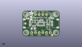
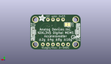
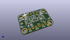

Contents
========

* [PROJ-ADAF-1231-STAN-01>Adafruit_ADXL345_PCB](#proj-adaf-1231-stan-01adafruit_adxl345_pcb)
	* [Images](#images)
	* [Interactive BOM](#interactive-bom)
	* [OOMP Parts](#oomp-parts)
	* [Tags](#tags)
  
![][im]
# PROJ-ADAF-1231-STAN-01>Adafruit_ADXL345_PCB

- ID: PROJ-ADAF-1231-STAN-01
- Hex ID: PRA1231
- Name: Adafruit_ADXL345_PCB
- Description: 

## Images
  
  

|eagleImage|kicadPcb3dFront|kicadPcb3dBack|kicadPcb3d|
| :---: | :---: | :---: | :---: |
|||||

## Interactive BOM

- Interactive BOM page: [ibom.html](kicad/bom/ibom.html)

## OOMP Parts
  

|OOMP Parts|
| :---: |
|CAPE-0603-X-NF100-01, C1, 12.953999999999999, 11.176, 0,C1, 0.1uF, 0603-NO, microbuilder, (0.51, 0.44), R0|
|CAPE-0805-X-UNMATCHED-01, C2, 7.365999999999999, 5.5245, 0,C2, 10uF, _0805MP, microbuilder, (0.29, 0.2175), R0|
|CAPE-0805-X-UNMATCHED-01, C3, 5.842, 12.572999999999999, 90,C3, 10uF, 0805-NO, microbuilder, (0.23, 0.495), R90|
|UNMATCHED-UNMATCHED-X-UNMATCHED-01, CONN3, 22.733, 8.889999999999999, 90,CONN3, STEMMA_I2C_QT, JST_SH4, microbuilder, (0.895, 0.35), R90|
|UNMATCHED-UNMATCHED-X-UNMATCHED-01, CONN4, 2.667, 8.889999999999999, 270,CONN4, STEMMA_I2C_QT, JST_SH4, microbuilder, (0.105, 0.35), R270|
|UNMATCHED-UNMATCHED-X-UNMATCHED-01, D1, 3.556, 12.572999999999999, 90,D1, GREEN, CHIPLED_0603_NOOUTLINE, microbuilder, (0.14, 0.495), R90|
|UNMATCHED-UNMATCHED-X-UNMATCHED-01, D2, 19.685, 12.7, 0,D2, 1N4148, SOD-323, microbuilder, (0.775, 0.5), R0|
|UNMATCHED-UNMATCHED-X-UNMATCHED-01, JP1, 12.7, 2.54, 0,JP1, 1X06_ROUND_70, microbuilder, (0.5, 0.1), R0|
|UNMATCHED-UNMATCHED-X-UNMATCHED-01, JP2, 12.7, 15.239999999999998, 0,JP2, 1X04_ROUND, microbuilder, (0.5, 0.6), R0|
|UNMATCHED-UNMATCHED-X-UNMATCHED-01, Q2, 17.779999999999998, 6.095999999999999, 90,Q2, BSS138, SOT363, microbuilder, (0.7, 0.24), R90|
|RESE-UNMATCHED-X-O103-01, R1, 8.636000000000001, 12.065, 0,R1, 10K, RESPACK_4X0603, microbuilder, (0.34, 0.475), R0|
|RESE-UNMATCHED-X-O103-01, R3, 17.7165, 9.7155, 270,R3, 10K, RESPACK_4X0603, microbuilder, (0.6975, 0.3825), R270|
|UNMATCHED-UNMATCHED-X-UNMATCHED-01, SJ1, 6.604, 12.7, M180,SJ1, SOLDERJUMPER_CLOSEDWIRE, microbuilder, (0.26, 0.5), MR180|
|UNMATCHED-UNMATCHED-X-UNMATCHED-01, U1, 12.7, 8.636000000000001, 0,U1, ADXL343, LGA14, microbuilder, (0.5, 0.34), R0|
|UNMATCHED-UNMATCHED-X-UNMATCHED-01, U2, 7.746999999999999, 8.509, 0,U2, AP2112K-3.3, SOT23-5, adafruit_power, (0.305, 0.335), R0|

## Tags

- hexID: PRA1231
- oompType: PROJ
- oompSize: ADAF
- oompColor: 1231
- oompDesc: STAN
- oompIndex: 01
- oompName: Adafruit_ADXL345_PCB
- sources: All source files from https://github.com/adafruit/Adafruit_ADXL345_PCB (source licence details in srcLicense.md)
- linkBuyPage: http://www.adafruit.com/products/1231
- oompPart: CAPE-0603-X-NF100-01, C1, 12.953999999999999, 11.176, 0
- oompPart: CAPE-0805-X-UNMATCHED-01, C2, 7.365999999999999, 5.5245, 0
- oompPart: CAPE-0805-X-UNMATCHED-01, C3, 5.842, 12.572999999999999, 90
- oompPart: UNMATCHED-UNMATCHED-X-UNMATCHED-01, CONN3, 22.733, 8.889999999999999, 90
- oompPart: UNMATCHED-UNMATCHED-X-UNMATCHED-01, CONN4, 2.667, 8.889999999999999, 270
- oompPart: UNMATCHED-UNMATCHED-X-UNMATCHED-01, D1, 3.556, 12.572999999999999, 90
- oompPart: UNMATCHED-UNMATCHED-X-UNMATCHED-01, D2, 19.685, 12.7, 0
- oompPart: SKIP-UNMATCHED-X-UNMATCHED-01, FID3, 20.2565, 0.8255, 0
- oompPart: SKIP-UNMATCHED-X-UNMATCHED-01, FID4, 1.9685, 8.889999999999999, 0
- oompPart: UNMATCHED-UNMATCHED-X-UNMATCHED-01, JP1, 12.7, 2.54, 0
- oompPart: UNMATCHED-UNMATCHED-X-UNMATCHED-01, JP2, 12.7, 15.239999999999998, 0
- oompPart: UNMATCHED-UNMATCHED-X-UNMATCHED-01, Q2, 17.779999999999998, 6.095999999999999, 90
- oompPart: RESE-UNMATCHED-X-O103-01, R1, 8.636000000000001, 12.065, 0
- oompPart: RESE-UNMATCHED-X-O103-01, R3, 17.7165, 9.7155, 270
- oompPart: UNMATCHED-UNMATCHED-X-UNMATCHED-01, SJ1, 6.604, 12.7, M180
- oompPart: SKIP-UNMATCHED-X-UNMATCHED-01, U$1, 2.54, 15.239999999999998, 0
- oompPart: SKIP-UNMATCHED-X-UNMATCHED-01, U$17, 22.86, 15.239999999999998, 0
- oompPart: SKIP-UNMATCHED-X-UNMATCHED-01, U$19, 2.54, 2.54, 0
- oompPart: SKIP-UNMATCHED-X-UNMATCHED-01, U$21, 22.86, 2.54, 0
- oompPart: UNMATCHED-UNMATCHED-X-UNMATCHED-01, U1, 12.7, 8.636000000000001, 0
- oompPart: UNMATCHED-UNMATCHED-X-UNMATCHED-01, U2, 7.746999999999999, 8.509, 0
- rawPart: C1, 0.1uF, 0603-NO, microbuilder, (0.51, 0.44), R0
- rawPart: C2, 10uF, _0805MP, microbuilder, (0.29, 0.2175), R0
- rawPart: C3, 10uF, 0805-NO, microbuilder, (0.23, 0.495), R90
- rawPart: CONN3, STEMMA_I2C_QT, JST_SH4, microbuilder, (0.895, 0.35), R90
- rawPart: CONN4, STEMMA_I2C_QT, JST_SH4, microbuilder, (0.105, 0.35), R270
- rawPart: D1, GREEN, CHIPLED_0603_NOOUTLINE, microbuilder, (0.14, 0.495), R90
- rawPart: D2, 1N4148, SOD-323, microbuilder, (0.775, 0.5), R0
- rawPart: FID3, FIDUCIAL_1MM, FIDUCIAL_1MM, microbuilder, (0.7975, 0.0325), R0
- rawPart: FID4, FIDUCIAL_1MM, FIDUCIAL_1MM, microbuilder, (0.0775, 0.35), R0
- rawPart: JP1, 1X06_ROUND_70, microbuilder, (0.5, 0.1), R0
- rawPart: JP2, 1X04_ROUND, microbuilder, (0.5, 0.6), R0
- rawPart: Q2, BSS138, SOT363, microbuilder, (0.7, 0.24), R90
- rawPart: R1, 10K, RESPACK_4X0603, microbuilder, (0.34, 0.475), R0
- rawPart: R3, 10K, RESPACK_4X0603, microbuilder, (0.6975, 0.3825), R270
- rawPart: SJ1, SOLDERJUMPER_CLOSEDWIRE, microbuilder, (0.26, 0.5), MR180
- rawPart: U$1, MOUNTINGHOLE2.5, MOUNTINGHOLE_2.5_PLATED, adafruit_electromech, (0.1, 0.6), R0
- rawPart: U$17, MOUNTINGHOLE2.5, MOUNTINGHOLE_2.5_PLATED, adafruit_electromech, (0.9, 0.6), R0
- rawPart: U$19, MOUNTINGHOLE2.5, MOUNTINGHOLE_2.5_PLATED, adafruit_electromech, (0.1, 0.1), R0
- rawPart: U$21, MOUNTINGHOLE2.5, MOUNTINGHOLE_2.5_PLATED, adafruit_electromech, (0.9, 0.1), R0
- rawPart: U1, ADXL343, LGA14, microbuilder, (0.5, 0.34), R0
- rawPart: U2, AP2112K-3.3, SOT23-5, adafruit_power, (0.305, 0.335), R0

[im]: kicadPcb3d_450.png
