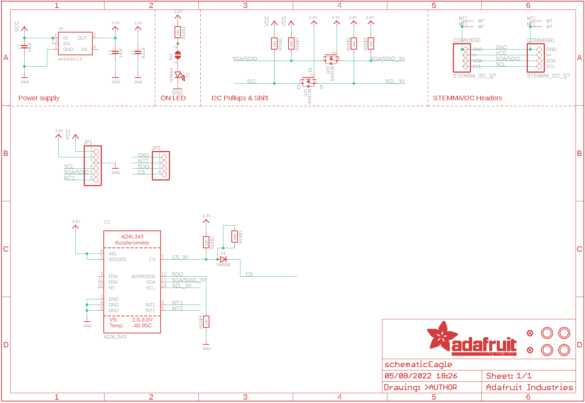
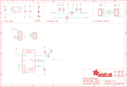

Contents
========

* [PRA1231 > Adafruit](#pra1231--adafruit)
	* [Schematic](#schematic)
	* [Interactive BOM](#interactive-bom)
	* [OOMP Parts](#oomp-parts)
	* [Images](#images)
	* [Tags](#tags)
  
![][im]
# PRA1231 > Adafruit

- ID: PROJ-ADAF-1231-STAN-01
- Hex ID: PRA1231
- Name: Adafruit
- Description: Adafruit
- Long Link: [http://oom.lt/PROJ-ADAF-1231-STAN-01](http://oom.lt/PROJ-ADAF-1231-STAN-01)
- Short Link: [http://oom.lt/PRA1231](http://oom.lt/PRA1231)

## Schematic
  

## Interactive BOM

- Interactive BOM page: [ibom.html](https://htmlpreview.github.io/?https://github.com/oomlout/oomlout_OOMP_projects/blob/main/PROJ-ADAF-1231-STAN-01/kicad/bom/ibom.html)

## OOMP Parts
  

|OOMP Parts|
| :---: |
|C1,CAPC-0603-X-NF100-V50,C1,0.1uF,CAP_CERAMIC0603_NO,0603-NO,Ceramic Capacitors,,|
|C2,CAPC-0805-X-UF10-V10,C2,10uF,CAP_CERAMIC_0805MP,_0805MP,Ceramic Capacitors,,|
|C3,CAPC-0805-X-UF10-V10,C3,10uF,CAP_CERAMIC0805-NOOUTLINE,0805-NO,Ceramic Capacitors,,|
|CONN3,UNMATCHED-UNMATCHED-X-UNMATCHED-01,CONN3,STEMMA_I2C_QT,STEMMA_I2C_QT,JST_SH4,,,|
|CONN4,UNMATCHED-UNMATCHED-X-UNMATCHED-01,CONN4,STEMMA_I2C_QT,STEMMA_I2C_QT,JST_SH4,,,|
|D1,LEDS-0603-G-STAN-01,D1,GREEN,LED0603_NOOUTLINE,CHIPLED_0603_NOOUTLINE,LED,,|
|D2,DIOD-S323-X-K4148-01,D2,1N4148,DIODESOD-323,SOD-323,Diode,,|
|JP1,HEAD-I01-X-PI06-01,FID3,FIDUCIAL_1MM,FIDUCIAL_1MM,FIDUCIAL_1MM,Fiducial Alignment Points,EXCLUDE,|
|JP2,HEAD-I01-X-PI04-01,FID4,FIDUCIAL_1MM,FIDUCIAL_1MM,FIDUCIAL_1MM,Fiducial Alignment Points,EXCLUDE,|
|Q2,MOSN-SO363-X-KBSS138-01,JP1,,HEADER-1X670MIL,1X06_ROUND_70,PIN HEADER,,|
|R1,RESE-UNMATCHED-X-O103-01,JP2,,HEADER-1X4ROUND,1X04_ROUND,PIN HEADER,,|
|R3,RESE-UNMATCHED-X-O103-01,Q2,BSS138,MOSFET-N_DUAL,SOT363,Dual N-Channel MOSFET,,|
|U1,UNMATCHED-UNMATCHED-X-UNMATCHED-01,R1,10K,RESISTOR_4PACK,RESPACK_4X0603,Resistor Packs (4 resistors),,|
|U2,VREG-SO235-X-KAP2112K-V33D,R3,10K,RESISTOR_4PACK,RESPACK_4X0603,Resistor Packs (4 resistors),,|

## Images
  
  

|kicadPcb3d|kicadPcb3dFront|kicadPcb3dBack|eagleImage|eagleSchemImage|
| :---: | :---: | :---: | :---: | :---: |
||||||

## Tags

- hexID: PRA1231
- oompType: PROJ
- oompSize: ADAF
- oompColor: 1231
- oompDesc: STAN
- oompIndex: 01
- oompName: Adafruit_ADXL345_PCB
- sources: All source files from https://github.com/adafruit/Adafruit_ADXL345_PCB (source licence details in srcLicense.md)
- linkBuyPage: http://www.adafruit.com/products/1231
- oompID: PROJ-ADAF-1231-STAN-01
- oompParts: C1,CAPC-0603-X-NF100-V50
- oompParts: C2,CAPC-0805-X-UF10-V10
- oompParts: C3,CAPC-0805-X-UF10-V10
- oompParts: CONN3,UNMATCHED-UNMATCHED-X-UNMATCHED-01
- oompParts: CONN4,UNMATCHED-UNMATCHED-X-UNMATCHED-01
- oompParts: D1,LEDS-0603-G-STAN-01
- oompParts: D2,DIOD-S323-X-K4148-01
- oompParts: JP1,HEAD-I01-X-PI06-01
- oompParts: JP2,HEAD-I01-X-PI04-01
- oompParts: Q2,MOSN-SO363-X-KBSS138-01
- oompParts: R1,RESE-UNMATCHED-X-O103-01
- oompParts: R3,RESE-UNMATCHED-X-O103-01
- oompParts: U1,UNMATCHED-UNMATCHED-X-UNMATCHED-01
- oompParts: U2,VREG-SO235-X-KAP2112K-V33D
- rawParts: C1,0.1uF,CAP_CERAMIC0603_NO,0603-NO,Ceramic Capacitors,,
- rawParts: C2,10uF,CAP_CERAMIC_0805MP,_0805MP,Ceramic Capacitors,,
- rawParts: C3,10uF,CAP_CERAMIC0805-NOOUTLINE,0805-NO,Ceramic Capacitors,,
- rawParts: CONN3,STEMMA_I2C_QT,STEMMA_I2C_QT,JST_SH4,,,
- rawParts: CONN4,STEMMA_I2C_QT,STEMMA_I2C_QT,JST_SH4,,,
- rawParts: D1,GREEN,LED0603_NOOUTLINE,CHIPLED_0603_NOOUTLINE,LED,,
- rawParts: D2,1N4148,DIODESOD-323,SOD-323,Diode,,
- rawParts: FID3,FIDUCIAL_1MM,FIDUCIAL_1MM,FIDUCIAL_1MM,Fiducial Alignment Points,EXCLUDE,
- rawParts: FID4,FIDUCIAL_1MM,FIDUCIAL_1MM,FIDUCIAL_1MM,Fiducial Alignment Points,EXCLUDE,
- rawParts: JP1,,HEADER-1X670MIL,1X06_ROUND_70,PIN HEADER,,
- rawParts: JP2,,HEADER-1X4ROUND,1X04_ROUND,PIN HEADER,,
- rawParts: Q2,BSS138,MOSFET-N_DUAL,SOT363,Dual N-Channel MOSFET,,
- rawParts: R1,10K,RESISTOR_4PACK,RESPACK_4X0603,Resistor Packs (4 resistors),,
- rawParts: R3,10K,RESISTOR_4PACK,RESPACK_4X0603,Resistor Packs (4 resistors),,
- rawParts: SJ1,,SOLDERJUMPERCLOSED,SOLDERJUMPER_CLOSEDWIRE,SMD Solder JUMPER,,
- rawParts: U$1,MOUNTINGHOLE2.5,MOUNTINGHOLE2.5,MOUNTINGHOLE_2.5_PLATED,Mounting Hole,EXCLUDE,
- rawParts: U$17,MOUNTINGHOLE2.5,MOUNTINGHOLE2.5,MOUNTINGHOLE_2.5_PLATED,Mounting Hole,EXCLUDE,
- rawParts: U$19,MOUNTINGHOLE2.5,MOUNTINGHOLE2.5,MOUNTINGHOLE_2.5_PLATED,Mounting Hole,EXCLUDE,
- rawParts: U$21,MOUNTINGHOLE2.5,MOUNTINGHOLE2.5,MOUNTINGHOLE_2.5_PLATED,Mounting Hole,EXCLUDE,
- rawParts: U1,ADXL343,ACCEL_ADXL343,LGA14,ADXL343 - Digital Accelerometer 2/4/8/16g,,
- rawParts: U2,AP2112K-3.3,VREG_SOT23-5,SOT23-5,SOT23-5 Fixed Voltage Regulators,,

[im]: kicadPcb3d_450.png
