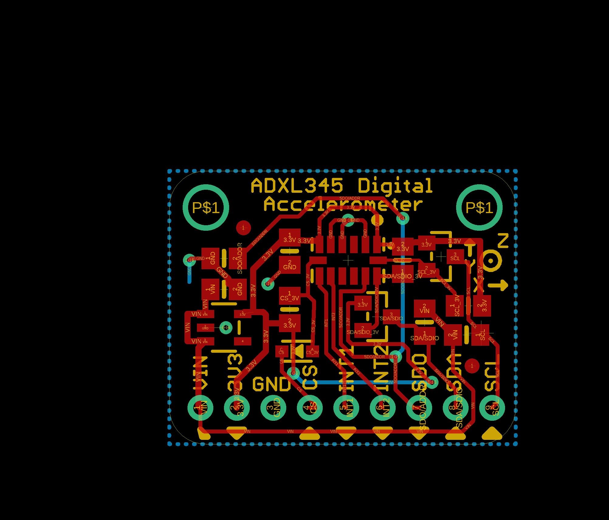
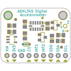
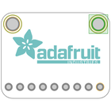
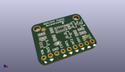
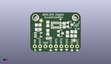
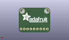
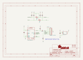
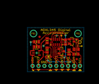
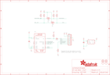

Contents
========

* [PRA1231B > ](#pra1231b--)
	* [Schematic](#schematic)
	* [PCB](#pcb)
	* [Interactive BOM](#interactive-bom)
	* [OOMP Parts](#oomp-parts)
	* [Images](#images)
	* [Tags](#tags)
  
![][im]
# PRA1231B > 

- ID: PROJ-ADAF-1231-STAN-0B
- Hex ID: PRA1231B
- Name: ADXL345 - Triple-Axis Accelerometer (+-2g/4g/8g/16g) Rev B
- Description: ADXL345 - Triple-Axis Accelerometer (+-2g/4g/8g/16g) Rev B
- Long Link: [http://oom.lt/PROJ-ADAF-1231-STAN-0B](http://oom.lt/PROJ-ADAF-1231-STAN-0B)
- Short Link: [http://oom.lt/PRA1231B](http://oom.lt/PRA1231B)

## Schematic
  

## PCB
  

## Interactive BOM

- Interactive BOM page: [ibom.html](https://htmlpreview.github.io/?https://github.com/oomlout/oomlout_OOMP_projects/blob/main/PROJ-ADAF-1231-STAN-0B/kicad/bom/ibom.html)

## OOMP Parts
  

|OOMP ID|Name|Identifier|
| :---: | :---: | :---: |
|[CAPC-0805-X-NF100-V50](https://github.com/oomlout/oomlout_OOMP_parts/tree/main/CAPC-0805-X-NF100-V50/)|[SMD (0805) 100 nF Capacitor (Ceramic) 50v](https://github.com/oomlout/oomlout_OOMP_parts/tree/main/CAPC-0805-X-NF100-V50/)|[C1](https://github.com/oomlout/oomlout_OOMP_parts/tree/main/CAPC-0805-X-NF100-V50/)|
|[CAPC-0805-X-UF10-V10](https://github.com/oomlout/oomlout_OOMP_parts/tree/main/CAPC-0805-X-UF10-V10/)|[SMD (0805) 10 uF Capacitor (Ceramic) 10v](https://github.com/oomlout/oomlout_OOMP_parts/tree/main/CAPC-0805-X-UF10-V10/)|[C3](https://github.com/oomlout/oomlout_OOMP_parts/tree/main/CAPC-0805-X-UF10-V10/)|
|[DIOD-S323-X-K4148-01](https://github.com/oomlout/oomlout_OOMP_parts/tree/main/DIOD-S323-X-K4148-01/)|[SMD (SOD-323) Diode](https://github.com/oomlout/oomlout_OOMP_parts/tree/main/DIOD-S323-X-K4148-01/)|[D1](https://github.com/oomlout/oomlout_OOMP_parts/tree/main/DIOD-S323-X-K4148-01/)|
|[HEAD-I01-X-PI09-01](https://github.com/oomlout/oomlout_OOMP_parts/tree/main/HEAD-I01-X-PI09-01/)|[2.54 mm 9 Pin Header](https://github.com/oomlout/oomlout_OOMP_parts/tree/main/HEAD-I01-X-PI09-01/)|[JP1](https://github.com/oomlout/oomlout_OOMP_parts/tree/main/HEAD-I01-X-PI09-01/)|
|[MOSN-SO23-X-KBSS138-01](https://github.com/oomlout/oomlout_OOMP_parts/tree/main/MOSN-SO23-X-KBSS138-01/)|[SMD (SOT-23) BSS138 N-Ch. MOSFET](https://github.com/oomlout/oomlout_OOMP_parts/tree/main/MOSN-SO23-X-KBSS138-01/)|[Q1, Q2](https://github.com/oomlout/oomlout_OOMP_parts/tree/main/MOSN-SO23-X-KBSS138-01/)|
|[RESE-0805-X-O103-01](https://github.com/oomlout/oomlout_OOMP_parts/tree/main/RESE-0805-X-O103-01/)|[SMD (0805) 10k Ohm Resistor](https://github.com/oomlout/oomlout_OOMP_parts/tree/main/RESE-0805-X-O103-01/)|[R1, R2, R3, R5, R6, R7](https://github.com/oomlout/oomlout_OOMP_parts/tree/main/RESE-0805-X-O103-01/)|
|[SENS-LG14-X-K345-01](https://github.com/oomlout/oomlout_OOMP_parts/tree/main/SENS-LG14-X-K345-01/)|[14 Pin SMD (LGA) Digital Accelerometer (ADXL345) Sensor](https://github.com/oomlout/oomlout_OOMP_parts/tree/main/SENS-LG14-X-K345-01/)|[U1](https://github.com/oomlout/oomlout_OOMP_parts/tree/main/SENS-LG14-X-K345-01/)|
|UNMATCHED-SO235-X-UNMATCHED-01||U2|

## Images
  
  

|bominteractivefront|bominteractiveback|kicadPcb3d|kicadPcb3dFront|kicadPcb3dBack|kicadschem|eagleImage|eagleSchemImage|
| :---: | :---: | :---: | :---: | :---: | :---: | :---: | :---: |
|||||||||

## Tags

- oompType: PROJ
- oompSize: ADAF
- oompColor: 1231
- oompDesc: STAN
- oompIndex: 0B
- name: ADXL345 - Triple-Axis Accelerometer (+-2g/4g/8g/16g) Rev B
- gitRepo: https://github.com/adafruit/Adafruit_ADXL345_PCB
- gitName: Adafruit_ADXL345_PCB
- eagleBoard: Adafruit ADXL345 Triple-Axis Accelerometer.brd
- eagleSchem: Adafruit ADXL345 Triple-Axis Accelerometer.sch
- hexID: PRA1231B
- oompID: PROJ-ADAF-1231-STAN-0B
- oompParts: C1,CAPC-0805-X-NF100-V50
- oompParts: C3,CAPC-0805-X-UF10-V10
- oompParts: D1,DIOD-S323-X-K4148-01
- oompParts: JP1,HEAD-I01-X-PI09-01
- oompParts: Q1,MOSN-SO23-X-KBSS138-01
- oompParts: Q2,MOSN-SO23-X-KBSS138-01
- oompParts: R1,RESE-0805-X-O103-01
- oompParts: R2,RESE-0805-X-O103-01
- oompParts: R3,RESE-0805-X-O103-01
- oompParts: R5,RESE-0805-X-O103-01
- oompParts: R6,RESE-0805-X-O103-01
- oompParts: R7,RESE-0805-X-O103-01
- oompParts: U1,SENS-LG14-X-K345-01
- oompParts: U2,UNMATCHED-SO235-X-UNMATCHED-01
- rawParts: C1,0.1uF,CAP_CERAMIC0805-NOOUTLINE,0805-NO,Ceramic Capacitors,,
- rawParts: C3,10µF,CAP_CERAMIC0805-NOOUTLINE,0805-NO,Ceramic Capacitors,,
- rawParts: D1,1N4148,DIODE_SOD323MINI,SOD-323_MINI,Diode,,
- rawParts: JP1,,HEADER-1X970MIL,1X09_ROUND_70,PIN HEADER,,
- rawParts: Q1,BSS138,MOSFET-NWIDE,SOT23-WIDE,N-Channel Mosfet,,
- rawParts: Q2,BSS138,MOSFET-NWIDE,SOT23-WIDE,N-Channel Mosfet,,
- rawParts: R1,10K,RESISTOR0805_NOOUTLINE,0805-NO,Resistors,,
- rawParts: R2,10K,RESISTOR0805_NOOUTLINE,0805-NO,Resistors,,
- rawParts: R3,10K,RESISTOR0805_NOOUTLINE,0805-NO,Resistors,,
- rawParts: R5,10K,RESISTOR0805_NOOUTLINE,0805-NO,Resistors,,
- rawParts: R6,10K,RESISTOR0805_NOOUTLINE,0805-NO,Resistors,,
- rawParts: R7,10K,RESISTOR0805_NOOUTLINE,0805-NO,Resistors,,
- rawParts: U$1,FIDUCIAL,FIDUCIAL,FIDUCIAL_1MM,For use by pick and place machines to calibrate the vision/machine, 1mm,,
- rawParts: U$3,FIDUCIAL,FIDUCIAL,FIDUCIAL_1MM,For use by pick and place machines to calibrate the vision/machine, 1mm,,
- rawParts: U$4,MOUNTINGHOLE2.5,MOUNTINGHOLE2.5,MOUNTINGHOLE_2.5_PLATED,Mounting Hole,EXCLUDE,
- rawParts: U$6,MOUNTINGHOLE2.5,MOUNTINGHOLE2.5,MOUNTINGHOLE_2.5_PLATED,Mounting Hole,EXCLUDE,
- rawParts: U1,,ACCEL_ADXL345,LGA14,ADXL345 - Digital 3-Axis Accelerometer (I2C/SPI),,
- rawParts: U2,,VREG_SOT23-5,SOT23-5,SOT23-5 Fixed Voltage Regulators,,

[im]: kicadPcb3d_450.png
