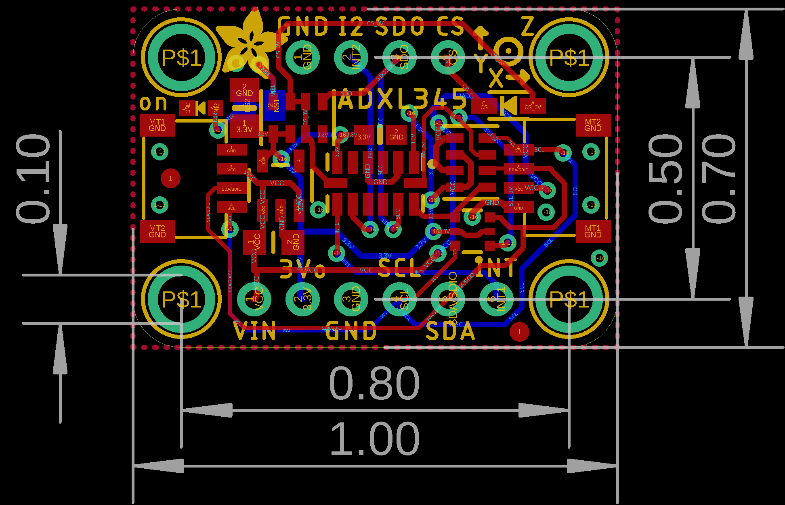
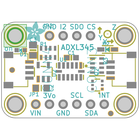
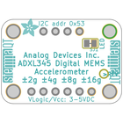
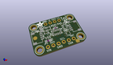
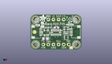
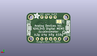
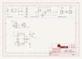
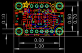
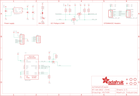

Contents
========

* [PRA1231C > ](#pra1231c--)
	* [Schematic](#schematic)
	* [PCB](#pcb)
	* [Interactive BOM](#interactive-bom)
	* [OOMP Parts](#oomp-parts)
	* [Images](#images)
	* [Tags](#tags)
  
![][im]
# PRA1231C > 

- ID: PROJ-ADAF-1231-STAN-0C
- Hex ID: PRA1231C
- Name: ADXL345 - Triple-Axis Accelerometer (+-2g/4g/8g/16g) Rev C
- Description: ADXL345 - Triple-Axis Accelerometer (+-2g/4g/8g/16g) Rev C
- Long Link: [http://oom.lt/PROJ-ADAF-1231-STAN-0C](http://oom.lt/PROJ-ADAF-1231-STAN-0C)
- Short Link: [http://oom.lt/PRA1231C](http://oom.lt/PRA1231C)

## Schematic
  

## PCB
  

## Interactive BOM

- Interactive BOM page: [ibom.html](https://htmlpreview.github.io/?https://github.com/oomlout/oomlout_OOMP_projects/blob/main/PROJ-ADAF-1231-STAN-0C/kicad/bom/ibom.html)

## OOMP Parts
  

|OOMP ID|Name|Identifier|
| :---: | :---: | :---: |
|[CAPC-0603-X-NF100-V50](https://github.com/oomlout/oomlout_OOMP_parts/tree/main/CAPC-0603-X-NF100-V50/)|[SMD (0603) 100 nF Capacitor (Ceramic) 50v](https://github.com/oomlout/oomlout_OOMP_parts/tree/main/CAPC-0603-X-NF100-V50/)|[C1](https://github.com/oomlout/oomlout_OOMP_parts/tree/main/CAPC-0603-X-NF100-V50/)|
|[CAPC-0805-X-UF10-V10](https://github.com/oomlout/oomlout_OOMP_parts/tree/main/CAPC-0805-X-UF10-V10/)|[SMD (0805) 10 uF Capacitor (Ceramic) 10v](https://github.com/oomlout/oomlout_OOMP_parts/tree/main/CAPC-0805-X-UF10-V10/)|[C2, C3](https://github.com/oomlout/oomlout_OOMP_parts/tree/main/CAPC-0805-X-UF10-V10/)|
|[HEAD-JSTSH-X-PI04-RS](https://github.com/oomlout/oomlout_OOMP_parts/tree/main/HEAD-JSTSH-X-PI04-RS/)|[JST XH (1 mm) 4 Pin Header Right Angle (SMD)](https://github.com/oomlout/oomlout_OOMP_parts/tree/main/HEAD-JSTSH-X-PI04-RS/)|[CONN3, CONN4](https://github.com/oomlout/oomlout_OOMP_parts/tree/main/HEAD-JSTSH-X-PI04-RS/)|
|[LEDS-0603-G-STAN-01](https://github.com/oomlout/oomlout_OOMP_parts/tree/main/LEDS-0603-G-STAN-01/)|[SMD (0603) Green LED](https://github.com/oomlout/oomlout_OOMP_parts/tree/main/LEDS-0603-G-STAN-01/)|[D1](https://github.com/oomlout/oomlout_OOMP_parts/tree/main/LEDS-0603-G-STAN-01/)|
|[DIOD-S323-X-K4148-01](https://github.com/oomlout/oomlout_OOMP_parts/tree/main/DIOD-S323-X-K4148-01/)|[SMD (SOD-323) Diode](https://github.com/oomlout/oomlout_OOMP_parts/tree/main/DIOD-S323-X-K4148-01/)|[D2](https://github.com/oomlout/oomlout_OOMP_parts/tree/main/DIOD-S323-X-K4148-01/)|
|[HEAD-I01-X-PI06-01](https://github.com/oomlout/oomlout_OOMP_parts/tree/main/HEAD-I01-X-PI06-01/)|[2.54 mm 6 Pin Header](https://github.com/oomlout/oomlout_OOMP_parts/tree/main/HEAD-I01-X-PI06-01/)|[JP1](https://github.com/oomlout/oomlout_OOMP_parts/tree/main/HEAD-I01-X-PI06-01/)|
|[HEAD-I01-X-PI04-01](https://github.com/oomlout/oomlout_OOMP_parts/tree/main/HEAD-I01-X-PI04-01/)|[2.54 mm 4 Pin Header](https://github.com/oomlout/oomlout_OOMP_parts/tree/main/HEAD-I01-X-PI04-01/)|[JP2](https://github.com/oomlout/oomlout_OOMP_parts/tree/main/HEAD-I01-X-PI04-01/)|
|[MOSN-SO363-X-KBSS138-01](https://github.com/oomlout/oomlout_OOMP_parts/tree/main/MOSN-SO363-X-KBSS138-01/)|[SMD (SOT-363) BSS138 N-Ch. MOSFET](https://github.com/oomlout/oomlout_OOMP_parts/tree/main/MOSN-SO363-X-KBSS138-01/)|[Q2](https://github.com/oomlout/oomlout_OOMP_parts/tree/main/MOSN-SO363-X-KBSS138-01/)|
|[RESA-06038-X-O103X4-01](https://github.com/oomlout/oomlout_OOMP_parts/tree/main/RESA-06038-X-O103X4-01/)|[SMD (0603-8) 10k Ohm (x4) Resistor Array](https://github.com/oomlout/oomlout_OOMP_parts/tree/main/RESA-06038-X-O103X4-01/)|[R1, R3](https://github.com/oomlout/oomlout_OOMP_parts/tree/main/RESA-06038-X-O103X4-01/)|
|[SENS-LG14-X-K345-01](https://github.com/oomlout/oomlout_OOMP_parts/tree/main/SENS-LG14-X-K345-01/)|[14 Pin SMD (LGA) Digital Accelerometer (ADXL345) Sensor](https://github.com/oomlout/oomlout_OOMP_parts/tree/main/SENS-LG14-X-K345-01/)|[U1](https://github.com/oomlout/oomlout_OOMP_parts/tree/main/SENS-LG14-X-K345-01/)|
|[VREG-SO235-X-KAP2112K-V33D](https://github.com/oomlout/oomlout_OOMP_parts/tree/main/VREG-SO235-X-KAP2112K-V33D/)|[SMD (SOT-23-5) AP2112K Voltage Regulator 3.3v](https://github.com/oomlout/oomlout_OOMP_parts/tree/main/VREG-SO235-X-KAP2112K-V33D/)|[U2](https://github.com/oomlout/oomlout_OOMP_parts/tree/main/VREG-SO235-X-KAP2112K-V33D/)|

## Images
  
  

|bominteractivefront|bominteractiveback|kicadPcb3d|kicadPcb3dFront|kicadPcb3dBack|kicadschem|eagleImage|eagleSchemImage|
| :---: | :---: | :---: | :---: | :---: | :---: | :---: | :---: |
|||||||||

## Tags

- oompType: PROJ
- oompSize: ADAF
- oompColor: 1231
- oompDesc: STAN
- oompIndex: 0C
- name: ADXL345 - Triple-Axis Accelerometer (+-2g/4g/8g/16g) Rev C
- gitRepo: https://github.com/adafruit/Adafruit_ADXL345_PCB
- gitName: Adafruit_ADXL345_PCB
- eagleBoard: ADXL345 STEMMA QT.brd
- eagleSchem: ADXL345 STEMMA QT.sch
- hexID: PRA1231C
- oompID: PROJ-ADAF-1231-STAN-0C
- oompParts: C1,CAPC-0603-X-NF100-V50
- oompParts: C2,CAPC-0805-X-UF10-V10
- oompParts: C3,CAPC-0805-X-UF10-V10
- oompParts: CONN3,HEAD-JSTSH-X-PI04-RS
- oompParts: CONN4,HEAD-JSTSH-X-PI04-RS
- oompParts: D1,LEDS-0603-G-STAN-01
- oompParts: D2,DIOD-S323-X-K4148-01
- oompParts: JP1,HEAD-I01-X-PI06-01
- oompParts: JP2,HEAD-I01-X-PI04-01
- oompParts: Q2,MOSN-SO363-X-KBSS138-01
- oompParts: R1,RESA-06038-X-O103X4-01
- oompParts: R3,RESA-06038-X-O103X4-01
- oompParts: U1,SENS-LG14-X-K345-01
- oompParts: U2,VREG-SO235-X-KAP2112K-V33D
- rawParts: C1,0.1uF,CAP_CERAMIC0603_NO,0603-NO,Ceramic Capacitors,,
- rawParts: C2,10uF,CAP_CERAMIC_0805MP,_0805MP,Ceramic Capacitors,,
- rawParts: C3,10uF,CAP_CERAMIC0805-NOOUTLINE,0805-NO,Ceramic Capacitors,,
- rawParts: CONN3,STEMMA_I2C_QT,STEMMA_I2C_QT,JST_SH4,,,
- rawParts: CONN4,STEMMA_I2C_QT,STEMMA_I2C_QT,JST_SH4,,,
- rawParts: D1,GREEN,LED0603_NOOUTLINE,CHIPLED_0603_NOOUTLINE,LED,,
- rawParts: D2,1N4148,DIODESOD-323,SOD-323,Diode,,
- rawParts: FID3,FIDUCIAL_1MM,FIDUCIAL_1MM,FIDUCIAL_1MM,Fiducial Alignment Points,EXCLUDE,
- rawParts: FID4,FIDUCIAL_1MM,FIDUCIAL_1MM,FIDUCIAL_1MM,Fiducial Alignment Points,EXCLUDE,
- rawParts: JP1,,HEADER-1X670MIL,1X06_ROUND_70,PIN HEADER,,
- rawParts: JP2,,HEADER-1X4ROUND,1X04_ROUND,PIN HEADER,,
- rawParts: Q2,BSS138,MOSFET-N_DUAL,SOT363,Dual N-Channel MOSFET,,
- rawParts: R1,10K,RESISTOR_4PACK,RESPACK_4X0603,Resistor Packs (4 resistors),,
- rawParts: R3,10K,RESISTOR_4PACK,RESPACK_4X0603,Resistor Packs (4 resistors),,
- rawParts: SJ1,,SOLDERJUMPERCLOSED,SOLDERJUMPER_CLOSEDWIRE,SMD Solder JUMPER,,
- rawParts: U$1,MOUNTINGHOLE2.5,MOUNTINGHOLE2.5,MOUNTINGHOLE_2.5_PLATED,Mounting Hole,EXCLUDE,
- rawParts: U$17,MOUNTINGHOLE2.5,MOUNTINGHOLE2.5,MOUNTINGHOLE_2.5_PLATED,Mounting Hole,EXCLUDE,
- rawParts: U$19,MOUNTINGHOLE2.5,MOUNTINGHOLE2.5,MOUNTINGHOLE_2.5_PLATED,Mounting Hole,EXCLUDE,
- rawParts: U$21,MOUNTINGHOLE2.5,MOUNTINGHOLE2.5,MOUNTINGHOLE_2.5_PLATED,Mounting Hole,EXCLUDE,
- rawParts: U1,ADXL343,ACCEL_ADXL343,LGA14,ADXL343 - Digital Accelerometer 2/4/8/16g,,
- rawParts: U2,AP2112K-3.3,VREG_SOT23-5,SOT23-5,SOT23-5 Fixed Voltage Regulators,,

[im]: kicadPcb3d_450.png
