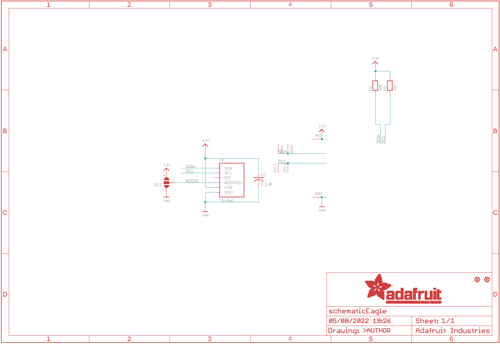
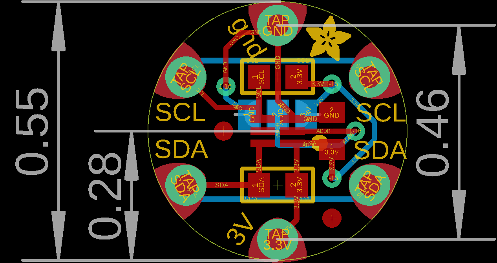
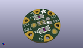
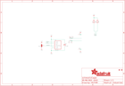

Contents
========

* [PRA1246 > Adafruit Flora TSL2561 Lux Sensor PCB](#pra1246--adafruit-flora-tsl2561-lux-sensor-pcb)
	* [Schematic](#schematic)
	* [PCB](#pcb)
	* [Interactive BOM](#interactive-bom)
	* [OOMP Parts](#oomp-parts)
	* [Images](#images)
	* [Tags](#tags)
  
![][im]
# PRA1246 > Adafruit Flora TSL2561 Lux Sensor PCB

- ID: PROJ-ADAF-1246-STAN-01
- Hex ID: PRA1246
- Name: Adafruit
- Description: Adafruit
- Long Link: [http://oom.lt/PROJ-ADAF-1246-STAN-01](http://oom.lt/PROJ-ADAF-1246-STAN-01)
- Short Link: [http://oom.lt/PRA1246](http://oom.lt/PRA1246)

## Schematic
  

## PCB
  

## Interactive BOM

- Interactive BOM page: [ibom.html](https://htmlpreview.github.io/?https://github.com/oomlout/oomlout_OOMP_projects/blob/main/PROJ-ADAF-1246-STAN-01/kicad/bom/ibom.html)

## OOMP Parts
  

|OOMP Parts|
| :---: |
|C1 C1,CAPC-0805-X-UF1D-01|
|[R2 RESE-0805-X-O103-01 SMD (0805) 10k Ohm Resistor](https://github.com/oomlout/oomlout_OOMP_parts/tree/main/RESE-0805-X-O103-01/)|
|[R3 RESE-0805-X-O103-01 SMD (0805) 10k Ohm Resistor](https://github.com/oomlout/oomlout_OOMP_parts/tree/main/RESE-0805-X-O103-01/)|
|SJ1 SJ1,UNMATCHED-UNMATCHED-X-UNMATCHED-01|
|U2 U2,UNMATCHED-UNMATCHED-X-UNMATCHED-01|

## Images
  
  

|kicadPcb3d|kicadPcb3dFront|kicadPcb3dBack|eagleImage|eagleSchemImage|
| :---: | :---: | :---: | :---: | :---: |
||||||

## Tags

- hexID: PRA1246
- oompType: PROJ
- oompSize: ADAF
- oompColor: 1246
- oompDesc: STAN
- oompIndex: 01
- oompName: Adafruit Flora TSL2561 Lux Sensor PCB
- sources: All source files from https://github.com/adafruit/Adafruit-Flora-TSL2561-Lux-Sensor-PCB (source licence details in srcLicense.md)
- linkBuyPage: http://www.adafruit.com/products/1246
- oompID: PROJ-ADAF-1246-STAN-01
- oompParts: C1,CAPC-0805-X-UF1D-01
- oompParts: R2,RESE-0805-X-O103-01
- oompParts: R3,RESE-0805-X-O103-01
- oompParts: SJ1,UNMATCHED-UNMATCHED-X-UNMATCHED-01
- oompParts: U2,UNMATCHED-UNMATCHED-X-UNMATCHED-01
- rawParts: C1,0.1uF,C-USC0805K,C0805K,CAPACITOR, American symbol,,
- rawParts: FID1,FIDUCIAL,FIDUCIAL,FIDUCIAL_1MM,Fiducial Alignment Points,EXCLUDE,
- rawParts: FID2,FIDUCIAL,FIDUCIAL,FIDUCIAL_1MM,Fiducial Alignment Points,EXCLUDE,
- rawParts: GND,SEWTAP0.5IN,SEWTAP0.5IN,SEWINGTAP_0.5,,,
- rawParts: R2,10K,RESISTOR_0805,_0805,Resistors,,
- rawParts: R3,10K,RESISTOR_0805,_0805,Resistors,,
- rawParts: SCL1,SEWTAP0.5IN,SEWTAP0.5IN,SEWINGTAP_0.5,,,
- rawParts: SCL2,SEWTAP0.5IN,SEWTAP0.5IN,SEWINGTAP_0.5,,,
- rawParts: SDA1,SEWTAP0.5IN,SEWTAP0.5IN,SEWINGTAP_0.5,,,
- rawParts: SDA2,SEWTAP0.5IN,SEWTAP0.5IN,SEWINGTAP_0.5,,,
- rawParts: SJ1,,SJ2W,SJ_2,SMD solder JUMPER,,
- rawParts: U2,TSL2561,TSL2561,TSL2561_FN,TSL2561 Light-To-Digital Sensor,,
- rawParts: VCC,SEWTAP0.5IN,SEWTAP0.5IN,SEWINGTAP_0.5,,,

[im]: kicadPcb3d_450.png
