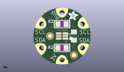

Contents
========

* [PROJ-ADAF-1246-STAN-01>Adafruit Flora TSL2561 Lux Sensor PCB](#proj-adaf-1246-stan-01adafruit-flora-tsl2561-lux-sensor-pcb)
	* [Images](#images)
	* [Interactive BOM](#interactive-bom)
	* [Tags](#tags)
  
![][im]
# PROJ-ADAF-1246-STAN-01>Adafruit Flora TSL2561 Lux Sensor PCB

- ID: PROJ-ADAF-1246-STAN-01
- Hex ID: PRA1246
- Name: Adafruit Flora TSL2561 Lux Sensor PCB
- Description: 

## Images
  
  

|eagleImage|kicadPcb3dFront|kicadPcb3dBack|kicadPcb3d|
| :---: | :---: | :---: | :---: |
|||||

## Interactive BOM

- Interactive BOM page: [ibom.html](kicad/bom/ibom.html)

## Tags

- hexID: PRA1246
- oompType: PROJ
- oompSize: ADAF
- oompColor: 1246
- oompDesc: STAN
- oompIndex: 01
- oompName: Adafruit Flora TSL2561 Lux Sensor PCB
- sources: All source files from https://github.com/adafruit/Adafruit-Flora-TSL2561-Lux-Sensor-PCB (source licence details in srcLicense.md)
- linkBuyPage: http://www.adafruit.com/products/1246
- oompID: PROJ-ADAF-1246-STAN-01
- oompParts: C1,UNMATCHED-UNMATCHED-UNMATCHED-UNMATCHED-UNMATCHED
- oompParts: GND,UNMATCHED-UNMATCHED-UNMATCHED-UNMATCHED-UNMATCHED
- oompParts: R2,UNMATCHED-UNMATCHED-UNMATCHED-UNMATCHED-UNMATCHED
- oompParts: R3,UNMATCHED-UNMATCHED-UNMATCHED-UNMATCHED-UNMATCHED
- oompParts: SCL1,UNMATCHED-UNMATCHED-UNMATCHED-UNMATCHED-UNMATCHED
- oompParts: SCL2,UNMATCHED-UNMATCHED-UNMATCHED-UNMATCHED-UNMATCHED
- oompParts: SDA1,UNMATCHED-UNMATCHED-UNMATCHED-UNMATCHED-UNMATCHED
- oompParts: SDA2,UNMATCHED-UNMATCHED-UNMATCHED-UNMATCHED-UNMATCHED
- oompParts: SJ1,UNMATCHED-UNMATCHED-UNMATCHED-UNMATCHED-UNMATCHED
- oompParts: U2,UNMATCHED-UNMATCHED-UNMATCHED-UNMATCHED-UNMATCHED
- oompParts: VCC,UNMATCHED-UNMATCHED-UNMATCHED-UNMATCHED-UNMATCHED
- rawParts: C1,0.1uF,C-USC0805K,C0805K,CAPACITOR, American symbol,,
- rawParts: FID1,FIDUCIAL,FIDUCIAL,FIDUCIAL_1MM,Fiducial Alignment Points,EXCLUDE,
- rawParts: FID2,FIDUCIAL,FIDUCIAL,FIDUCIAL_1MM,Fiducial Alignment Points,EXCLUDE,
- rawParts: GND,SEWTAP0.5IN,SEWTAP0.5IN,SEWINGTAP_0.5,,,
- rawParts: R2,10K,RESISTOR_0805,_0805,Resistors,,
- rawParts: R3,10K,RESISTOR_0805,_0805,Resistors,,
- rawParts: SCL1,SEWTAP0.5IN,SEWTAP0.5IN,SEWINGTAP_0.5,,,
- rawParts: SCL2,SEWTAP0.5IN,SEWTAP0.5IN,SEWINGTAP_0.5,,,
- rawParts: SDA1,SEWTAP0.5IN,SEWTAP0.5IN,SEWINGTAP_0.5,,,
- rawParts: SDA2,SEWTAP0.5IN,SEWTAP0.5IN,SEWINGTAP_0.5,,,
- rawParts: SJ1,,SJ2W,SJ_2,SMD solder JUMPER,,
- rawParts: U2,TSL2561,TSL2561,TSL2561_FN,TSL2561 Light-To-Digital Sensor,,
- rawParts: VCC,SEWTAP0.5IN,SEWTAP0.5IN,SEWINGTAP_0.5,,,

[im]: kicadPcb3d_450.png
