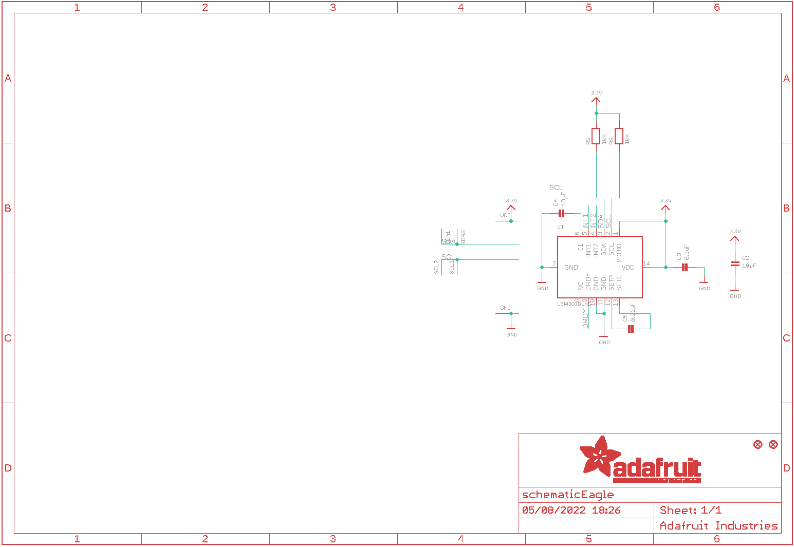
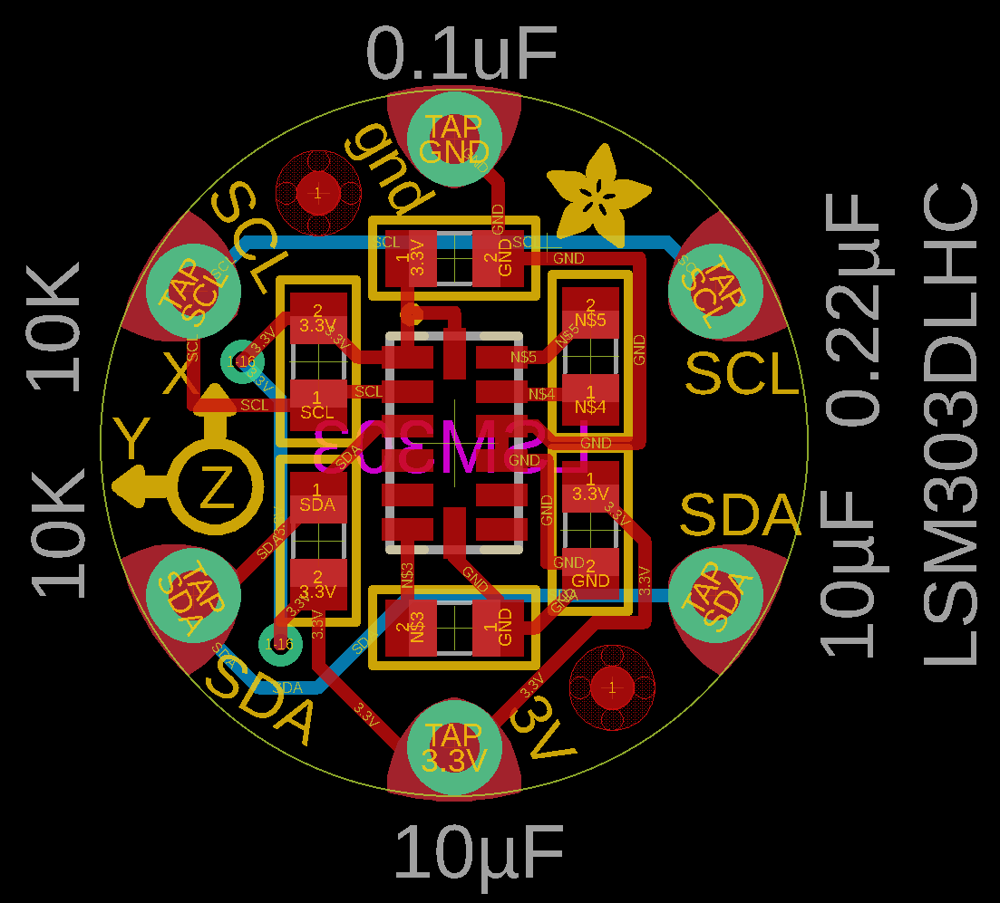
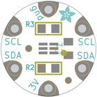
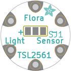
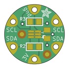
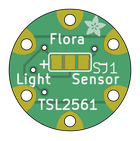

Contents
========

* [PRA1247 > Adafruit Flora LSM303 PCB](#pra1247--adafruit-flora-lsm303-pcb)
	* [Schematic](#schematic)
	* [PCB](#pcb)
	* [Interactive BOM](#interactive-bom)
	* [OOMP Parts](#oomp-parts)
	* [Images](#images)
	* [Tags](#tags)
  
![][im]
# PRA1247 > Adafruit Flora LSM303 PCB

- ID: PROJ-ADAF-1247-STAN-01
- Hex ID: PRA1247
- Name: Adafruit
- Description: Adafruit
- Long Link: [http://oom.lt/PROJ-ADAF-1247-STAN-01](http://oom.lt/PROJ-ADAF-1247-STAN-01)
- Short Link: [http://oom.lt/PRA1247](http://oom.lt/PRA1247)

## Schematic
  

## PCB
  

## Interactive BOM

- Interactive BOM page: [ibom.html](https://htmlpreview.github.io/?https://github.com/oomlout/oomlout_OOMP_projects/blob/main/PROJ-ADAF-1247-STAN-01/kicad/bom/ibom.html)

## OOMP Parts
  

|OOMP Parts|
| :---: |
|[CAPC-0805-X-UF10-V10  SMD (0805) 10 uF Capacitor (Ceramic) 10v  C2, C4](https://github.com/oomlout/oomlout_OOMP_parts/tree/main/CAPC-0805-X-UF10-V10/)|
|[CAPC-0805-X-NF100-V50  SMD (0805) 100 nF Capacitor (Ceramic) 50v  C3](https://github.com/oomlout/oomlout_OOMP_parts/tree/main/CAPC-0805-X-NF100-V50/)|
|CAPC-0805-X-NF220-01 C5|
|[RESE-0805-X-O103-01  SMD (0805) 10k Ohm Resistor  R2, R3](https://github.com/oomlout/oomlout_OOMP_parts/tree/main/RESE-0805-X-O103-01/)|
|UNMATCHED-UNMATCHED-X-UNMATCHED-01 U1|

## Images
  
  

|bominteractivefront|bominteractiveback|kicadPcb3d|kicadPcb3dFront|kicadPcb3dBack|eagleImage|eagleSchemImage|pcbdraw|pcbdrawback|
| :---: | :---: | :---: | :---: | :---: | :---: | :---: | :---: | :---: |
||||||||||

## Tags

- hexID: PRA1247
- oompType: PROJ
- oompSize: ADAF
- oompColor: 1247
- oompDesc: STAN
- oompIndex: 01
- oompName: Adafruit Flora LSM303 PCB
- sources: All source files from https://github.com/adafruit/Adafruit-Flora-LSM303-PCB (source licence details in srcLicense.md)
- linkBuyPage: http://www.adafruit.com/products/1247
- oompID: PROJ-ADAF-1247-STAN-01
- oompParts: C2,CAPC-0805-X-UF10-V10
- oompParts: C3,CAPC-0805-X-NF100-V50
- oompParts: C4,CAPC-0805-X-UF10-V10
- oompParts: C5,CAPC-0805-X-NF220-01
- oompParts: R2,RESE-0805-X-O103-01
- oompParts: R3,RESE-0805-X-O103-01
- oompParts: U1,UNMATCHED-UNMATCHED-X-UNMATCHED-01
- rawParts: C2,10µF,CAP_CERAMIC_0805,_0805,Ceramic Capacitors,,
- rawParts: C3,0.1uF,CAP_CERAMIC_0805,_0805,Ceramic Capacitors,,
- rawParts: C4,10µF,CAP_CERAMIC_0805,_0805,Ceramic Capacitors,,
- rawParts: C5,0.22µF,CAP_CERAMIC_0805,_0805,Ceramic Capacitors,,
- rawParts: FID1,FIDUCIAL,FIDUCIAL,FIDUCIAL_1MM,Fiducial Alignment Points,,
- rawParts: FID2,FIDUCIAL,FIDUCIAL,FIDUCIAL_1MM,Fiducial Alignment Points,,
- rawParts: GND,SEWTAP0.5IN,SEWTAP0.5IN,SEWINGTAP_0.5,,,
- rawParts: R2,10K,RESISTOR_0805,_0805,Resistors,,
- rawParts: R3,10K,RESISTOR_0805,_0805,Resistors,,
- rawParts: SCL1,SEWTAP0.5IN,SEWTAP0.5IN,SEWINGTAP_0.5,,,
- rawParts: SCL2,SEWTAP0.5IN,SEWTAP0.5IN,SEWINGTAP_0.5,,,
- rawParts: SDA1,SEWTAP0.5IN,SEWTAP0.5IN,SEWINGTAP_0.5,,,
- rawParts: SDA2,SEWTAP0.5IN,SEWTAP0.5IN,SEWINGTAP_0.5,,,
- rawParts: U1,LSM303DLHC,LSM303DLHC,LGA14,LSM303DLHC 3-Axis I2C Accelerometer and 3-Axis Magnetometer,,
- rawParts: VCC,SEWTAP0.5IN,SEWTAP0.5IN,SEWINGTAP_0.5,,,

[im]: kicadPcb3d_450.png
