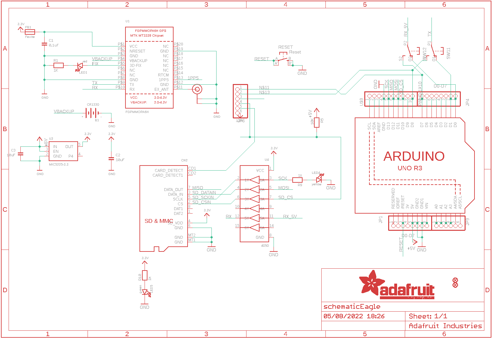
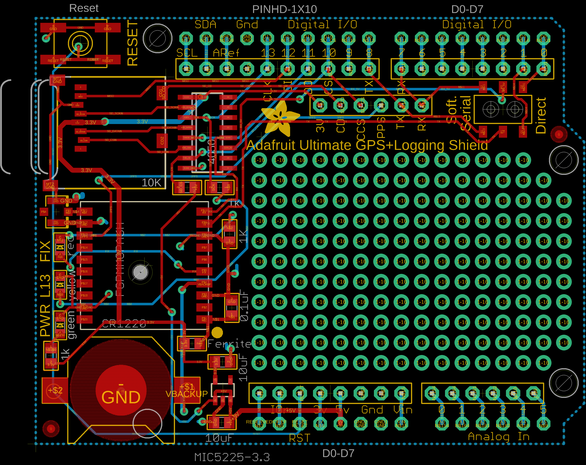
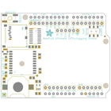
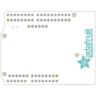
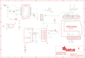
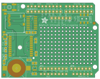
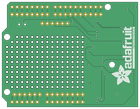

Contents
========

* [PRA1272 > Adafruit GPS Logger Shield PCB](#pra1272--adafruit-gps-logger-shield-pcb)
	* [Schematic](#schematic)
	* [PCB](#pcb)
	* [Interactive BOM](#interactive-bom)
	* [OOMP Parts](#oomp-parts)
	* [Images](#images)
	* [Tags](#tags)
  
![][im]
# PRA1272 > Adafruit GPS Logger Shield PCB

- ID: PROJ-ADAF-1272-STAN-01
- Hex ID: PRA1272
- Name: Adafruit
- Description: Adafruit
- Long Link: [http://oom.lt/PROJ-ADAF-1272-STAN-01](http://oom.lt/PROJ-ADAF-1272-STAN-01)
- Short Link: [http://oom.lt/PRA1272](http://oom.lt/PRA1272)

## Schematic
  

## PCB
  

## Interactive BOM

- Interactive BOM page: [ibom.html](https://htmlpreview.github.io/?https://github.com/oomlout/oomlout_OOMP_projects/blob/main/PROJ-ADAF-1272-STAN-01/kicad/bom/ibom.html)

## OOMP Parts
  

|OOMP ID|Name|Identifier|
| :---: | :---: | :---: |
|UNMATCHED-UNMATCHED-X-UNMATCHED-01||B1, CN2, SW1, U$20, U1, U3, U4|
|CAPC-UNMATCHED-X-NF100-01||C1|
|CAPC-UNMATCHED-X-UF10-01||C2, C3|
|FERB-UNMATCHED-X-UNMATCHED-01||FB1|
|[HEAD-I01-X-PI08-01](https://github.com/oomlout/oomlout_OOMP_parts/tree/main/HEAD-I01-X-PI08-01/)|[2.54 mm 8 Pin Header](https://github.com/oomlout/oomlout_OOMP_parts/tree/main/HEAD-I01-X-PI08-01/)|[JP1, JP4](https://github.com/oomlout/oomlout_OOMP_parts/tree/main/HEAD-I01-X-PI08-01/)|
|[HEAD-I01-X-PI06-01](https://github.com/oomlout/oomlout_OOMP_parts/tree/main/HEAD-I01-X-PI06-01/)|[2.54 mm 6 Pin Header](https://github.com/oomlout/oomlout_OOMP_parts/tree/main/HEAD-I01-X-PI06-01/)|[JP6, JP9](https://github.com/oomlout/oomlout_OOMP_parts/tree/main/HEAD-I01-X-PI06-01/)|
|[LEDS-0805-R-STAN-01](https://github.com/oomlout/oomlout_OOMP_parts/tree/main/LEDS-0805-R-STAN-01/)|[SMD (0805) Red LED](https://github.com/oomlout/oomlout_OOMP_parts/tree/main/LEDS-0805-R-STAN-01/)|[LED1](https://github.com/oomlout/oomlout_OOMP_parts/tree/main/LEDS-0805-R-STAN-01/)|
|[LEDS-0805-Y-STAN-01](https://github.com/oomlout/oomlout_OOMP_parts/tree/main/LEDS-0805-Y-STAN-01/)|[SMD (0805) Yellow LED](https://github.com/oomlout/oomlout_OOMP_parts/tree/main/LEDS-0805-Y-STAN-01/)|[LED4](https://github.com/oomlout/oomlout_OOMP_parts/tree/main/LEDS-0805-Y-STAN-01/)|
|[LEDS-0805-G-STAN-01](https://github.com/oomlout/oomlout_OOMP_parts/tree/main/LEDS-0805-G-STAN-01/)|[SMD (0805) Green LED](https://github.com/oomlout/oomlout_OOMP_parts/tree/main/LEDS-0805-G-STAN-01/)|[LED5](https://github.com/oomlout/oomlout_OOMP_parts/tree/main/LEDS-0805-G-STAN-01/)|
|[RESE-0805-X-O102-01](https://github.com/oomlout/oomlout_OOMP_parts/tree/main/RESE-0805-X-O102-01/)|[SMD (0805) 1k Ohm Resistor](https://github.com/oomlout/oomlout_OOMP_parts/tree/main/RESE-0805-X-O102-01/)|[R1, R9, R10](https://github.com/oomlout/oomlout_OOMP_parts/tree/main/RESE-0805-X-O102-01/)|
|[RESE-0805-X-O103-01](https://github.com/oomlout/oomlout_OOMP_parts/tree/main/RESE-0805-X-O103-01/)|[SMD (0805) 10k Ohm Resistor](https://github.com/oomlout/oomlout_OOMP_parts/tree/main/RESE-0805-X-O103-01/)|[R5](https://github.com/oomlout/oomlout_OOMP_parts/tree/main/RESE-0805-X-O103-01/)|
|[BUTA-6060-X-STAN-01](https://github.com/oomlout/oomlout_OOMP_parts/tree/main/BUTA-6060-X-STAN-01/)|[SMD (6060) Pushbutton (Tactile)](https://github.com/oomlout/oomlout_OOMP_parts/tree/main/BUTA-6060-X-STAN-01/)|[RESET](https://github.com/oomlout/oomlout_OOMP_parts/tree/main/BUTA-6060-X-STAN-01/)|
|[HEAD-I01-X-PI10-01](https://github.com/oomlout/oomlout_OOMP_parts/tree/main/HEAD-I01-X-PI10-01/)|[2.54 mm 10 Pin Header](https://github.com/oomlout/oomlout_OOMP_parts/tree/main/HEAD-I01-X-PI10-01/)|[U$9](https://github.com/oomlout/oomlout_OOMP_parts/tree/main/HEAD-I01-X-PI10-01/)|
|[VREG-SO235-X-KMIC5225-V33D](https://github.com/oomlout/oomlout_OOMP_parts/tree/main/VREG-SO235-X-KMIC5225-V33D/)|[SMD (SOT-23-5) MIC5225 Voltage Regulator 3.3v](https://github.com/oomlout/oomlout_OOMP_parts/tree/main/VREG-SO235-X-KMIC5225-V33D/)|[U2](https://github.com/oomlout/oomlout_OOMP_parts/tree/main/VREG-SO235-X-KMIC5225-V33D/)|

## Images
  
  

|bominteractivefront|bominteractiveback|kicadPcb3d|kicadPcb3dFront|kicadPcb3dBack|eagleImage|eagleSchemImage|pcbdraw|pcbdrawback|
| :---: | :---: | :---: | :---: | :---: | :---: | :---: | :---: | :---: |
||||||||||

## Tags

- hexID: PRA1272
- oompType: PROJ
- oompSize: ADAF
- oompColor: 1272
- oompDesc: STAN
- oompIndex: 01
- oompName: Adafruit GPS Logger Shield PCB
- sources: All source files from https://github.com/adafruit/Adafruit-GPS-Logger-Shield-PCB (source licence details in srcLicense.md)
- linkBuyPage: http://www.adafruit.com/products/1272
- oompID: PROJ-ADAF-1272-STAN-01
- oompParts: B1,UNMATCHED-UNMATCHED-X-UNMATCHED-01
- oompParts: C1,CAPC-UNMATCHED-X-NF100-01
- oompParts: C2,CAPC-UNMATCHED-X-UF10-01
- oompParts: C3,CAPC-UNMATCHED-X-UF10-01
- oompParts: CN2,UNMATCHED-UNMATCHED-X-UNMATCHED-01
- oompParts: FB1,FERB-UNMATCHED-X-UNMATCHED-01
- oompParts: JP1,HEAD-I01-X-PI08-01
- oompParts: JP4,HEAD-I01-X-PI08-01
- oompParts: JP6,HEAD-I01-X-PI06-01
- oompParts: JP9,HEAD-I01-X-PI06-01
- oompParts: LED1,LEDS-0805-R-STAN-01
- oompParts: LED4,LEDS-0805-Y-STAN-01
- oompParts: LED5,LEDS-0805-G-STAN-01
- oompParts: R1,RESE-0805-X-O102-01
- oompParts: R5,RESE-0805-X-O103-01
- oompParts: R9,RESE-0805-X-O102-01
- oompParts: R10,RESE-0805-X-O102-01
- oompParts: RESET,BUTA-6060-X-STAN-01
- oompParts: SW1,UNMATCHED-UNMATCHED-X-UNMATCHED-01
- oompParts: U$9,HEAD-I01-X-PI10-01
- oompParts: U$20,UNMATCHED-UNMATCHED-X-UNMATCHED-01
- oompParts: U1,UNMATCHED-UNMATCHED-X-UNMATCHED-01
- oompParts: U2,VREG-SO235-X-KMIC5225-V33D
- oompParts: U3,UNMATCHED-UNMATCHED-X-UNMATCHED-01
- oompParts: U4,UNMATCHED-UNMATCHED-X-UNMATCHED-01
- rawParts: B1,CR1220,BATTERYCR1220_SMT,CR1220,,,
- rawParts: C1,0.1uF,CAP_CERAMIC0805,0805@1,Ceramic Capacitors,,
- rawParts: C2,10uF,CAP_CERAMIC0805,0805@1,Ceramic Capacitors,,
- rawParts: C3,10uF,CAP_CERAMIC0805,0805@1,Ceramic Capacitors,,
- rawParts: CN2,,MICROSD,MICROSD,MicroSD/Transflash Card Holder with SPI pinout,,
- rawParts: FB1,Ferrite,FERRITE0805,0805@1,Ferrite Bead,,
- rawParts: FID1,FIDUCIAL,FIDUCIAL,FIDUCIAL_1MM,Fiducial Alignment Points,,
- rawParts: FID2,FIDUCIAL,FIDUCIAL,FIDUCIAL_1MM,Fiducial Alignment Points,,
- rawParts: JP1,D0-D7,PINHD-1X8BIG,1X08-BIG,PIN HEADER,,
- rawParts: JP4,D0-D7,PINHD-1X8BIG,1X08-BIG,PIN HEADER,,
- rawParts: JP6,,PINHD-1X6B,1X06-BIG,PIN HEADER,,
- rawParts: JP9,,PINHD-1X6B,1X06-BIG,PIN HEADER,,
- rawParts: LED1,red,LED0805,CHIPLED_0805,LED,,
- rawParts: LED4,yellow,LED0805,CHIPLED_0805,LED,,
- rawParts: LED5,green,LED0805,CHIPLED_0805,LED,,
- rawParts: R1,1K,RESISTOR0805,0805,Resistors,,
- rawParts: R5,10K,RESISTOR0805,0805,Resistors,,
- rawParts: R9,1k,RESISTOR0805,0805,Resistors,,
- rawParts: R10,1k,RESISTOR0805,0805,Resistors,,
- rawParts: RESET,Reset,SPST_TACT-EVQQ2,EVQ-Q2,SMT 6mm switch, EVQQ2 series,,
- rawParts: SW1,,DPDT-EG1390,EG1390,,,
- rawParts: U$9,PINHD-1X10,PINHD-1X10,1X10-BIG,Pin header 1x10 0.1 spacing,,
- rawParts: U$20,U.FL,U.FL,U.FL,U.FL Antenna Connector,,
- rawParts: U1,FGPMMOPA6H,GPS_FGPMMOPA6H,FGPMMOPA6H,GPS Module - MTK MT3339 Chipset, -165dBm sensitivity, 22 channels, 10Hz, auto-select external antenna options,,
- rawParts: U2,MIC5225-3.3,VREG_SOT23-5,SOT23-5,SOT23-5 Fixed Voltage Regulators,,
- rawParts: U3,ARDUINOR3-DIMENSION,ARDUINOR3-DIMENSION,ARDUINOR3,This is a new object for the new Arduino R3 - with extra pins that you may want to use (such as IOref, and duplicated A4/A5,,
- rawParts: U4,4050,74HC4050D,SOIC16,6-channel level shifter,,

[im]: kicadPcb3d_450.png
