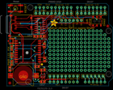
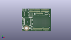
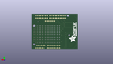
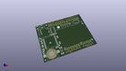

Contents
========

* [PROJ-ADAF-1272-STAN-01>Adafruit GPS Logger Shield PCB](#proj-adaf-1272-stan-01adafruit-gps-logger-shield-pcb)
	* [Images](#images)
	* [Interactive BOM](#interactive-bom)
	* [OOMP Parts](#oomp-parts)
	* [Tags](#tags)
  
![][im]
# PROJ-ADAF-1272-STAN-01>Adafruit GPS Logger Shield PCB

- ID: PROJ-ADAF-1272-STAN-01
- Hex ID: PRA1272
- Name: Adafruit GPS Logger Shield PCB
- Description: 

## Images
  
  

|eagleImage|kicadPcb3dFront|kicadPcb3dBack|kicadPcb3d|
| :---: | :---: | :---: | :---: |
|||||

## Interactive BOM

- Interactive BOM page: [ibom.html](kicad/bom/ibom.html)

## OOMP Parts
  

|OOMP Parts|
| :---: |
|UNMATCHED-UNMATCHED-X-UNMATCHED-01, B1, 10.668, 6.731, 180,B1, CR1220, CR1220, microbuilder, (0.42, 0.265), R180|
|CAPC-UNMATCHED-X-NF100-V50, C1, 24.511, 17.041999951999998, 90,C1, 0.1uF, 0805@1, microbuilder, (0.965, 0.67094488), R90|
|CAPC-UNMATCHED-X-UNMATCHED-01, C2, 23.344000047999998, 10.287, 0,C2, 10uF, 0805@1, microbuilder, (0.91905512, 0.405), R0|
|CAPC-UNMATCHED-X-UNMATCHED-01, C3, 23.241, 2.690999952, 180,C3, 10uF, 0805@1, microbuilder, (0.915, 0.10594488), R180|
|UNMATCHED-UNMATCHED-X-UNMATCHED-01, CN2, 16.256, 45.974, 270,CN2, MICROSD, microbuilder, (0.64, 1.81), R270|
|UNMATCHED-UNMATCHED-X-UNMATCHED-01, FB1, 19.534000048, 12.572999999999999, 0,FB1, Ferrite, 0805@1, microbuilder, (0.76905512, 0.495), R0|
|<table><tr><td></td><td> JP1</td><td>[HEAD-I01-X-PI08-01 2.54 mm 8 Pin Header](https://github.com/oomlout/oomlout_OOMP_parts/tree/main/HEAD-I01-X-PI08-01/)</td><td>[H08](https://github.com/oomlout/oomlout_OOMP_parts/tree/main/HEAD-I01-X-PI08-01/)</td></tr></table>|
|<table><tr><td></td><td> JP4</td><td>[HEAD-I01-X-PI08-01 2.54 mm 8 Pin Header](https://github.com/oomlout/oomlout_OOMP_parts/tree/main/HEAD-I01-X-PI08-01/)</td><td>[H08](https://github.com/oomlout/oomlout_OOMP_parts/tree/main/HEAD-I01-X-PI08-01/)</td></tr></table>|
|<table><tr><td></td><td> JP6</td><td>[HEAD-I01-X-PI06-01 2.54 mm 6 Pin Header](https://github.com/oomlout/oomlout_OOMP_parts/tree/main/HEAD-I01-X-PI06-01/)</td><td>[H06](https://github.com/oomlout/oomlout_OOMP_parts/tree/main/HEAD-I01-X-PI06-01/)</td></tr></table>|
|<table><tr><td></td><td> JP9</td><td>[HEAD-I01-X-PI06-01 2.54 mm 6 Pin Header](https://github.com/oomlout/oomlout_OOMP_parts/tree/main/HEAD-I01-X-PI06-01/)</td><td>[H06](https://github.com/oomlout/oomlout_OOMP_parts/tree/main/HEAD-I01-X-PI06-01/)</td></tr></table>|
|UNMATCHED-0805-X-UNMATCHED-01, LED1, 3.0479999999999996, 24.637999999999998, 0,LED1, red, CHIPLED_0805, microbuilder, (0.12, 0.97), R0|
|UNMATCHED-0805-X-UNMATCHED-01, LED4, 3.0479999999999996, 19.939, 0,LED4, yellow, CHIPLED_0805, microbuilder, (0.12, 0.785), R0|
|UNMATCHED-0805-X-UNMATCHED-01, LED5, 3.0479999999999996, 14.858999999999998, 0,LED5, green, CHIPLED_0805, microbuilder, (0.12, 0.585), R0|
|RESE-0805-X-UNMATCHED-01, R1, 24.233000048, 26.288999999999998, 90,R1, 1K, 0805, microbuilder, (0.95405512, 1.035), R90|
|<table><tr><td></td><td> R5</td><td>[RESE-0805-X-O103-01 SMD (0805) 10k Ohm Resistor](https://github.com/oomlout/oomlout_OOMP_parts/tree/main/RESE-0805-X-O103-01/)</td><td>[R85103](https://github.com/oomlout/oomlout_OOMP_parts/tree/main/RESE-0805-X-O103-01/)</td></tr></table>|
|RESE-0805-X-UNMATCHED-01, R9, 22.987, 32.13099999999999, 180,R9, 1k, 0805, microbuilder, (0.905, 1.265), R180|
|RESE-0805-X-UNMATCHED-01, R10, 1.9049999999999998, 11.049, 270,R10, 1k, 0805, microbuilder, (0.075, 0.435), R270|
|UNMATCHED-UNMATCHED-X-UNMATCHED-01, RESET, 5.588, 50.165, 0,RESET, Reset, EVQ-Q2, adafruit, (0.22, 1.975), R0|
|UNMATCHED-UNMATCHED-X-UNMATCHED-01, SW1, 58.419999999999995, 41.91, 180,SW1, EG1390, adafruit, (2.3, 1.65), R180|
|UNMATCHED-UNMATCHED-X-UNMATCHED-01, U$9, 30.225999999999996, 46.99, 0,U$9, PINHD-1X10, 1X10-BIG, adafruit, (1.19, 1.85), R0|
|UNMATCHED-UNMATCHED-X-UNMATCHED-01, U$20, 2.54, 29.083, 0,U$20, U.FL, U.FL, microbuilder, (0.1, 1.145), R0|
|UNMATCHED-UNMATCHED-X-UNMATCHED-01, U1, 13.589, 22.352, 180,U1, FGPMMOPA6H, FGPMMOPA6H, microbuilder, (0.535, 0.88), R180|
|UNMATCHED-UNMATCHED-X-UNMATCHED-01, U2, 23.391999952, 6.731, 0,U2, MIC5225-3.3, SOT23-5, microbuilder, (0.92094488, 0.265), R0|
|UNMATCHED-UNMATCHED-X-UNMATCHED-01, U3, 0.0, 0.0, 0,U3, ARDUINOR3-DIMENSION, ARDUINOR3, adafruit, (0, 0), R0|
|UNMATCHED-UNMATCHED-X-UNMATCHED-01, U4, 21.462999999999997, 38.989, 270,U4, 4050, SOIC16, microbuilder, (0.845, 1.535), R270|

## Tags

- hexID: PRA1272
- oompType: PROJ
- oompSize: ADAF
- oompColor: 1272
- oompDesc: STAN
- oompIndex: 01
- oompName: Adafruit GPS Logger Shield PCB
- sources: All source files from https://github.com/adafruit/Adafruit-GPS-Logger-Shield-PCB (source licence details in srcLicense.md)
- linkBuyPage: http://www.adafruit.com/products/1272
- oompPart: UNMATCHED-UNMATCHED-X-UNMATCHED-01, B1, 10.668, 6.731, 180
- oompPart: CAPC-UNMATCHED-X-NF100-V50, C1, 24.511, 17.041999951999998, 90
- oompPart: CAPC-UNMATCHED-X-UNMATCHED-01, C2, 23.344000047999998, 10.287, 0
- oompPart: CAPC-UNMATCHED-X-UNMATCHED-01, C3, 23.241, 2.690999952, 180
- oompPart: UNMATCHED-UNMATCHED-X-UNMATCHED-01, CN2, 16.256, 45.974, 270
- oompPart: UNMATCHED-UNMATCHED-X-UNMATCHED-01, FB1, 19.534000048, 12.572999999999999, 0
- oompPart: SKIP-UNMATCHED-X-UNMATCHED-01, FID1, 1.9049999999999998, 1.9049999999999998, 0
- oompPart: SKIP-UNMATCHED-X-UNMATCHED-01, FID2, 65.427999954, 38.779999909999994, 0
- oompPart: HEAD-I01-X-PI08-01, JP1, 36.83, 6.35, 0
- oompPart: HEAD-I01-X-PI08-01, JP4, 54.60999999999999, 46.99, 180
- oompPart: HEAD-I01-X-PI06-01, JP6, 41.91, 42.418, 180
- oompPart: HEAD-I01-X-PI06-01, JP9, 55.88, 6.35, 0
- oompPart: UNMATCHED-0805-X-UNMATCHED-01, LED1, 3.0479999999999996, 24.637999999999998, 0
- oompPart: UNMATCHED-0805-X-UNMATCHED-01, LED4, 3.0479999999999996, 19.939, 0
- oompPart: UNMATCHED-0805-X-UNMATCHED-01, LED5, 3.0479999999999996, 14.858999999999998, 0
- oompPart: RESE-0805-X-UNMATCHED-01, R1, 24.233000048, 26.288999999999998, 90
- oompPart: RESE-0805-X-O103-01, R5, 18.923, 32.13099999999999, 180
- oompPart: RESE-0805-X-UNMATCHED-01, R9, 22.987, 32.13099999999999, 180
- oompPart: RESE-0805-X-UNMATCHED-01, R10, 1.9049999999999998, 11.049, 270
- oompPart: UNMATCHED-UNMATCHED-X-UNMATCHED-01, RESET, 5.588, 50.165, 0
- oompPart: UNMATCHED-UNMATCHED-X-UNMATCHED-01, SW1, 58.419999999999995, 41.91, 180
- oompPart: UNMATCHED-UNMATCHED-X-UNMATCHED-01, U$9, 30.225999999999996, 46.99, 0
- oompPart: UNMATCHED-UNMATCHED-X-UNMATCHED-01, U$20, 2.54, 29.083, 0
- oompPart: UNMATCHED-UNMATCHED-X-UNMATCHED-01, U1, 13.589, 22.352, 180
- oompPart: UNMATCHED-UNMATCHED-X-UNMATCHED-01, U2, 23.391999952, 6.731, 0
- oompPart: UNMATCHED-UNMATCHED-X-UNMATCHED-01, U3, 0.0, 0.0, 0
- oompPart: UNMATCHED-UNMATCHED-X-UNMATCHED-01, U4, 21.462999999999997, 38.989, 270
- rawPart: B1, CR1220, CR1220, microbuilder, (0.42, 0.265), R180
- rawPart: C1, 0.1uF, 0805@1, microbuilder, (0.965, 0.67094488), R90
- rawPart: C2, 10uF, 0805@1, microbuilder, (0.91905512, 0.405), R0
- rawPart: C3, 10uF, 0805@1, microbuilder, (0.915, 0.10594488), R180
- rawPart: CN2, MICROSD, microbuilder, (0.64, 1.81), R270
- rawPart: FB1, Ferrite, 0805@1, microbuilder, (0.76905512, 0.495), R0
- rawPart: FID1, FIDUCIAL, FIDUCIAL_1MM, microbuilder, (0.075, 0.075), R0
- rawPart: FID2, FIDUCIAL, FIDUCIAL_1MM, microbuilder, (2.57590551, 1.52677165), R0
- rawPart: JP1, D0-D7, 1X08-BIG, adafruit, (1.45, 0.25), R0
- rawPart: JP4, D0-D7, 1X08-BIG, adafruit, (2.15, 1.85), R180
- rawPart: JP6, 1X06-BIG, adafruit, (1.65, 1.67), R180
- rawPart: JP9, 1X06-BIG, adafruit, (2.2, 0.25), R0
- rawPart: LED1, red, CHIPLED_0805, microbuilder, (0.12, 0.97), R0
- rawPart: LED4, yellow, CHIPLED_0805, microbuilder, (0.12, 0.785), R0
- rawPart: LED5, green, CHIPLED_0805, microbuilder, (0.12, 0.585), R0
- rawPart: R1, 1K, 0805, microbuilder, (0.95405512, 1.035), R90
- rawPart: R5, 10K, 0805, microbuilder, (0.745, 1.265), R180
- rawPart: R9, 1k, 0805, microbuilder, (0.905, 1.265), R180
- rawPart: R10, 1k, 0805, microbuilder, (0.075, 0.435), R270
- rawPart: RESET, Reset, EVQ-Q2, adafruit, (0.22, 1.975), R0
- rawPart: SW1, EG1390, adafruit, (2.3, 1.65), R180
- rawPart: U$9, PINHD-1X10, 1X10-BIG, adafruit, (1.19, 1.85), R0
- rawPart: U$20, U.FL, U.FL, microbuilder, (0.1, 1.145), R0
- rawPart: U1, FGPMMOPA6H, FGPMMOPA6H, microbuilder, (0.535, 0.88), R180
- rawPart: U2, MIC5225-3.3, SOT23-5, microbuilder, (0.92094488, 0.265), R0
- rawPart: U3, ARDUINOR3-DIMENSION, ARDUINOR3, adafruit, (0, 0), R0
- rawPart: U4, 4050, SOIC16, microbuilder, (0.845, 1.535), R270
- oompID: PROJ-ADAF-1272-STAN-01

[im]: kicadPcb3d_450.png
