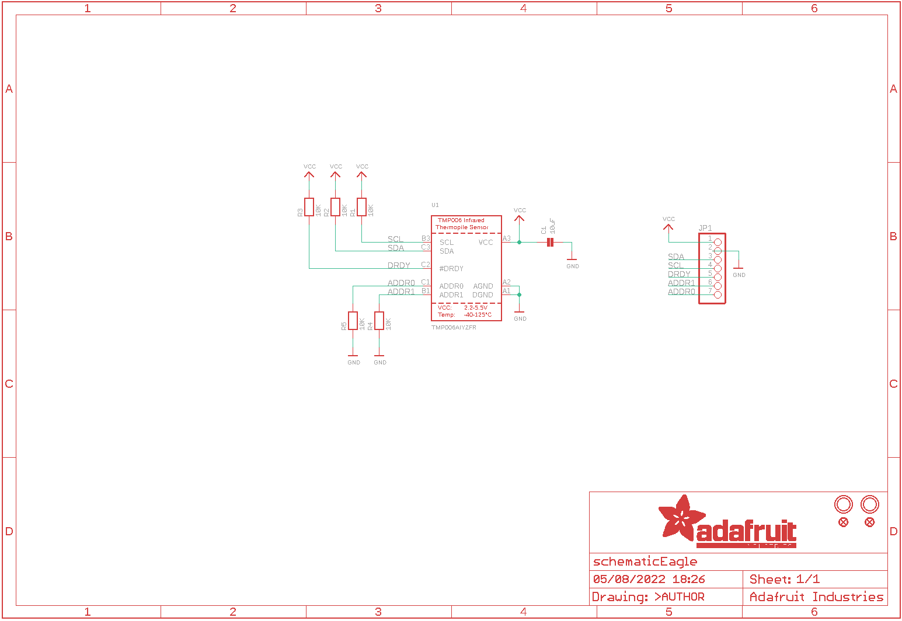

Contents
========

* [PRA1296 > Adafruit TMP006 and TMP007 PCB](#pra1296--adafruit-tmp006-and-tmp007-pcb)
	* [Schematic](#schematic)
	* [PCB](#pcb)
	* [Interactive BOM](#interactive-bom)
	* [OOMP Parts](#oomp-parts)
	* [Images](#images)
	* [Tags](#tags)
  
![][im]
# PRA1296 > Adafruit TMP006 and TMP007 PCB

- ID: PROJ-ADAF-1296-STAN-01
- Hex ID: PRA1296
- Name: Adafruit
- Description: Adafruit
- Long Link: [http://oom.lt/PROJ-ADAF-1296-STAN-01](http://oom.lt/PROJ-ADAF-1296-STAN-01)
- Short Link: [http://oom.lt/PRA1296](http://oom.lt/PRA1296)

## Schematic
  

## PCB
  

## Interactive BOM

- Interactive BOM page: [ibom.html](https://htmlpreview.github.io/?https://github.com/oomlout/oomlout_OOMP_projects/blob/main/PROJ-ADAF-1296-STAN-01/kicad/bom/ibom.html)

## OOMP Parts
  

|OOMP Parts|
| :---: |
|[CAPC-0805-X-UF10-V10  SMD (0805) 10 uF Capacitor (Ceramic) 10v  C1](https://github.com/oomlout/oomlout_OOMP_parts/tree/main/CAPC-0805-X-UF10-V10/)|
|[HEAD-I01-X-PI07-01  2.54 mm 7 Pin Header  JP1](https://github.com/oomlout/oomlout_OOMP_parts/tree/main/HEAD-I01-X-PI07-01/)|
|[RESE-0805-X-O103-01  SMD (0805) 10k Ohm Resistor  R1, R2, R3, R4, R5](https://github.com/oomlout/oomlout_OOMP_parts/tree/main/RESE-0805-X-O103-01/)|
|UNMATCHED-UNMATCHED-X-UNMATCHED-01 U1|

## Images
  
  

|kicadPcb3d|kicadPcb3dFront|kicadPcb3dBack|eagleImage|eagleSchemImage|
| :---: | :---: | :---: | :---: | :---: |
||||||

## Tags

- hexID: PRA1296
- oompType: PROJ
- oompSize: ADAF
- oompColor: 1296
- oompDesc: STAN
- oompIndex: 01
- oompName: Adafruit TMP006 and TMP007 PCB
- sources: All source files from https://github.com/adafruit/Adafruit-TMP006-and-TMP007-PCB (source licence details in srcLicense.md)
- linkBuyPage: http://www.adafruit.com/products/1296
- oompID: PROJ-ADAF-1296-STAN-01
- oompParts: C1,CAPC-0805-X-UF10-V10
- oompParts: JP1,HEAD-I01-X-PI07-01
- oompParts: R1,RESE-0805-X-O103-01
- oompParts: R2,RESE-0805-X-O103-01
- oompParts: R3,RESE-0805-X-O103-01
- oompParts: R4,RESE-0805-X-O103-01
- oompParts: R5,RESE-0805-X-O103-01
- oompParts: U1,UNMATCHED-UNMATCHED-X-UNMATCHED-01
- rawParts: C1,10uF,CAP_CERAMIC0805,0805,Ceramic Capacitors,,
- rawParts: FID1,FIDUCIAL,FIDUCIAL,FIDUCIAL_1MM,Fiducial Alignment Points,,
- rawParts: FID2,FIDUCIAL,FIDUCIAL,FIDUCIAL_1MM,Fiducial Alignment Points,,
- rawParts: JP1,,HEADER-1X7THICKER,1X07_ROUND_76,PIN HEADER,,
- rawParts: R1,10K,RESISTOR0805,0805,Resistors,,
- rawParts: R2,10K,RESISTOR0805,0805,Resistors,,
- rawParts: R3,10K,RESISTOR0805,0805,Resistors,,
- rawParts: R4,10K,RESISTOR0805,0805,Resistors,,
- rawParts: R5,10K,RESISTOR0805,0805,Resistors,,
- rawParts: U$6,MOUNTINGHOLE2.5,MOUNTINGHOLE2.5,MOUNTINGHOLE_2.5_PLATED,Mounting Hole,,
- rawParts: U$7,MOUNTINGHOLE2.5,MOUNTINGHOLE2.5,MOUNTINGHOLE_2.5_PLATED,Mounting Hole,,
- rawParts: U1,TMP006AIYZFR,TMP006,WCSP-8,TMP006 Infrared Thermopile Sensor,,

[im]: kicadPcb3d_450.png
