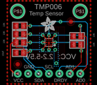
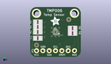
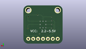
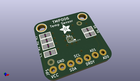

Contents
========

* [PROJ-ADAF-1296-STAN-01>Adafruit TMP006 and TMP007 PCB](#proj-adaf-1296-stan-01adafruit-tmp006-and-tmp007-pcb)
	* [Images](#images)
	* [Interactive BOM](#interactive-bom)
	* [Tags](#tags)
  
![][im]
# PROJ-ADAF-1296-STAN-01>Adafruit TMP006 and TMP007 PCB

- ID: PROJ-ADAF-1296-STAN-01
- Hex ID: PRA1296
- Name: Adafruit TMP006 and TMP007 PCB
- Description: 

## Images
  
  

|eagleImage|kicadPcb3dFront|kicadPcb3dBack|kicadPcb3d|
| :---: | :---: | :---: | :---: |
|||||

## Interactive BOM

- Interactive BOM page: [ibom.html](kicad/bom/ibom.html)

## Tags

- hexID: PRA1296
- oompType: PROJ
- oompSize: ADAF
- oompColor: 1296
- oompDesc: STAN
- oompIndex: 01
- oompName: Adafruit TMP006 and TMP007 PCB
- sources: All source files from https://github.com/adafruit/Adafruit-TMP006-and-TMP007-PCB (source licence details in srcLicense.md)
- linkBuyPage: http://www.adafruit.com/products/1296

[im]: kicadPcb3d_450.png
