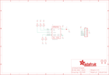

Contents
========

* [PRA1296 > Adafruit](#pra1296--adafruit)
	* [Images](#images)
	* [Tags](#tags)
  
![][im]
# PRA1296 > Adafruit

- ID: PROJ-ADAF-1296-STAN-01
- Hex ID: PRA1296
- Name: Adafruit
- Description: Adafruit

## Images
  
  

|kicadPcb3d|kicadPcb3dFront|kicadPcb3dBack|eagleImage|eagleSchemImage|
| :---: | :---: | :---: | :---: | :---: |
||||||

## Tags

- hexID: PRA1296
- oompType: PROJ
- oompSize: ADAF
- oompColor: 1296
- oompDesc: STAN
- oompIndex: 01
- oompName: Adafruit TMP006 and TMP007 PCB
- sources: All source files from https://github.com/adafruit/Adafruit-TMP006-and-TMP007-PCB (source licence details in srcLicense.md)
- linkBuyPage: http://www.adafruit.com/products/1296
- oompID: PROJ-ADAF-1296-STAN-01
- oompParts: C1,UNMATCHED-UNMATCHED-UNMATCHED-UNMATCHED-UNMATCHED
- oompParts: JP1,UNMATCHED-UNMATCHED-UNMATCHED-UNMATCHED-UNMATCHED
- oompParts: R1,UNMATCHED-UNMATCHED-UNMATCHED-UNMATCHED-UNMATCHED
- oompParts: R2,UNMATCHED-UNMATCHED-UNMATCHED-UNMATCHED-UNMATCHED
- oompParts: R3,UNMATCHED-UNMATCHED-UNMATCHED-UNMATCHED-UNMATCHED
- oompParts: R4,UNMATCHED-UNMATCHED-UNMATCHED-UNMATCHED-UNMATCHED
- oompParts: R5,UNMATCHED-UNMATCHED-UNMATCHED-UNMATCHED-UNMATCHED
- oompParts: U$6,UNMATCHED-UNMATCHED-UNMATCHED-UNMATCHED-UNMATCHED
- oompParts: U$7,UNMATCHED-UNMATCHED-UNMATCHED-UNMATCHED-UNMATCHED
- oompParts: U1,UNMATCHED-UNMATCHED-UNMATCHED-UNMATCHED-UNMATCHED
- rawParts: C1,10uF,CAP_CERAMIC0805,0805,Ceramic Capacitors,,
- rawParts: FID1,FIDUCIAL,FIDUCIAL,FIDUCIAL_1MM,Fiducial Alignment Points,,
- rawParts: FID2,FIDUCIAL,FIDUCIAL,FIDUCIAL_1MM,Fiducial Alignment Points,,
- rawParts: JP1,,HEADER-1X7THICKER,1X07_ROUND_76,PIN HEADER,,
- rawParts: R1,10K,RESISTOR0805,0805,Resistors,,
- rawParts: R2,10K,RESISTOR0805,0805,Resistors,,
- rawParts: R3,10K,RESISTOR0805,0805,Resistors,,
- rawParts: R4,10K,RESISTOR0805,0805,Resistors,,
- rawParts: R5,10K,RESISTOR0805,0805,Resistors,,
- rawParts: U$6,MOUNTINGHOLE2.5,MOUNTINGHOLE2.5,MOUNTINGHOLE_2.5_PLATED,Mounting Hole,,
- rawParts: U$7,MOUNTINGHOLE2.5,MOUNTINGHOLE2.5,MOUNTINGHOLE_2.5_PLATED,Mounting Hole,,
- rawParts: U1,TMP006AIYZFR,TMP006,WCSP-8,TMP006 Infrared Thermopile Sensor,,

[im]: kicadPcb3d_450.png
