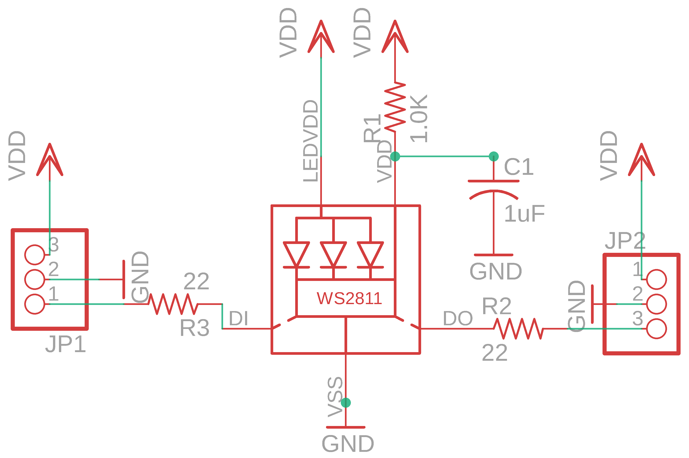
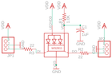

Contents
========

* [PRA1312 > Adafruit_Breadboard_NeoPixel_PCB](#pra1312--adafruit_breadboard_neopixel_pcb)
	* [Schematic](#schematic)
	* [PCB](#pcb)
	* [Interactive BOM](#interactive-bom)
	* [OOMP Parts](#oomp-parts)
	* [Images](#images)
	* [Tags](#tags)
  
![][im]
# PRA1312 > Adafruit_Breadboard_NeoPixel_PCB

- ID: PROJ-ADAF-1312-STAN-01
- Hex ID: PRA1312
- Name: Adafruit
- Description: Adafruit
- Long Link: [http://oom.lt/PROJ-ADAF-1312-STAN-01](http://oom.lt/PROJ-ADAF-1312-STAN-01)
- Short Link: [http://oom.lt/PRA1312](http://oom.lt/PRA1312)

## Schematic
  

## PCB
  

## Interactive BOM

- Interactive BOM page: [ibom.html](https://htmlpreview.github.io/?https://github.com/oomlout/oomlout_OOMP_projects/blob/main/PROJ-ADAF-1312-STAN-01/kicad/bom/ibom.html)

## OOMP Parts
  

|OOMP Parts|
| :---: |
|C1 C1,CAPC-0603-X-UF1-01|
|[JP1 HEAD-I01-X-PI03-01 2.54 mm 3 Pin Header](https://github.com/oomlout/oomlout_OOMP_parts/tree/main/HEAD-I01-X-PI03-01/)|
|[JP2 HEAD-I01-X-PI03-01 2.54 mm 3 Pin Header](https://github.com/oomlout/oomlout_OOMP_parts/tree/main/HEAD-I01-X-PI03-01/)|
|LED1 LED1,LEDS-5050-RGB-K2811-01|
|[R1 RESE-0603-X-O102-01 SMD (0603) 1k Ohm Resistor](https://github.com/oomlout/oomlout_OOMP_parts/tree/main/RESE-0603-X-O102-01/)|
|[R2 RESE-0603-X-O220-01 SMD (0603) 22 Ohm Resistor](https://github.com/oomlout/oomlout_OOMP_parts/tree/main/RESE-0603-X-O220-01/)|
|[R3 RESE-0603-X-O220-01 SMD (0603) 22 Ohm Resistor](https://github.com/oomlout/oomlout_OOMP_parts/tree/main/RESE-0603-X-O220-01/)|

## Images
  
  

|kicadPcb3d|kicadPcb3dFront|kicadPcb3dBack|eagleImage|eagleSchemImage|
| :---: | :---: | :---: | :---: | :---: |
||||||

## Tags

- hexID: PRA1312
- oompType: PROJ
- oompSize: ADAF
- oompColor: 1312
- oompDesc: STAN
- oompIndex: 01
- oompName: Adafruit_Breadboard_NeoPixel_PCB
- sources: All source files from https://github.com/adafruit/Adafruit_Breadboard_NeoPixel_PCB (source licence details in srcLicense.md)
- linkBuyPage: http://www.adafruit.com/products/1312
- oompID: PROJ-ADAF-1312-STAN-01
- oompParts: C1,CAPC-0603-X-UF1-01
- oompParts: JP1,HEAD-I01-X-PI03-01
- oompParts: JP2,HEAD-I01-X-PI03-01
- oompParts: LED1,LEDS-5050-RGB-K2811-01
- oompParts: R1,RESE-0603-X-O102-01
- oompParts: R2,RESE-0603-X-O220-01
- oompParts: R3,RESE-0603-X-O220-01
- rawParts: C1,1uF,C-USC0603K,C0603K,CAPACITOR, American symbol,,
- rawParts: JP1,,PINHD-1X3CB,1X03-CLEANBIG,PIN HEADER,,
- rawParts: JP2,,PINHD-1X3CB,1X03-CLEANBIG,PIN HEADER,,
- rawParts: LED1,WS28115050,WS28115050,WS28115050,,,
- rawParts: R1,1.0K,R-US_R0603,R0603,RESISTOR, American symbol,,
- rawParts: R2,22,R-US_R0603,R0603,RESISTOR, American symbol,,
- rawParts: R3,22,R-US_R0603,R0603,RESISTOR, American symbol,,

[im]: kicadPcb3d_450.png
