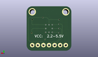

Contents
========

* [PROJ-ADAF-1312-STAN-01>Adafruit_Breadboard_NeoPixel_PCB](#proj-adaf-1312-stan-01adafruit_breadboard_neopixel_pcb)
	* [Images](#images)
	* [Interactive BOM](#interactive-bom)
	* [Tags](#tags)
  
![][im]
# PROJ-ADAF-1312-STAN-01>Adafruit_Breadboard_NeoPixel_PCB

- ID: PROJ-ADAF-1312-STAN-01
- Hex ID: PRA1312
- Name: Adafruit_Breadboard_NeoPixel_PCB
- Description: 

## Images
  
  

|eagleImage|kicadPcb3dFront|kicadPcb3dBack|kicadPcb3d|
| :---: | :---: | :---: | :---: |
|||||

## Interactive BOM

- Interactive BOM page: [ibom.html](kicad/bom/ibom.html)

## Tags

- hexID: PRA1312
- oompType: PROJ
- oompSize: ADAF
- oompColor: 1312
- oompDesc: STAN
- oompIndex: 01
- oompName: Adafruit_Breadboard_NeoPixel_PCB
- sources: All source files from https://github.com/adafruit/Adafruit_Breadboard_NeoPixel_PCB (source licence details in srcLicense.md)
- linkBuyPage: http://www.adafruit.com/products/1312
- oompID: PROJ-ADAF-1312-STAN-01
- oompParts: C1,UNMATCHED-UNMATCHED-UNMATCHED-UNMATCHED-UNMATCHED
- oompParts: JP1,UNMATCHED-UNMATCHED-UNMATCHED-UNMATCHED-UNMATCHED
- oompParts: JP2,UNMATCHED-UNMATCHED-UNMATCHED-UNMATCHED-UNMATCHED
- oompParts: LED1,UNMATCHED-UNMATCHED-UNMATCHED-UNMATCHED-UNMATCHED
- oompParts: R1,UNMATCHED-UNMATCHED-UNMATCHED-UNMATCHED-UNMATCHED
- oompParts: R2,UNMATCHED-UNMATCHED-UNMATCHED-UNMATCHED-UNMATCHED
- oompParts: R3,UNMATCHED-UNMATCHED-UNMATCHED-UNMATCHED-UNMATCHED
- rawParts: C1,1uF,C-USC0603K,C0603K,CAPACITOR, American symbol,,
- rawParts: JP1,,PINHD-1X3CB,1X03-CLEANBIG,PIN HEADER,,
- rawParts: JP2,,PINHD-1X3CB,1X03-CLEANBIG,PIN HEADER,,
- rawParts: LED1,WS28115050,WS28115050,WS28115050,,,
- rawParts: R1,1.0K,R-US_R0603,R0603,RESISTOR, American symbol,,
- rawParts: R2,22,R-US_R0603,R0603,RESISTOR, American symbol,,
- rawParts: R3,22,R-US_R0603,R0603,RESISTOR, American symbol,,

[im]: kicadPcb3d_450.png
