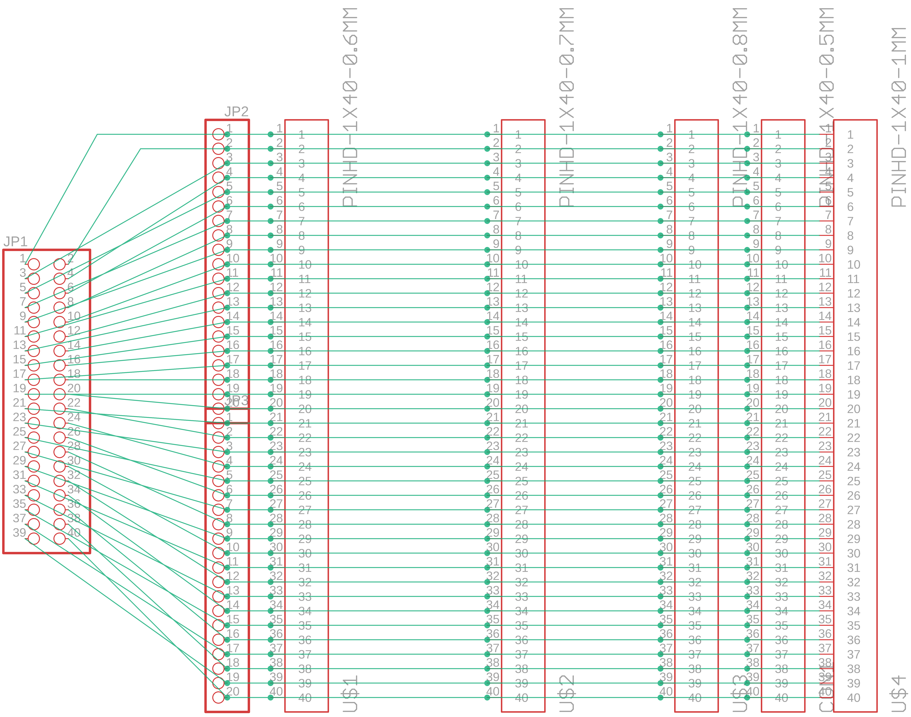
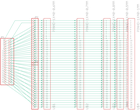

Contents
========

* [PRA1325 > Adafruit FPC SMT Adapter PCBs](#pra1325--adafruit-fpc-smt-adapter-pcbs)
	* [Schematic](#schematic)
	* [PCB](#pcb)
	* [Interactive BOM](#interactive-bom)
	* [OOMP Parts](#oomp-parts)
	* [Images](#images)
	* [Tags](#tags)
  
![][im]
# PRA1325 > Adafruit FPC SMT Adapter PCBs

- ID: PROJ-ADAF-1325-STAN-01
- Hex ID: PRA1325
- Name: Adafruit
- Description: Adafruit
- Long Link: [http://oom.lt/PROJ-ADAF-1325-STAN-01](http://oom.lt/PROJ-ADAF-1325-STAN-01)
- Short Link: [http://oom.lt/PRA1325](http://oom.lt/PRA1325)

## Schematic
  

## PCB
  

## Interactive BOM

- Interactive BOM page: [ibom.html](https://htmlpreview.github.io/?https://github.com/oomlout/oomlout_OOMP_projects/blob/main/PROJ-ADAF-1325-STAN-01/kicad/bom/ibom.html)

## OOMP Parts
  

|OOMP Parts|
| :---: |
|CON1 CON1,UNMATCHED-UNMATCHED-X-UNMATCHED-01|
|JP1 JP1,UNMATCHED-UNMATCHED-X-UNMATCHED-01|
|[JP2 HEAD-I01-X-PI20-01 2.54 mm 20 Pin Header](https://github.com/oomlout/oomlout_OOMP_parts/tree/main/HEAD-I01-X-PI20-01/)|
|[JP3 HEAD-I01-X-PI20-01 2.54 mm 20 Pin Header](https://github.com/oomlout/oomlout_OOMP_parts/tree/main/HEAD-I01-X-PI20-01/)|
|U$1 U$1,UNMATCHED-UNMATCHED-X-UNMATCHED-01|
|U$2 U$2,UNMATCHED-UNMATCHED-X-UNMATCHED-01|
|U$3 U$3,UNMATCHED-UNMATCHED-X-UNMATCHED-01|
|U$4 U$4,UNMATCHED-UNMATCHED-X-UNMATCHED-01|

## Images
  
  

|kicadPcb3d|kicadPcb3dFront|kicadPcb3dBack|eagleImage|eagleSchemImage|
| :---: | :---: | :---: | :---: | :---: |
||||||

## Tags

- hexID: PRA1325
- oompType: PROJ
- oompSize: ADAF
- oompColor: 1325
- oompDesc: STAN
- oompIndex: 01
- oompName: Adafruit FPC SMT Adapter PCBs
- sources: All source files from https://github.com/adafruit/Adafruit-FPC-SMT-Adapter-PCBs (source licence details in srcLicense.md)
- linkBuyPage: http://www.adafruit.com/products/1325
- oompID: PROJ-ADAF-1325-STAN-01
- oompParts: CON1,UNMATCHED-UNMATCHED-X-UNMATCHED-01
- oompParts: JP1,UNMATCHED-UNMATCHED-X-UNMATCHED-01
- oompParts: JP2,HEAD-I01-X-PI20-01
- oompParts: JP3,HEAD-I01-X-PI20-01
- oompParts: U$1,UNMATCHED-UNMATCHED-X-UNMATCHED-01
- oompParts: U$2,UNMATCHED-UNMATCHED-X-UNMATCHED-01
- oompParts: U$3,UNMATCHED-UNMATCHED-X-UNMATCHED-01
- oompParts: U$4,UNMATCHED-UNMATCHED-X-UNMATCHED-01
- rawParts: CON1,PINHD-1X40-0.5MM,PINHD-1X40-0.5MM,1X40-0.5MM,Pinouts for OLED/LCD displays with flex ribbons,,
- rawParts: JP1,,PINHD-2X20-BIG,2X20-BIG,PIN HEADER,,
- rawParts: JP2,,PINHD-1X20-BIG,1X20-BIG,PIN HEADER,,
- rawParts: JP3,,PINHD-1X20-BIG,1X20-BIG,PIN HEADER,,
- rawParts: U$1,PINHD-1X40-0.6MM,PINHD-1X40-0.6MM,1X40-0.6MM,Pinouts for OLED/LCD displays with flex ribbons,,
- rawParts: U$2,PINHD-1X40-0.7MM,PINHD-1X40-0.7MM,1X40-0.7MM,Pinouts for OLED/LCD displays with flex ribbons,,
- rawParts: U$3,PINHD-1X40-0.8MM,PINHD-1X40-0.8MM,1X40-0.8MM,Pinouts for OLED/LCD displays with flex ribbons,,
- rawParts: U$4,PINHD-1X40-1MM,PINHD-1X40-1MM,1X40-1MM,Pinouts for OLED/LCD displays with flex ribbons,,

[im]: kicadPcb3d_450.png
