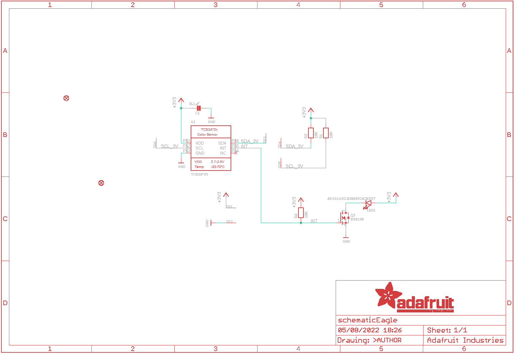
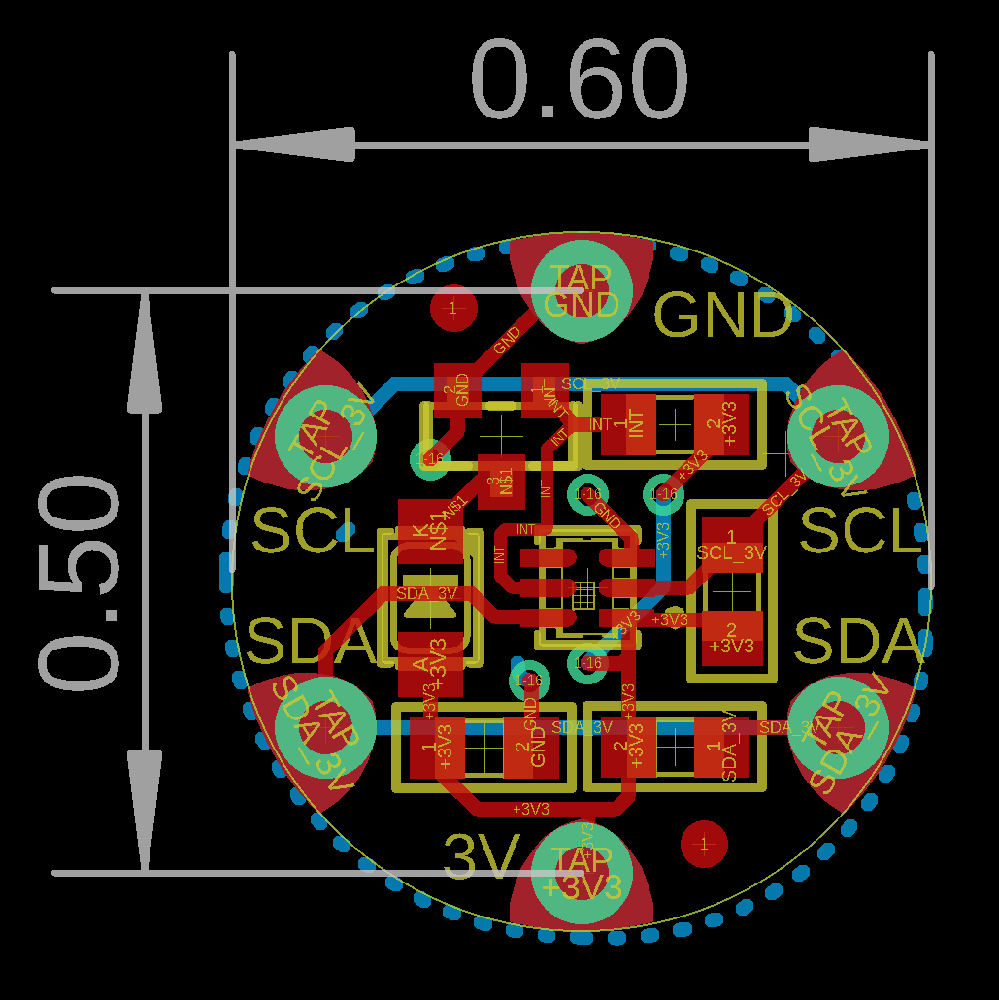
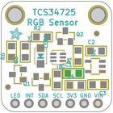
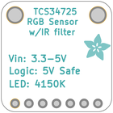
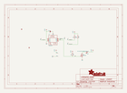
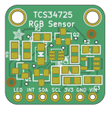
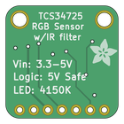

Contents
========

* [PRA1356 > Adafruit Flora TCS34725 Color Sensor PCB](#pra1356--adafruit-flora-tcs34725-color-sensor-pcb)
	* [Schematic](#schematic)
	* [PCB](#pcb)
	* [Interactive BOM](#interactive-bom)
	* [OOMP Parts](#oomp-parts)
	* [Images](#images)
	* [Tags](#tags)
  
![][im]
# PRA1356 > Adafruit Flora TCS34725 Color Sensor PCB

- ID: PROJ-ADAF-1356-STAN-01
- Hex ID: PRA1356
- Name: Adafruit 1356
- Description: Adafruit 1356
- Long Link: [http://oom.lt/PROJ-ADAF-1356-STAN-01](http://oom.lt/PROJ-ADAF-1356-STAN-01)
- Short Link: [http://oom.lt/PRA1356](http://oom.lt/PRA1356)

## Schematic
  

## PCB
  

## Interactive BOM

- Interactive BOM page: [ibom.html](https://htmlpreview.github.io/?https://github.com/oomlout/oomlout_OOMP_projects/blob/main/PROJ-ADAF-1356-STAN-01/kicad/bom/ibom.html)

## OOMP Parts
  

|OOMP ID|Name|Identifier|
| :---: | :---: | :---: |
|CAPC-0805-X-UNMATCHED-01||C1|
|LEDS-UNMATCHED-G-STAN-01||LED1|
|[MOSN-SO23-X-KBSS138-01](https://github.com/oomlout/oomlout_OOMP_parts/tree/main/MOSN-SO23-X-KBSS138-01/)|[SMD (SOT-23) BSS138 N-Ch. MOSFET](https://github.com/oomlout/oomlout_OOMP_parts/tree/main/MOSN-SO23-X-KBSS138-01/)|[Q3](https://github.com/oomlout/oomlout_OOMP_parts/tree/main/MOSN-SO23-X-KBSS138-01/)|
|[RESE-0805-X-O103-01](https://github.com/oomlout/oomlout_OOMP_parts/tree/main/RESE-0805-X-O103-01/)|[SMD (0805) 10k Ohm Resistor](https://github.com/oomlout/oomlout_OOMP_parts/tree/main/RESE-0805-X-O103-01/)|[R1, R2, R6](https://github.com/oomlout/oomlout_OOMP_parts/tree/main/RESE-0805-X-O103-01/)|
|UNMATCHED-UNMATCHED-X-UNMATCHED-01||U1|

## Images
  
  

|bominteractivefront|bominteractiveback|kicadPcb3d|kicadPcb3dFront|kicadPcb3dBack|kicadSchem|eagleImage|eagleSchemImage|pcbdraw|pcbdrawback|
| :---: | :---: | :---: | :---: | :---: | :---: | :---: | :---: | :---: | :---: |
|||||||||||

## Tags

- hexID: PRA1356
- oompType: PROJ
- oompSize: ADAF
- oompColor: 1356
- oompDesc: STAN
- oompIndex: 01
- oompName: Adafruit Flora TCS34725 Color Sensor PCB
- sources: All source files from https://github.com/adafruit/Adafruit-Flora-TCS34725-Color-Sensor-PCB (source licence details in srcLicense.md)
- linkBuyPage: http://www.adafruit.com/products/1356
- oompID: PROJ-ADAF-1356-STAN-01
- oompParts: C1,CAPC-0805-X-UNMATCHED-01
- oompParts: LED1,LEDS-UNMATCHED-G-STAN-01
- oompParts: Q3,MOSN-SO23-X-KBSS138-01
- oompParts: R1,RESE-0805-X-O103-01
- oompParts: R2,RESE-0805-X-O103-01
- oompParts: R6,RESE-0805-X-O103-01
- oompParts: U1,UNMATCHED-UNMATCHED-X-UNMATCHED-01
- rawParts: C1,0.1µF,CAP_CERAMIC_0805,_0805,Ceramic Capacitors,,
- rawParts: FID1,FIDUCIAL,FIDUCIAL,FIDUCIAL_1MM,Fiducial Alignment Points,EXCLUDE,
- rawParts: FID2,FIDUCIAL,FIDUCIAL,FIDUCIAL_1MM,Fiducial Alignment Points,EXCLUDE,
- rawParts: LED1,45-21/LK2C-B38452C4CB2/2T,LEDEV45-21,EVERLIGHT_45-21,LED,,
- rawParts: Q3,BSS138,MOSFET-NWIDE,SOT23-WIDE,N-Channel Mosfet,,
- rawParts: R1,10K,RESISTOR_0805,_0805,Resistors,,
- rawParts: R2,10K,RESISTOR_0805,_0805,Resistors,,
- rawParts: R6,10K,RESISTOR_0805,_0805,Resistors,,
- rawParts: TP1,SEWTAP0.5IN,SEWTAP0.5IN,SEWINGTAP_0.5,,,
- rawParts: TP2,SEWTAP0.5IN,SEWTAP0.5IN,SEWINGTAP_0.5,,,
- rawParts: TP3,SEWTAP0.5IN,SEWTAP0.5IN,SEWINGTAP_0.5,,,
- rawParts: TP4,SEWTAP0.5IN,SEWTAP0.5IN,SEWINGTAP_0.5,,,
- rawParts: TP5,SEWTAP0.5IN,SEWTAP0.5IN,SEWINGTAP_0.5,,,
- rawParts: TP6,SEWTAP0.5IN,SEWTAP0.5IN,SEWINGTAP_0.5,,,
- rawParts: U1,TCS34725,LIGHT_TCS3472,TCS3472_FN6,TCS3472 RGB + Clear Color Sensor,,

[im]: kicadPcb3d_450.png
