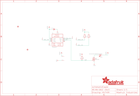

Contents
========

* [PRA1356 > Adafruit](#pra1356--adafruit)
	* [Schematic](#schematic)
	* [Interactive BOM](#interactive-bom)
	* [OOMP Parts](#oomp-parts)
	* [Images](#images)
	* [Tags](#tags)
  
![][im]
# PRA1356 > Adafruit

- ID: PROJ-ADAF-1356-STAN-01
- Hex ID: PRA1356
- Name: Adafruit
- Description: Adafruit
- Long Link: [http://oom.lt/PROJ-ADAF-1356-STAN-01](http://oom.lt/PROJ-ADAF-1356-STAN-01)
- Long Link: [http://oom.lt/PRA1356](http://oom.lt/PRA1356)

## Schematic
  
![][schem]
## Interactive BOM

- Interactive BOM page: [ibom.html](https://htmlpreview.github.io/?https://github.com/oomlout/oomlout_OOMP_projects/blob/main/PROJ-ADAF-1356-STAN-01/kicad/bom/ibom.html)

## OOMP Parts
  

|OOMP Parts|
| :---: |
|C1,UNMATCHED-UNMATCHED-UNMATCHED-UNMATCHED-UNMATCHED,C1,0.1µF,CAP_CERAMIC_0805,_0805,Ceramic Capacitors,,|
|LED1,UNMATCHED-UNMATCHED-UNMATCHED-UNMATCHED-UNMATCHED,FID1,FIDUCIAL,FIDUCIAL,FIDUCIAL_1MM,Fiducial Alignment Points,EXCLUDE,|
|Q3,UNMATCHED-UNMATCHED-UNMATCHED-UNMATCHED-UNMATCHED,FID2,FIDUCIAL,FIDUCIAL,FIDUCIAL_1MM,Fiducial Alignment Points,EXCLUDE,|
|R1,UNMATCHED-UNMATCHED-UNMATCHED-UNMATCHED-UNMATCHED,LED1,45-21/LK2C-B38452C4CB2/2T,LEDEV45-21,EVERLIGHT_45-21,LED,,|
|R2,UNMATCHED-UNMATCHED-UNMATCHED-UNMATCHED-UNMATCHED,Q3,BSS138,MOSFET-NWIDE,SOT23-WIDE,N-Channel Mosfet,,|
|R6,UNMATCHED-UNMATCHED-UNMATCHED-UNMATCHED-UNMATCHED,R1,10K,RESISTOR_0805,_0805,Resistors,,|
|TP1,UNMATCHED-UNMATCHED-UNMATCHED-UNMATCHED-UNMATCHED,R2,10K,RESISTOR_0805,_0805,Resistors,,|
|TP2,UNMATCHED-UNMATCHED-UNMATCHED-UNMATCHED-UNMATCHED,R6,10K,RESISTOR_0805,_0805,Resistors,,|
|TP3,UNMATCHED-UNMATCHED-UNMATCHED-UNMATCHED-UNMATCHED,TP1,SEWTAP0.5IN,SEWTAP0.5IN,SEWINGTAP_0.5,,,|
|TP4,UNMATCHED-UNMATCHED-UNMATCHED-UNMATCHED-UNMATCHED,TP2,SEWTAP0.5IN,SEWTAP0.5IN,SEWINGTAP_0.5,,,|
|TP5,UNMATCHED-UNMATCHED-UNMATCHED-UNMATCHED-UNMATCHED,TP3,SEWTAP0.5IN,SEWTAP0.5IN,SEWINGTAP_0.5,,,|
|TP6,UNMATCHED-UNMATCHED-UNMATCHED-UNMATCHED-UNMATCHED,TP4,SEWTAP0.5IN,SEWTAP0.5IN,SEWINGTAP_0.5,,,|
|U1,UNMATCHED-UNMATCHED-UNMATCHED-UNMATCHED-UNMATCHED,TP5,SEWTAP0.5IN,SEWTAP0.5IN,SEWINGTAP_0.5,,,|

## Images
  
  

|kicadPcb3d|kicadPcb3dFront|kicadPcb3dBack|eagleImage|eagleSchemImage|
| :---: | :---: | :---: | :---: | :---: |
||||||

## Tags

- hexID: PRA1356
- oompType: PROJ
- oompSize: ADAF
- oompColor: 1356
- oompDesc: STAN
- oompIndex: 01
- oompName: Adafruit Flora TCS34725 Color Sensor PCB
- sources: All source files from https://github.com/adafruit/Adafruit-Flora-TCS34725-Color-Sensor-PCB (source licence details in srcLicense.md)
- linkBuyPage: http://www.adafruit.com/products/1356
- oompID: PROJ-ADAF-1356-STAN-01
- oompParts: C1,UNMATCHED-UNMATCHED-UNMATCHED-UNMATCHED-UNMATCHED
- oompParts: LED1,UNMATCHED-UNMATCHED-UNMATCHED-UNMATCHED-UNMATCHED
- oompParts: Q3,UNMATCHED-UNMATCHED-UNMATCHED-UNMATCHED-UNMATCHED
- oompParts: R1,UNMATCHED-UNMATCHED-UNMATCHED-UNMATCHED-UNMATCHED
- oompParts: R2,UNMATCHED-UNMATCHED-UNMATCHED-UNMATCHED-UNMATCHED
- oompParts: R6,UNMATCHED-UNMATCHED-UNMATCHED-UNMATCHED-UNMATCHED
- oompParts: TP1,UNMATCHED-UNMATCHED-UNMATCHED-UNMATCHED-UNMATCHED
- oompParts: TP2,UNMATCHED-UNMATCHED-UNMATCHED-UNMATCHED-UNMATCHED
- oompParts: TP3,UNMATCHED-UNMATCHED-UNMATCHED-UNMATCHED-UNMATCHED
- oompParts: TP4,UNMATCHED-UNMATCHED-UNMATCHED-UNMATCHED-UNMATCHED
- oompParts: TP5,UNMATCHED-UNMATCHED-UNMATCHED-UNMATCHED-UNMATCHED
- oompParts: TP6,UNMATCHED-UNMATCHED-UNMATCHED-UNMATCHED-UNMATCHED
- oompParts: U1,UNMATCHED-UNMATCHED-UNMATCHED-UNMATCHED-UNMATCHED
- rawParts: C1,0.1µF,CAP_CERAMIC_0805,_0805,Ceramic Capacitors,,
- rawParts: FID1,FIDUCIAL,FIDUCIAL,FIDUCIAL_1MM,Fiducial Alignment Points,EXCLUDE,
- rawParts: FID2,FIDUCIAL,FIDUCIAL,FIDUCIAL_1MM,Fiducial Alignment Points,EXCLUDE,
- rawParts: LED1,45-21/LK2C-B38452C4CB2/2T,LEDEV45-21,EVERLIGHT_45-21,LED,,
- rawParts: Q3,BSS138,MOSFET-NWIDE,SOT23-WIDE,N-Channel Mosfet,,
- rawParts: R1,10K,RESISTOR_0805,_0805,Resistors,,
- rawParts: R2,10K,RESISTOR_0805,_0805,Resistors,,
- rawParts: R6,10K,RESISTOR_0805,_0805,Resistors,,
- rawParts: TP1,SEWTAP0.5IN,SEWTAP0.5IN,SEWINGTAP_0.5,,,
- rawParts: TP2,SEWTAP0.5IN,SEWTAP0.5IN,SEWINGTAP_0.5,,,
- rawParts: TP3,SEWTAP0.5IN,SEWTAP0.5IN,SEWINGTAP_0.5,,,
- rawParts: TP4,SEWTAP0.5IN,SEWTAP0.5IN,SEWINGTAP_0.5,,,
- rawParts: TP5,SEWTAP0.5IN,SEWTAP0.5IN,SEWINGTAP_0.5,,,
- rawParts: TP6,SEWTAP0.5IN,SEWTAP0.5IN,SEWINGTAP_0.5,,,
- rawParts: U1,TCS34725,LIGHT_TCS3472,TCS3472_FN6,TCS3472 RGB + Clear Color Sensor,,

[im]: kicadPcb3d_450.png
[schem]: eagleSchemImage.png
