Contents
========

* [PRA1362 > Adafruit Standalone Capacitive Sensor PCB](#pra1362--adafruit-standalone-capacitive-sensor-pcb)
	* [Schematic](#schematic)
	* [PCB](#pcb)
	* [Interactive BOM](#interactive-bom)
	* [OOMP Parts](#oomp-parts)
	* [Images](#images)
	* [Tags](#tags)
  
![][im]
# PRA1362 > Adafruit Standalone Capacitive Sensor PCB

- ID: PROJ-ADAF-1362-STAN-01
- Hex ID: PRA1362
- Name: Adafruit
- Description: Adafruit
- Long Link: [http://oom.lt/PROJ-ADAF-1362-STAN-01](http://oom.lt/PROJ-ADAF-1362-STAN-01)
- Short Link: [http://oom.lt/PRA1362](http://oom.lt/PRA1362)

## Schematic
  
[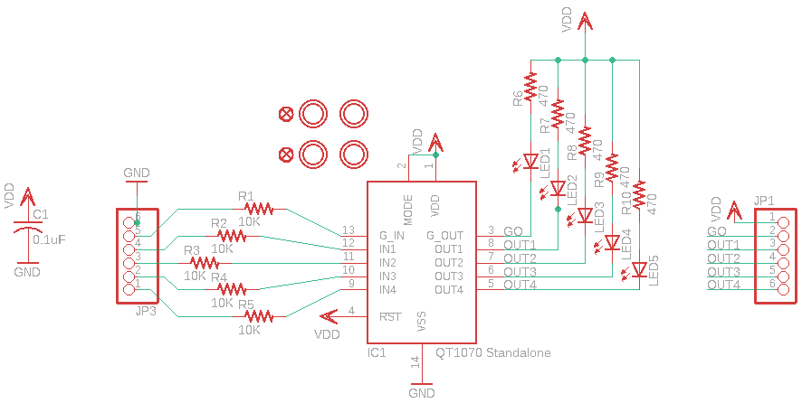](eagleSchemImage.png)
## PCB
  
[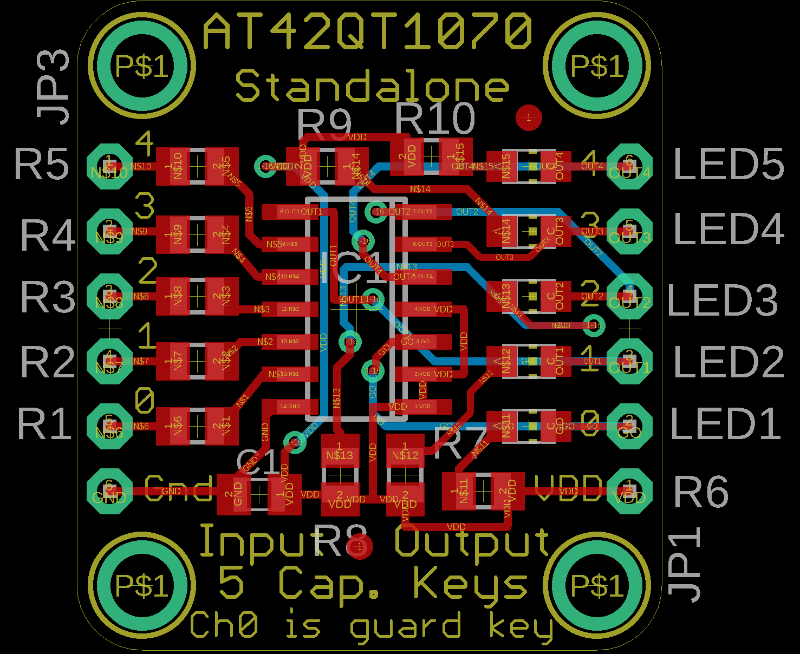](eagleImage.png)
## Interactive BOM

- Interactive BOM page: [ibom.html](https://htmlpreview.github.io/?https://github.com/oomlout/oomlout_OOMP_projects/blob/main/PROJ-ADAF-1362-STAN-01/kicad/bom/ibom.html)

## OOMP Parts
  

|OOMP ID|Name|Identifier|
| :---: | :---: | :---: |
|[CAPC-0805-X-NF100-V50](https://github.com/oomlout/oomlout_OOMP_parts/tree/main/CAPC-0805-X-NF100-V50/)|[SMD (0805) 100 nF Capacitor (Ceramic) 50v](https://github.com/oomlout/oomlout_OOMP_parts/tree/main/CAPC-0805-X-NF100-V50/)|[C1](https://github.com/oomlout/oomlout_OOMP_parts/tree/main/CAPC-0805-X-NF100-V50/)|
|UNMATCHED-UNMATCHED-X-UNMATCHED-01||IC1|
|[HEAD-I01-X-PI06-01](https://github.com/oomlout/oomlout_OOMP_parts/tree/main/HEAD-I01-X-PI06-01/)|[2.54 mm 6 Pin Header](https://github.com/oomlout/oomlout_OOMP_parts/tree/main/HEAD-I01-X-PI06-01/)|[JP1, JP3](https://github.com/oomlout/oomlout_OOMP_parts/tree/main/HEAD-I01-X-PI06-01/)|
|[LEDS-0805-G-STAN-01](https://github.com/oomlout/oomlout_OOMP_parts/tree/main/LEDS-0805-G-STAN-01/)|[SMD (0805) Green LED](https://github.com/oomlout/oomlout_OOMP_parts/tree/main/LEDS-0805-G-STAN-01/)|[LED1, LED2, LED3, LED4, LED5](https://github.com/oomlout/oomlout_OOMP_parts/tree/main/LEDS-0805-G-STAN-01/)|
|[RESE-0805-X-O103-01](https://github.com/oomlout/oomlout_OOMP_parts/tree/main/RESE-0805-X-O103-01/)|[SMD (0805) 10k Ohm Resistor](https://github.com/oomlout/oomlout_OOMP_parts/tree/main/RESE-0805-X-O103-01/)|[R1, R2, R3, R4, R5](https://github.com/oomlout/oomlout_OOMP_parts/tree/main/RESE-0805-X-O103-01/)|
|[RESE-0805-X-O471-01](https://github.com/oomlout/oomlout_OOMP_parts/tree/main/RESE-0805-X-O471-01/)|[SMD (0805) 470 Ohm Resistor](https://github.com/oomlout/oomlout_OOMP_parts/tree/main/RESE-0805-X-O471-01/)|[R6, R7, R8, R9, R10](https://github.com/oomlout/oomlout_OOMP_parts/tree/main/RESE-0805-X-O471-01/)|

## Images
  
  

|bominteractivefront|bominteractiveback|kicadPcb3d|kicadPcb3dFront|kicadPcb3dBack|kicadSchem|eagleImage|eagleSchemImage|pcbdraw|pcbdrawback|
| :---: | :---: | :---: | :---: | :---: | :---: | :---: | :---: | :---: | :---: |
|[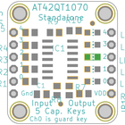](bomFront.png)|[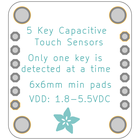](bomBack.png)|[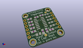](kicadPcb3d.png)|[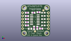](kicadPcb3dFront.png)|[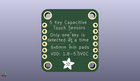](kicadPcb3dBack.png)|[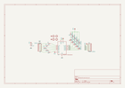](kicadSchem.png)|[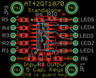](eagleImage.png)|[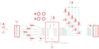](eagleSchemImage.png)|[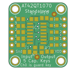](pcbdraw.png)|[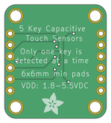](pcbdrawBack.png)|

## Tags

- hexID: PRA1362
- oompType: PROJ
- oompSize: ADAF
- oompColor: 1362
- oompDesc: STAN
- oompIndex: 01
- oompName: Adafruit Standalone Capacitive Sensor PCB
- sources: All source files from https://github.com/adafruit/Adafruit-Standalone-Capacitive-Sensor-PCB (source licence details in srcLicense.md)
- linkBuyPage: http://www.adafruit.com/products/1362
- oompID: PROJ-ADAF-1362-STAN-01
- oompParts: C1,CAPC-0805-X-NF100-V50
- oompParts: IC1,UNMATCHED-UNMATCHED-X-UNMATCHED-01
- oompParts: JP1,HEAD-I01-X-PI06-01
- oompParts: JP3,HEAD-I01-X-PI06-01
- oompParts: LED1,LEDS-0805-G-STAN-01
- oompParts: LED2,LEDS-0805-G-STAN-01
- oompParts: LED3,LEDS-0805-G-STAN-01
- oompParts: LED4,LEDS-0805-G-STAN-01
- oompParts: LED5,LEDS-0805-G-STAN-01
- oompParts: R1,RESE-0805-X-O103-01
- oompParts: R2,RESE-0805-X-O103-01
- oompParts: R3,RESE-0805-X-O103-01
- oompParts: R4,RESE-0805-X-O103-01
- oompParts: R5,RESE-0805-X-O103-01
- oompParts: R6,RESE-0805-X-O471-01
- oompParts: R7,RESE-0805-X-O471-01
- oompParts: R8,RESE-0805-X-O471-01
- oompParts: R9,RESE-0805-X-O471-01
- oompParts: R10,RESE-0805-X-O471-01
- rawParts: C1,0.1uF,C-USC0805K,C0805K,CAPACITOR, American symbol,,
- rawParts: FID1,FIDUCIAL,FIDUCIAL,FIDUCIAL_1MM,Fiducial Alignment Points,,
- rawParts: FID2,FIDUCIAL,FIDUCIAL,FIDUCIAL_1MM,Fiducial Alignment Points,,
- rawParts: IC1,AT42QT1070-SSU,AT42QT1070-SSU,SO14,QTouch 5-channel standalone sensor IC,,
- rawParts: JP1,,PINHD-1X6CB,1X06-CLEANBIG,PIN HEADER,,
- rawParts: JP3,,PINHD-1X6CB,1X06-CLEANBIG,PIN HEADER,,
- rawParts: LED1,,LEDCHIP-LED0805,CHIP-LED0805,LED,,
- rawParts: LED2,,LEDCHIP-LED0805,CHIP-LED0805,LED,,
- rawParts: LED3,,LEDCHIP-LED0805,CHIP-LED0805,LED,,
- rawParts: LED4,,LEDCHIP-LED0805,CHIP-LED0805,LED,,
- rawParts: LED5,,LEDCHIP-LED0805,CHIP-LED0805,LED,,
- rawParts: R1,10K,R-US_R0805,R0805,RESISTOR, American symbol,,
- rawParts: R2,10K,R-US_R0805,R0805,RESISTOR, American symbol,,
- rawParts: R3,10K,R-US_R0805,R0805,RESISTOR, American symbol,,
- rawParts: R4,10K,R-US_R0805,R0805,RESISTOR, American symbol,,
- rawParts: R5,10K,R-US_R0805,R0805,RESISTOR, American symbol,,
- rawParts: R6,470,R-US_R0805,R0805,RESISTOR, American symbol,,
- rawParts: R7,470,R-US_R0805,R0805,RESISTOR, American symbol,,
- rawParts: R8,470,R-US_R0805,R0805,RESISTOR, American symbol,,
- rawParts: R9,470,R-US_R0805,R0805,RESISTOR, American symbol,,
- rawParts: R10,470,R-US_R0805,R0805,RESISTOR, American symbol,,
- rawParts: U$1,MOUNTINGHOLE2.5,MOUNTINGHOLE2.5,MOUNTINGHOLE_2.5_PLATED,Mounting Hole,,
- rawParts: U$2,MOUNTINGHOLE2.5,MOUNTINGHOLE2.5,MOUNTINGHOLE_2.5_PLATED,Mounting Hole,,
- rawParts: U$3,MOUNTINGHOLE2.5,MOUNTINGHOLE2.5,MOUNTINGHOLE_2.5_PLATED,Mounting Hole,,
- rawParts: U$4,MOUNTINGHOLE2.5,MOUNTINGHOLE2.5,MOUNTINGHOLE_2.5_PLATED,Mounting Hole,,

[im]: kicadPcb3d_450.png
