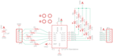

Contents
========

* [PRA1362 > Adafruit](#pra1362--adafruit)
	* [Schematic](#schematic)
	* [Interactive BOM](#interactive-bom)
	* [OOMP Parts](#oomp-parts)
	* [Images](#images)
	* [Tags](#tags)
  
![][im]
# PRA1362 > Adafruit

- ID: PROJ-ADAF-1362-STAN-01
- Hex ID: PRA1362
- Name: Adafruit
- Description: Adafruit
- Long Link: [http://oom.lt/PROJ-ADAF-1362-STAN-01](http://oom.lt/PROJ-ADAF-1362-STAN-01)
- Long Link: [http://oom.lt/PRA1362](http://oom.lt/PRA1362)

## Schematic
  
![][schem]
## Interactive BOM

- Interactive BOM page: [ibom.html](https://htmlpreview.github.io/?https://github.com/oomlout/oomlout_OOMP_projects/blob/main/PROJ-ADAF-1362-STAN-01/kicad/bom/ibom.html)

## OOMP Parts
  

|OOMP Parts|
| :---: |
|C1,UNMATCHED-UNMATCHED-UNMATCHED-UNMATCHED-UNMATCHED,C1,0.1uF,C-USC0805K,C0805K,CAPACITOR, American symbol,,|
|IC1,UNMATCHED-UNMATCHED-UNMATCHED-UNMATCHED-UNMATCHED,FID1,FIDUCIAL,FIDUCIAL,FIDUCIAL_1MM,Fiducial Alignment Points,,|
|JP1,UNMATCHED-UNMATCHED-UNMATCHED-UNMATCHED-UNMATCHED,FID2,FIDUCIAL,FIDUCIAL,FIDUCIAL_1MM,Fiducial Alignment Points,,|
|JP3,UNMATCHED-UNMATCHED-UNMATCHED-UNMATCHED-UNMATCHED,IC1,AT42QT1070-SSU,AT42QT1070-SSU,SO14,QTouch 5-channel standalone sensor IC,,|
|LED1,UNMATCHED-UNMATCHED-UNMATCHED-UNMATCHED-UNMATCHED,JP1,,PINHD-1X6CB,1X06-CLEANBIG,PIN HEADER,,|
|LED2,UNMATCHED-UNMATCHED-UNMATCHED-UNMATCHED-UNMATCHED,JP3,,PINHD-1X6CB,1X06-CLEANBIG,PIN HEADER,,|
|LED3,UNMATCHED-UNMATCHED-UNMATCHED-UNMATCHED-UNMATCHED,LED1,,LEDCHIP-LED0805,CHIP-LED0805,LED,,|
|LED4,UNMATCHED-UNMATCHED-UNMATCHED-UNMATCHED-UNMATCHED,LED2,,LEDCHIP-LED0805,CHIP-LED0805,LED,,|
|LED5,UNMATCHED-UNMATCHED-UNMATCHED-UNMATCHED-UNMATCHED,LED3,,LEDCHIP-LED0805,CHIP-LED0805,LED,,|
|R1,UNMATCHED-UNMATCHED-UNMATCHED-UNMATCHED-UNMATCHED,LED4,,LEDCHIP-LED0805,CHIP-LED0805,LED,,|
|R2,UNMATCHED-UNMATCHED-UNMATCHED-UNMATCHED-UNMATCHED,LED5,,LEDCHIP-LED0805,CHIP-LED0805,LED,,|
|R3,UNMATCHED-UNMATCHED-UNMATCHED-UNMATCHED-UNMATCHED,R1,10K,R-US_R0805,R0805,RESISTOR, American symbol,,|
|R4,UNMATCHED-UNMATCHED-UNMATCHED-UNMATCHED-UNMATCHED,R2,10K,R-US_R0805,R0805,RESISTOR, American symbol,,|
|R5,UNMATCHED-UNMATCHED-UNMATCHED-UNMATCHED-UNMATCHED,R3,10K,R-US_R0805,R0805,RESISTOR, American symbol,,|
|R6,UNMATCHED-UNMATCHED-UNMATCHED-UNMATCHED-UNMATCHED,R4,10K,R-US_R0805,R0805,RESISTOR, American symbol,,|
|R7,UNMATCHED-UNMATCHED-UNMATCHED-UNMATCHED-UNMATCHED,R5,10K,R-US_R0805,R0805,RESISTOR, American symbol,,|
|R8,UNMATCHED-UNMATCHED-UNMATCHED-UNMATCHED-UNMATCHED,R6,470,R-US_R0805,R0805,RESISTOR, American symbol,,|
|R9,UNMATCHED-UNMATCHED-UNMATCHED-UNMATCHED-UNMATCHED,R7,470,R-US_R0805,R0805,RESISTOR, American symbol,,|
|R10,UNMATCHED-UNMATCHED-UNMATCHED-UNMATCHED-UNMATCHED,R8,470,R-US_R0805,R0805,RESISTOR, American symbol,,|
|U$1,UNMATCHED-UNMATCHED-UNMATCHED-UNMATCHED-UNMATCHED,R9,470,R-US_R0805,R0805,RESISTOR, American symbol,,|
|U$2,UNMATCHED-UNMATCHED-UNMATCHED-UNMATCHED-UNMATCHED,R10,470,R-US_R0805,R0805,RESISTOR, American symbol,,|
|U$3,UNMATCHED-UNMATCHED-UNMATCHED-UNMATCHED-UNMATCHED,U$1,MOUNTINGHOLE2.5,MOUNTINGHOLE2.5,MOUNTINGHOLE_2.5_PLATED,Mounting Hole,,|
|U$4,UNMATCHED-UNMATCHED-UNMATCHED-UNMATCHED-UNMATCHED,U$2,MOUNTINGHOLE2.5,MOUNTINGHOLE2.5,MOUNTINGHOLE_2.5_PLATED,Mounting Hole,,|

## Images
  
  

|kicadPcb3d|kicadPcb3dFront|kicadPcb3dBack|eagleImage|eagleSchemImage|
| :---: | :---: | :---: | :---: | :---: |
||||||

## Tags

- hexID: PRA1362
- oompType: PROJ
- oompSize: ADAF
- oompColor: 1362
- oompDesc: STAN
- oompIndex: 01
- oompName: Adafruit Standalone Capacitive Sensor PCB
- sources: All source files from https://github.com/adafruit/Adafruit-Standalone-Capacitive-Sensor-PCB (source licence details in srcLicense.md)
- linkBuyPage: http://www.adafruit.com/products/1362
- oompID: PROJ-ADAF-1362-STAN-01
- oompParts: C1,UNMATCHED-UNMATCHED-UNMATCHED-UNMATCHED-UNMATCHED
- oompParts: IC1,UNMATCHED-UNMATCHED-UNMATCHED-UNMATCHED-UNMATCHED
- oompParts: JP1,UNMATCHED-UNMATCHED-UNMATCHED-UNMATCHED-UNMATCHED
- oompParts: JP3,UNMATCHED-UNMATCHED-UNMATCHED-UNMATCHED-UNMATCHED
- oompParts: LED1,UNMATCHED-UNMATCHED-UNMATCHED-UNMATCHED-UNMATCHED
- oompParts: LED2,UNMATCHED-UNMATCHED-UNMATCHED-UNMATCHED-UNMATCHED
- oompParts: LED3,UNMATCHED-UNMATCHED-UNMATCHED-UNMATCHED-UNMATCHED
- oompParts: LED4,UNMATCHED-UNMATCHED-UNMATCHED-UNMATCHED-UNMATCHED
- oompParts: LED5,UNMATCHED-UNMATCHED-UNMATCHED-UNMATCHED-UNMATCHED
- oompParts: R1,UNMATCHED-UNMATCHED-UNMATCHED-UNMATCHED-UNMATCHED
- oompParts: R2,UNMATCHED-UNMATCHED-UNMATCHED-UNMATCHED-UNMATCHED
- oompParts: R3,UNMATCHED-UNMATCHED-UNMATCHED-UNMATCHED-UNMATCHED
- oompParts: R4,UNMATCHED-UNMATCHED-UNMATCHED-UNMATCHED-UNMATCHED
- oompParts: R5,UNMATCHED-UNMATCHED-UNMATCHED-UNMATCHED-UNMATCHED
- oompParts: R6,UNMATCHED-UNMATCHED-UNMATCHED-UNMATCHED-UNMATCHED
- oompParts: R7,UNMATCHED-UNMATCHED-UNMATCHED-UNMATCHED-UNMATCHED
- oompParts: R8,UNMATCHED-UNMATCHED-UNMATCHED-UNMATCHED-UNMATCHED
- oompParts: R9,UNMATCHED-UNMATCHED-UNMATCHED-UNMATCHED-UNMATCHED
- oompParts: R10,UNMATCHED-UNMATCHED-UNMATCHED-UNMATCHED-UNMATCHED
- oompParts: U$1,UNMATCHED-UNMATCHED-UNMATCHED-UNMATCHED-UNMATCHED
- oompParts: U$2,UNMATCHED-UNMATCHED-UNMATCHED-UNMATCHED-UNMATCHED
- oompParts: U$3,UNMATCHED-UNMATCHED-UNMATCHED-UNMATCHED-UNMATCHED
- oompParts: U$4,UNMATCHED-UNMATCHED-UNMATCHED-UNMATCHED-UNMATCHED
- rawParts: C1,0.1uF,C-USC0805K,C0805K,CAPACITOR, American symbol,,
- rawParts: FID1,FIDUCIAL,FIDUCIAL,FIDUCIAL_1MM,Fiducial Alignment Points,,
- rawParts: FID2,FIDUCIAL,FIDUCIAL,FIDUCIAL_1MM,Fiducial Alignment Points,,
- rawParts: IC1,AT42QT1070-SSU,AT42QT1070-SSU,SO14,QTouch 5-channel standalone sensor IC,,
- rawParts: JP1,,PINHD-1X6CB,1X06-CLEANBIG,PIN HEADER,,
- rawParts: JP3,,PINHD-1X6CB,1X06-CLEANBIG,PIN HEADER,,
- rawParts: LED1,,LEDCHIP-LED0805,CHIP-LED0805,LED,,
- rawParts: LED2,,LEDCHIP-LED0805,CHIP-LED0805,LED,,
- rawParts: LED3,,LEDCHIP-LED0805,CHIP-LED0805,LED,,
- rawParts: LED4,,LEDCHIP-LED0805,CHIP-LED0805,LED,,
- rawParts: LED5,,LEDCHIP-LED0805,CHIP-LED0805,LED,,
- rawParts: R1,10K,R-US_R0805,R0805,RESISTOR, American symbol,,
- rawParts: R2,10K,R-US_R0805,R0805,RESISTOR, American symbol,,
- rawParts: R3,10K,R-US_R0805,R0805,RESISTOR, American symbol,,
- rawParts: R4,10K,R-US_R0805,R0805,RESISTOR, American symbol,,
- rawParts: R5,10K,R-US_R0805,R0805,RESISTOR, American symbol,,
- rawParts: R6,470,R-US_R0805,R0805,RESISTOR, American symbol,,
- rawParts: R7,470,R-US_R0805,R0805,RESISTOR, American symbol,,
- rawParts: R8,470,R-US_R0805,R0805,RESISTOR, American symbol,,
- rawParts: R9,470,R-US_R0805,R0805,RESISTOR, American symbol,,
- rawParts: R10,470,R-US_R0805,R0805,RESISTOR, American symbol,,
- rawParts: U$1,MOUNTINGHOLE2.5,MOUNTINGHOLE2.5,MOUNTINGHOLE_2.5_PLATED,Mounting Hole,,
- rawParts: U$2,MOUNTINGHOLE2.5,MOUNTINGHOLE2.5,MOUNTINGHOLE_2.5_PLATED,Mounting Hole,,
- rawParts: U$3,MOUNTINGHOLE2.5,MOUNTINGHOLE2.5,MOUNTINGHOLE_2.5_PLATED,Mounting Hole,,
- rawParts: U$4,MOUNTINGHOLE2.5,MOUNTINGHOLE2.5,MOUNTINGHOLE_2.5_PLATED,Mounting Hole,,

[im]: kicadPcb3d_450.png
[schem]: eagleSchemImage.png
