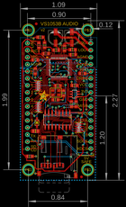
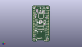

Contents
========

* [PROJ-ADAF-1381-STAN-01>Adafruit VS1053 Breakout PCB](#proj-adaf-1381-stan-01adafruit-vs1053-breakout-pcb)
	* [Images](#images)
	* [Interactive BOM](#interactive-bom)
	* [OOMP Parts](#oomp-parts)
	* [Tags](#tags)
  
![][im]
# PROJ-ADAF-1381-STAN-01>Adafruit VS1053 Breakout PCB

- ID: PROJ-ADAF-1381-STAN-01
- Hex ID: PRA1381
- Name: Adafruit VS1053 Breakout PCB
- Description: 

## Images
  
  

|eagleImage|kicadPcb3dFront|kicadPcb3dBack|kicadPcb3d|
| :---: | :---: | :---: | :---: |
|||||

## Interactive BOM

- Interactive BOM page: [ibom.html](kicad/bom/ibom.html)

## OOMP Parts
  

|OOMP Parts|
| :---: |
|CAPE-UNMATCHED-X-UNMATCHED-01, C1, 18.541999999999998, 51.56199999999999, 270,C1, 220uF, PANASONIC_C, rcl, (0.73, 2.03), R270|
|CAPE-UNMATCHED-X-UNMATCHED-01, C2, 12.7, 51.56199999999999, 270,C2, 220uF, PANASONIC_C, rcl, (0.5, 2.03), R270|
|CAPE-0805-X-UNMATCHED-01, C4, 15.620999999999999, 31.5214, 270,C4, 10pF, _0805MP, microbuilder, (0.615, 1.241), R270|
|CAPE-0805-X-UNMATCHED-01, C5, 12.6238, 29.083, 0,C5, 10pF, _0805MP, microbuilder, (0.497, 1.145), R0|
|CAPE-0805-X-UNMATCHED-01, C6, 18.415, 27.558999999999997, 270,C6, 10uF, _0805MP, microbuilder, (0.725, 1.085), R270|
|CAPE-0805-X-UNMATCHED-01, C7, 20.066, 27.558999999999997, 270,C7, 10uF, _0805MP, microbuilder, (0.79, 1.085), R270|
|CAPE-0805-X-NF100-01, C8, 9.192200056, 45.762999914, 0,C8, 0.1uF, _0805MP, microbuilder, (0.36189764, 1.80169291), R0|
|CAPE-0805-X-UNMATCHED-01, C19, 3.302, 8.636000000000001, 0,C19, 10uF, _0805MP, microbuilder, (0.13, 0.34), R0|
|CAPE-0805-X-UNMATCHED-01, C20, 19.5326, 34.2138, 180,C20, 10uF, _0805MP, microbuilder, (0.769, 1.347), R180|
|ERROR, C21 10nF (0.01uF), 0, 0, 0,C21, 10nF, (0.01uF), _0805MP, microbuilder, (0.28346469, 2.03366142), R180|
|ERROR, C22 10nF (0.01uF), 0, 0, 0,C22, 10nF, (0.01uF), _0805MP, microbuilder, (0.74613386, 1.78638583), R180|
|CAPE-0805-X-NF100-01, C26, 5.384799999999999, 39.427200037999995, 270,C26, 0.1uF, _0805MP, microbuilder, (0.212, 1.55225197), R270|
|UNMATCHED-UNMATCHED-X-UNMATCHED-01, CN1, 6.357999983999999, 16.002, 0,CN1, 2908-05WB-M6, MICROSD, microbuilder, (0.25031496, 0.63), R0|
|UNMATCHED-UNMATCHED-X-UNMATCHED-01, D1, 5.968999999999999, 20.827999999999996, 270,D1, 1N4148, SOD-323, microbuilder, (0.235, 0.82), R270|
|UNMATCHED-0805-X-UNMATCHED-01, FB1, 6.659003192, 48.773396991999995, 270,FB1, FERITTE, _0805MP, microbuilder, (0.26216548, 1.92021248), R270|
|UNMATCHED-0805-X-UNMATCHED-01, FB2, 22.317799916, 38.55079996199999, 180,FB2, FERITTE, _0805MP, microbuilder, (0.87865354, 1.51774803), R180|
|UNMATCHED-UNMATCHED-X-UNMATCHED-01, JP2, 25.4, 30.479999999999997, 270,JP2, 1X16_ROUND, microbuilder, (1, 1.2), R270|
|UNMATCHED-UNMATCHED-X-UNMATCHED-01, JP3, 2.54, 30.479999999999997, 270,JP3, 1X16_ROUND, microbuilder, (0.1, 1.2), R270|
|RESE-0805-X-UNMATCHED-01, R1, 13.4874, 34.1884, 0,R1, 1M, _0805MP, microbuilder, (0.531, 1.346), R0|
|RESE-0805-X-O104-01, R2, 5.310203248, 43.486399946, 0,R2, 100K, _0805MP, microbuilder, (0.20906312, 1.71206299), R0|
|RESE-0805-X-UNMATCHED-01, R3, 8.729003116, 48.830996825999996, 90,R3, 20, _0805MP, microbuilder, (0.34366154, 1.92248019), R90|
|RESE-0805-X-UNMATCHED-01, R4, 18.872000101999998, 47.140999952, 0,R4, 20, _0805MP, microbuilder, (0.74299213, 1.85594488), R0|
|RESE-0805-X-UNMATCHED-01, R6, 15.907999934, 47.771999959999995, 270,R6, 100, _0805MP, microbuilder, (0.62629921, 1.8807874), R270|
|RESE-0805-X-UNMATCHED-01, R7, 12.863999926, 47.012999954, 180,R7, 100, _0805MP, microbuilder, (0.50645669, 1.85090551), R180|
|RESE-UNMATCHED-X-O104-01, R8, 6.5024, 26.492199999999997, 270,R8, 100K, RESPACK_4X0603, microbuilder, (0.256, 1.043), R270|
|RESE-UNMATCHED-X-O104-01, R9, 21.005799999999997, 19.049999999999997, 270,R9, 100K, RESPACK_4X0603, microbuilder, (0.827, 0.75), R270|
|<table><tr><td></td><td> R10</td><td>[RESE-0805-X-O103-01 SMD (0805) 10k Ohm Resistor](https://github.com/oomlout/oomlout_OOMP_parts/tree/main/RESE-0805-X-O103-01/)</td><td>[R85103](https://github.com/oomlout/oomlout_OOMP_parts/tree/main/RESE-0805-X-O103-01/)</td></tr></table>|
|RESE-UNMATCHED-X-O104-01, R16, 6.4262, 34.112199999999994, 270,R16, 100K, RESPACK_4X0603, microbuilder, (0.253, 1.343), R270|
|UNMATCHED-UNMATCHED-X-UNMATCHED-01, U1, 13.97, 40.766999999999996, 0,U1, VS1053B, LQFP48, microbuilder, (0.55, 1.605), R0|
|UNMATCHED-UNMATCHED-X-UNMATCHED-01, U2, 19.565999983999998, 31.118999992, 90,U2, AP7312-1833W6-7, SOT23-6, microbuilder, (0.77031496, 1.22515748), R90|
|UNMATCHED-UNMATCHED-X-UNMATCHED-01, U3, 13.3858, 21.843999999999998, 180,U3, 74HC4050D, SOIC16, microbuilder, (0.527, 0.86), R180|
|UNMATCHED-UNMATCHED-X-UNMATCHED-01, Y1, 12.788199976, 31.644400008, 0,Y1, ABM8G-12.288MHZ-4Y-T3, CRYSTAL_3.2X2.5, microbuilder, (0.50347244, 1.24584252), R0|

## Tags

- hexID: PRA1381
- oompType: PROJ
- oompSize: ADAF
- oompColor: 1381
- oompDesc: STAN
- oompIndex: 01
- oompName: Adafruit VS1053 Breakout PCB
- sources: All source files from https://github.com/adafruit/Adafruit-VS1053-Breakout-PCB (source licence details in srcLicense.md)
- linkBuyPage: http://www.adafruit.com/products/1381
- oompPart: CAPE-UNMATCHED-X-UNMATCHED-01, C1, 18.541999999999998, 51.56199999999999, 270
- oompPart: CAPE-UNMATCHED-X-UNMATCHED-01, C2, 12.7, 51.56199999999999, 270
- oompPart: CAPE-0805-X-UNMATCHED-01, C4, 15.620999999999999, 31.5214, 270
- oompPart: CAPE-0805-X-UNMATCHED-01, C5, 12.6238, 29.083, 0
- oompPart: CAPE-0805-X-UNMATCHED-01, C6, 18.415, 27.558999999999997, 270
- oompPart: CAPE-0805-X-UNMATCHED-01, C7, 20.066, 27.558999999999997, 270
- oompPart: CAPE-0805-X-NF100-01, C8, 9.192200056, 45.762999914, 0
- oompPart: CAPE-0805-X-UNMATCHED-01, C19, 3.302, 8.636000000000001, 0
- oompPart: CAPE-0805-X-UNMATCHED-01, C20, 19.5326, 34.2138, 180
- oompPart: ERROR, C21 10nF (0.01uF), 0, 0, 0
- oompPart: ERROR, C22 10nF (0.01uF), 0, 0, 0
- oompPart: CAPE-0805-X-NF100-01, C26, 5.384799999999999, 39.427200037999995, 270
- oompPart: UNMATCHED-UNMATCHED-X-UNMATCHED-01, CN1, 6.357999983999999, 16.002, 0
- oompPart: UNMATCHED-UNMATCHED-X-UNMATCHED-01, D1, 5.968999999999999, 20.827999999999996, 270
- oompPart: UNMATCHED-0805-X-UNMATCHED-01, FB1, 6.659003192, 48.773396991999995, 270
- oompPart: UNMATCHED-0805-X-UNMATCHED-01, FB2, 22.317799916, 38.55079996199999, 180
- oompPart: SKIP-UNMATCHED-X-UNMATCHED-01, FID1, 5.715, 56.515, 0
- oompPart: SKIP-UNMATCHED-X-UNMATCHED-01, FID2, 22.035000125999996, 1.2190001019999999, 0
- oompPart: UNMATCHED-UNMATCHED-X-UNMATCHED-01, JP2, 25.4, 30.479999999999997, 270
- oompPart: UNMATCHED-UNMATCHED-X-UNMATCHED-01, JP3, 2.54, 30.479999999999997, 270
- oompPart: RESE-0805-X-UNMATCHED-01, R1, 13.4874, 34.1884, 0
- oompPart: RESE-0805-X-O104-01, R2, 5.310203248, 43.486399946, 0
- oompPart: RESE-0805-X-UNMATCHED-01, R3, 8.729003116, 48.830996825999996, 90
- oompPart: RESE-0805-X-UNMATCHED-01, R4, 18.872000101999998, 47.140999952, 0
- oompPart: RESE-0805-X-UNMATCHED-01, R6, 15.907999934, 47.771999959999995, 270
- oompPart: RESE-0805-X-UNMATCHED-01, R7, 12.863999926, 47.012999954, 180
- oompPart: RESE-UNMATCHED-X-O104-01, R8, 6.5024, 26.492199999999997, 270
- oompPart: RESE-UNMATCHED-X-O104-01, R9, 21.005799999999997, 19.049999999999997, 270
- oompPart: RESE-0805-X-O103-01, R10, 5.460999999999999, 17.779999999999998, 180
- oompPart: RESE-UNMATCHED-X-O104-01, R16, 6.4262, 34.112199999999994, 270
- oompPart: SKIP-UNMATCHED-X-UNMATCHED-01, U$50, 2.921, 3.8099999999999996, 0
- oompPart: SKIP-UNMATCHED-X-UNMATCHED-01, U$51, 24.256999999999998, 3.8099999999999996, 0
- oompPart: SKIP-UNMATCHED-X-UNMATCHED-01, U$52, 24.256999999999998, 54.22899999999999, 0
- oompPart: SKIP-UNMATCHED-X-UNMATCHED-01, U$53, 2.921, 54.22899999999999, 0
- oompPart: UNMATCHED-UNMATCHED-X-UNMATCHED-01, U1, 13.97, 40.766999999999996, 0
- oompPart: UNMATCHED-UNMATCHED-X-UNMATCHED-01, U2, 19.565999983999998, 31.118999992, 90
- oompPart: UNMATCHED-UNMATCHED-X-UNMATCHED-01, U3, 13.3858, 21.843999999999998, 180
- oompPart: UNMATCHED-UNMATCHED-X-UNMATCHED-01, Y1, 12.788199976, 31.644400008, 0
- rawPart: C1, 220uF, PANASONIC_C, rcl, (0.73, 2.03), R270
- rawPart: C2, 220uF, PANASONIC_C, rcl, (0.5, 2.03), R270
- rawPart: C4, 10pF, _0805MP, microbuilder, (0.615, 1.241), R270
- rawPart: C5, 10pF, _0805MP, microbuilder, (0.497, 1.145), R0
- rawPart: C6, 10uF, _0805MP, microbuilder, (0.725, 1.085), R270
- rawPart: C7, 10uF, _0805MP, microbuilder, (0.79, 1.085), R270
- rawPart: C8, 0.1uF, _0805MP, microbuilder, (0.36189764, 1.80169291), R0
- rawPart: C19, 10uF, _0805MP, microbuilder, (0.13, 0.34), R0
- rawPart: C20, 10uF, _0805MP, microbuilder, (0.769, 1.347), R180
- rawPart: C21, 10nF, (0.01uF), _0805MP, microbuilder, (0.28346469, 2.03366142), R180
- rawPart: C22, 10nF, (0.01uF), _0805MP, microbuilder, (0.74613386, 1.78638583), R180
- rawPart: C26, 0.1uF, _0805MP, microbuilder, (0.212, 1.55225197), R270
- rawPart: CN1, 2908-05WB-M6, MICROSD, microbuilder, (0.25031496, 0.63), R0
- rawPart: D1, 1N4148, SOD-323, microbuilder, (0.235, 0.82), R270
- rawPart: FB1, FERITTE, _0805MP, microbuilder, (0.26216548, 1.92021248), R270
- rawPart: FB2, FERITTE, _0805MP, microbuilder, (0.87865354, 1.51774803), R180
- rawPart: FID1, FIDUCIAL, FIDUCIAL_1MM, microbuilder, (0.225, 2.225), R0
- rawPart: FID2, FIDUCIAL, FIDUCIAL_1MM, microbuilder, (0.86751969, 0.04799213), R0
- rawPart: JP2, 1X16_ROUND, microbuilder, (1, 1.2), R270
- rawPart: JP3, 1X16_ROUND, microbuilder, (0.1, 1.2), R270
- rawPart: R1, 1M, _0805MP, microbuilder, (0.531, 1.346), R0
- rawPart: R2, 100K, _0805MP, microbuilder, (0.20906312, 1.71206299), R0
- rawPart: R3, 20, _0805MP, microbuilder, (0.34366154, 1.92248019), R90
- rawPart: R4, 20, _0805MP, microbuilder, (0.74299213, 1.85594488), R0
- rawPart: R6, 100, _0805MP, microbuilder, (0.62629921, 1.8807874), R270
- rawPart: R7, 100, _0805MP, microbuilder, (0.50645669, 1.85090551), R180
- rawPart: R8, 100K, RESPACK_4X0603, microbuilder, (0.256, 1.043), R270
- rawPart: R9, 100K, RESPACK_4X0603, microbuilder, (0.827, 0.75), R270
- rawPart: R10, 10K, 0805-NO, microbuilder, (0.215, 0.7), R180
- rawPart: R16, 100K, RESPACK_4X0603, microbuilder, (0.253, 1.343), R270
- rawPart: U$50, MOUNTINGHOLE3.0THIN, MOUNTINGHOLE_3.0_PLATEDTHIN, microbuilder, (0.115, 0.15), R0
- rawPart: U$51, MOUNTINGHOLE3.0THIN, MOUNTINGHOLE_3.0_PLATEDTHIN, microbuilder, (0.955, 0.15), R0
- rawPart: U$52, MOUNTINGHOLE3.0THIN, MOUNTINGHOLE_3.0_PLATEDTHIN, microbuilder, (0.955, 2.135), R0
- rawPart: U$53, MOUNTINGHOLE3.0THIN, MOUNTINGHOLE_3.0_PLATEDTHIN, microbuilder, (0.115, 2.135), R0
- rawPart: U1, VS1053B, LQFP48, microbuilder, (0.55, 1.605), R0
- rawPart: U2, AP7312-1833W6-7, SOT23-6, microbuilder, (0.77031496, 1.22515748), R90
- rawPart: U3, 74HC4050D, SOIC16, microbuilder, (0.527, 0.86), R180
- rawPart: Y1, ABM8G-12.288MHZ-4Y-T3, CRYSTAL_3.2X2.5, microbuilder, (0.50347244, 1.24584252), R0

[im]: kicadPcb3d_450.png
