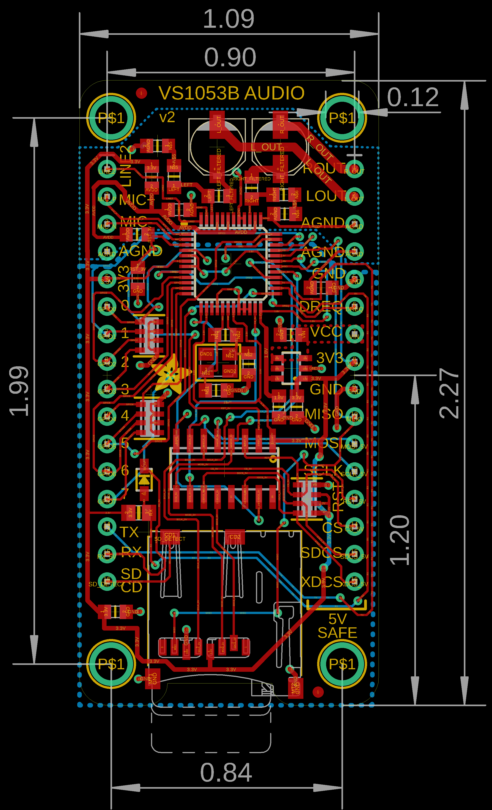
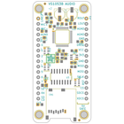
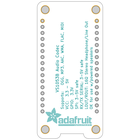
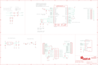
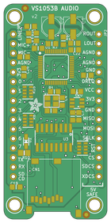
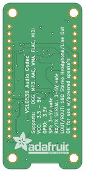

Contents
========

* [PRA1381 > Adafruit VS1053 Breakout PCB](#pra1381--adafruit-vs1053-breakout-pcb)
	* [Schematic](#schematic)
	* [PCB](#pcb)
	* [Interactive BOM](#interactive-bom)
	* [OOMP Parts](#oomp-parts)
	* [Images](#images)
	* [Tags](#tags)
  
![][im]
# PRA1381 > Adafruit VS1053 Breakout PCB

- ID: PROJ-ADAF-1381-STAN-01
- Hex ID: PRA1381
- Name: Adafruit
- Description: Adafruit
- Long Link: [http://oom.lt/PROJ-ADAF-1381-STAN-01](http://oom.lt/PROJ-ADAF-1381-STAN-01)
- Short Link: [http://oom.lt/PRA1381](http://oom.lt/PRA1381)

## Schematic
  

## PCB
  

## Interactive BOM

- Interactive BOM page: [ibom.html](https://htmlpreview.github.io/?https://github.com/oomlout/oomlout_OOMP_projects/blob/main/PROJ-ADAF-1381-STAN-01/kicad/bom/ibom.html)

## OOMP Parts
  

|OOMP Parts|
| :---: |
|CAPE-PANC-X-UF220-01 C1, C2|
|CAPC-0805-X-PF10-01 C4, C5|
|[CAPC-0805-X-UF10-V10  SMD (0805) 10 uF Capacitor (Ceramic) 10v  C6, C7, C19, C20](https://github.com/oomlout/oomlout_OOMP_parts/tree/main/CAPC-0805-X-UF10-V10/)|
|[CAPC-0805-X-NF100-V50  SMD (0805) 100 nF Capacitor (Ceramic) 50v  C8, C26](https://github.com/oomlout/oomlout_OOMP_parts/tree/main/CAPC-0805-X-NF100-V50/)|
|CAPC-0805-X-UNMATCHED-01 C21, C22|
|UNMATCHED-UNMATCHED-X-UNMATCHED-01 CN1, U1, U3, Y1|
|[DIOD-S323-X-K4148-01  SMD (SOD-323) Diode  D1](https://github.com/oomlout/oomlout_OOMP_parts/tree/main/DIOD-S323-X-K4148-01/)|
|FERB-0805-X-UNMATCHED-01 FB1, FB2|
|[HEAD-I01-X-PI16-01  2.54 mm 16 Pin Header  JP2, JP3](https://github.com/oomlout/oomlout_OOMP_parts/tree/main/HEAD-I01-X-PI16-01/)|
|RESE-0805-X-O105-01 R1|
|RESE-0805-X-O1003-01 R2|
|[RESE-0805-X-O200-01  SMD (0805) 20 Ohm Resistor  R3, R4](https://github.com/oomlout/oomlout_OOMP_parts/tree/main/RESE-0805-X-O200-01/)|
|[RESE-0805-X-O101-01  SMD (0805) 100 Ohm Resistor  R6, R7](https://github.com/oomlout/oomlout_OOMP_parts/tree/main/RESE-0805-X-O101-01/)|
|RESA-06038-X-O1003X4-01 R8, R9, R16|
|[RESE-0805-X-O103-01  SMD (0805) 10k Ohm Resistor  R10](https://github.com/oomlout/oomlout_OOMP_parts/tree/main/RESE-0805-X-O103-01/)|
|UNMATCHED-SO23-X-UNMATCHED-01 U2|

## Images
  
  

|bominteractivefront|bominteractiveback|kicadPcb3d|kicadPcb3dFront|kicadPcb3dBack|eagleImage|eagleSchemImage|pcbdraw|pcbdrawback|
| :---: | :---: | :---: | :---: | :---: | :---: | :---: | :---: | :---: |
||||||||||

## Tags

- hexID: PRA1381
- oompType: PROJ
- oompSize: ADAF
- oompColor: 1381
- oompDesc: STAN
- oompIndex: 01
- oompName: Adafruit VS1053 Breakout PCB
- sources: All source files from https://github.com/adafruit/Adafruit-VS1053-Breakout-PCB (source licence details in srcLicense.md)
- linkBuyPage: http://www.adafruit.com/products/1381
- oompID: PROJ-ADAF-1381-STAN-01
- oompParts: C1,CAPE-PANC-X-UF220-01
- oompParts: C2,CAPE-PANC-X-UF220-01
- oompParts: C4,CAPC-0805-X-PF10-01
- oompParts: C5,CAPC-0805-X-PF10-01
- oompParts: C6,CAPC-0805-X-UF10-V10
- oompParts: C7,CAPC-0805-X-UF10-V10
- oompParts: C8,CAPC-0805-X-NF100-V50
- oompParts: C19,CAPC-0805-X-UF10-V10
- oompParts: C20,CAPC-0805-X-UF10-V10
- oompParts: C21,CAPC-0805-X-UNMATCHED-01
- oompParts: C22,CAPC-0805-X-UNMATCHED-01
- oompParts: C26,CAPC-0805-X-NF100-V50
- oompParts: CN1,UNMATCHED-UNMATCHED-X-UNMATCHED-01
- oompParts: D1,DIOD-S323-X-K4148-01
- oompParts: FB1,FERB-0805-X-UNMATCHED-01
- oompParts: FB2,FERB-0805-X-UNMATCHED-01
- oompParts: JP2,HEAD-I01-X-PI16-01
- oompParts: JP3,HEAD-I01-X-PI16-01
- oompParts: R1,RESE-0805-X-O105-01
- oompParts: R2,RESE-0805-X-O1003-01
- oompParts: R3,RESE-0805-X-O200-01
- oompParts: R4,RESE-0805-X-O200-01
- oompParts: R6,RESE-0805-X-O101-01
- oompParts: R7,RESE-0805-X-O101-01
- oompParts: R8,RESA-06038-X-O1003X4-01
- oompParts: R9,RESA-06038-X-O1003X4-01
- oompParts: R10,RESE-0805-X-O103-01
- oompParts: R16,RESA-06038-X-O1003X4-01
- oompParts: U1,UNMATCHED-UNMATCHED-X-UNMATCHED-01
- oompParts: U2,UNMATCHED-SO23-X-UNMATCHED-01
- oompParts: U3,UNMATCHED-UNMATCHED-X-UNMATCHED-01
- oompParts: Y1,UNMATCHED-UNMATCHED-X-UNMATCHED-01
- rawParts: C1,220uF,CPOL-USC,PANASONIC_C,POLARIZED CAPACITOR, American symbol,,
- rawParts: C2,220uF,CPOL-USC,PANASONIC_C,POLARIZED CAPACITOR, American symbol,,
- rawParts: C4,10pF,CAP_CERAMIC_0805MP,_0805MP,Ceramic Capacitors,,
- rawParts: C5,10pF,CAP_CERAMIC_0805MP,_0805MP,Ceramic Capacitors,,
- rawParts: C6,10µF,CAP_CERAMIC_0805MP,_0805MP,Ceramic Capacitors,,
- rawParts: C7,10µF,CAP_CERAMIC_0805MP,_0805MP,Ceramic Capacitors,,
- rawParts: C8,0.1µF,CAP_CERAMIC_0805MP,_0805MP,Ceramic Capacitors,,
- rawParts: C19,10µF,CAP_CERAMIC_0805MP,_0805MP,Ceramic Capacitors,,
- rawParts: C20,10µF,CAP_CERAMIC_0805MP,_0805MP,Ceramic Capacitors,,
- rawParts: C21,10nF (0.01uF),CAP_CERAMIC_0805MP,_0805MP,Ceramic Capacitors,,
- rawParts: C22,10nF (0.01uF),CAP_CERAMIC_0805MP,_0805MP,Ceramic Capacitors,,
- rawParts: C26,0.1µF,CAP_CERAMIC_0805MP,_0805MP,Ceramic Capacitors,,
- rawParts: CN1,2908-05WB-M6,MICROSD,MICROSD,MicroSD/Transflash Card Holder with SPI pinout,,
- rawParts: D1,1N4148,DIODESOD-323,SOD-323,Diode,,
- rawParts: FB1,FERITTE,FERRITE_0805MP,_0805MP,Ferrite Bead,,
- rawParts: FB2,FERITTE,FERRITE_0805MP,_0805MP,Ferrite Bead,,
- rawParts: FID1,FIDUCIAL,FIDUCIAL,FIDUCIAL_1MM,Fiducial Alignment Points,EXCLUDE,
- rawParts: FID2,FIDUCIAL,FIDUCIAL,FIDUCIAL_1MM,Fiducial Alignment Points,EXCLUDE,
- rawParts: JP2,,HEADER-1X16ROUND,1X16_ROUND,PIN HEADER,,
- rawParts: JP3,,HEADER-1X16ROUND,1X16_ROUND,PIN HEADER,,
- rawParts: R1,1M,RESISTOR_0805MP,_0805MP,Resistors,,
- rawParts: R2,100K,RESISTOR_0805MP,_0805MP,Resistors,,
- rawParts: R3,20,RESISTOR_0805MP,_0805MP,Resistors,,
- rawParts: R4,20,RESISTOR_0805MP,_0805MP,Resistors,,
- rawParts: R6,100,RESISTOR_0805MP,_0805MP,Resistors,,
- rawParts: R7,100,RESISTOR_0805MP,_0805MP,Resistors,,
- rawParts: R8,100K,RESISTOR_4PACK,RESPACK_4X0603,Resistor Packs (4 resistors),,
- rawParts: R9,100K,RESISTOR_4PACK,RESPACK_4X0603,Resistor Packs (4 resistors),,
- rawParts: R10,10K,RESISTOR0805_NOOUTLINE,0805-NO,Resistors,,
- rawParts: R16,100K,RESISTOR_4PACK,RESPACK_4X0603,Resistor Packs (4 resistors),,
- rawParts: U$50,MOUNTINGHOLE3.0THIN,MOUNTINGHOLE3.0THIN,MOUNTINGHOLE_3.0_PLATEDTHIN,Mounting Hole,EXCLUDE,
- rawParts: U$51,MOUNTINGHOLE3.0THIN,MOUNTINGHOLE3.0THIN,MOUNTINGHOLE_3.0_PLATEDTHIN,Mounting Hole,EXCLUDE,
- rawParts: U$52,MOUNTINGHOLE3.0THIN,MOUNTINGHOLE3.0THIN,MOUNTINGHOLE_3.0_PLATEDTHIN,Mounting Hole,EXCLUDE,
- rawParts: U$53,MOUNTINGHOLE3.0THIN,MOUNTINGHOLE3.0THIN,MOUNTINGHOLE_3.0_PLATEDTHIN,Mounting Hole,EXCLUDE,
- rawParts: U1,VS1053B,VS1053B,LQFP48,VS1053b Audio Codec - Ogg Vorbis/MP3/AAC/WMA/FLAC/MIDI,,
- rawParts: U2,AP7312-1833W6-7,VREG_SOT23-6_DUALAP7312,SOT23-6,Dual Output SOT23-6 Linear Regulators,,
- rawParts: U3,74HC4050D,74HC4050D,SOIC16,6-channel level shifter,,
- rawParts: Y1,ABM8G-12.288MHZ-4Y-T3,CRYSTAL3.2X2.5,CRYSTAL_3.2X2.5,Crystals,,

[im]: kicadPcb3d_450.png
