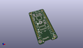
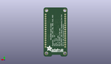
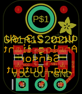
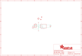

Contents
========

* [PRA1384 > Adafruit](#pra1384--adafruit)
	* [Images](#images)
	* [Tags](#tags)
  
![][im]
# PRA1384 > Adafruit

- ID: PROJ-ADAF-1384-STAN-01
- Hex ID: PRA1384
- Name: Adafruit
- Description: Adafruit

## Images
  
  

|kicadPcb3d|kicadPcb3dFront|kicadPcb3dBack|eagleImage|eagleSchemImage|
| :---: | :---: | :---: | :---: | :---: |
||||||

## Tags

- hexID: PRA1384
- oompType: PROJ
- oompSize: ADAF
- oompColor: 1384
- oompDesc: STAN
- oompIndex: 01
- oompName: Adafruit GA1A1S202WP Breakout PCB
- sources: All source files from https://github.com/adafruit/Adafruit-GA1A1S202WP-Breakout-PCB (source licence details in srcLicense.md)
- linkBuyPage: http://www.adafruit.com/products/1384
- oompID: PROJ-ADAF-1384-STAN-01
- oompParts: C1,UNMATCHED-UNMATCHED-UNMATCHED-UNMATCHED-UNMATCHED
- oompParts: JP1,UNMATCHED-UNMATCHED-UNMATCHED-UNMATCHED-UNMATCHED
- oompParts: R1,UNMATCHED-UNMATCHED-UNMATCHED-UNMATCHED-UNMATCHED
- oompParts: U$3,UNMATCHED-UNMATCHED-UNMATCHED-UNMATCHED-UNMATCHED
- oompParts: U1,UNMATCHED-UNMATCHED-UNMATCHED-UNMATCHED-UNMATCHED
- rawParts: C1,0.1uF,CAP_CERAMIC_0805MP,_0805MP,Ceramic Capacitors,,
- rawParts: FID1,FIDUCIAL,FIDUCIAL,FIDUCIAL_1MM,Fiducial Alignment Points,EXCLUDE,
- rawParts: FID2,FIDUCIAL,FIDUCIAL,FIDUCIAL_1MM,Fiducial Alignment Points,EXCLUDE,
- rawParts: JP1,,HEADER-1X3ROUND,1X03_ROUND,PIN HEADER,,
- rawParts: R1,68K,RESISTOR_0805MP,_0805MP,Resistors,,
- rawParts: U$3,MOUNTINGHOLE2.5,MOUNTINGHOLE2.5,MOUNTINGHOLE_2.5_PLATED,Mounting Hole,,
- rawParts: U1,GA1A1S202WP,GA1A1S202WP,GA1A1S202WP,GA1A1S202WP - Analog Light Sensor,,

[im]: kicadPcb3d_450.png
