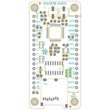
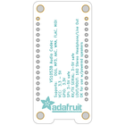
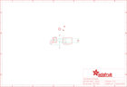
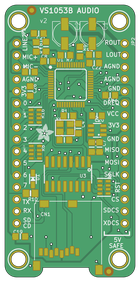
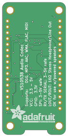

Contents
========

* [PRA1384 > Adafruit GA1A1S202WP Breakout PCB](#pra1384--adafruit-ga1a1s202wp-breakout-pcb)
	* [Schematic](#schematic)
	* [PCB](#pcb)
	* [Interactive BOM](#interactive-bom)
	* [OOMP Parts](#oomp-parts)
	* [Images](#images)
	* [Tags](#tags)
  
![][im]
# PRA1384 > Adafruit GA1A1S202WP Breakout PCB

- ID: PROJ-ADAF-1384-STAN-01
- Hex ID: PRA1384
- Name: Adafruit
- Description: Adafruit
- Long Link: [http://oom.lt/PROJ-ADAF-1384-STAN-01](http://oom.lt/PROJ-ADAF-1384-STAN-01)
- Short Link: [http://oom.lt/PRA1384](http://oom.lt/PRA1384)

## Schematic
  

## PCB
  

## Interactive BOM

- Interactive BOM page: [ibom.html](https://htmlpreview.github.io/?https://github.com/oomlout/oomlout_OOMP_projects/blob/main/PROJ-ADAF-1384-STAN-01/kicad/bom/ibom.html)

## OOMP Parts
  

|OOMP Parts|
| :---: |
|[CAPC-0805-X-NF100-V50  SMD (0805) 100 nF Capacitor (Ceramic) 50v  C1](https://github.com/oomlout/oomlout_OOMP_parts/tree/main/CAPC-0805-X-NF100-V50/)|
|[HEAD-I01-X-PI03-01  2.54 mm 3 Pin Header  JP1](https://github.com/oomlout/oomlout_OOMP_parts/tree/main/HEAD-I01-X-PI03-01/)|
|RESE-0805-X-O683-01 R1|
|UNMATCHED-UNMATCHED-X-UNMATCHED-01 U1|

## Images
  
  

|bominteractivefront|bominteractiveback|kicadPcb3d|kicadPcb3dFront|kicadPcb3dBack|eagleImage|eagleSchemImage|pcbdraw|pcbdrawback|
| :---: | :---: | :---: | :---: | :---: | :---: | :---: | :---: | :---: |
||||||||||

## Tags

- hexID: PRA1384
- oompType: PROJ
- oompSize: ADAF
- oompColor: 1384
- oompDesc: STAN
- oompIndex: 01
- oompName: Adafruit GA1A1S202WP Breakout PCB
- sources: All source files from https://github.com/adafruit/Adafruit-GA1A1S202WP-Breakout-PCB (source licence details in srcLicense.md)
- linkBuyPage: http://www.adafruit.com/products/1384
- oompID: PROJ-ADAF-1384-STAN-01
- oompParts: C1,CAPC-0805-X-NF100-V50
- oompParts: JP1,HEAD-I01-X-PI03-01
- oompParts: R1,RESE-0805-X-O683-01
- oompParts: U1,UNMATCHED-UNMATCHED-X-UNMATCHED-01
- rawParts: C1,0.1uF,CAP_CERAMIC_0805MP,_0805MP,Ceramic Capacitors,,
- rawParts: FID1,FIDUCIAL,FIDUCIAL,FIDUCIAL_1MM,Fiducial Alignment Points,EXCLUDE,
- rawParts: FID2,FIDUCIAL,FIDUCIAL,FIDUCIAL_1MM,Fiducial Alignment Points,EXCLUDE,
- rawParts: JP1,,HEADER-1X3ROUND,1X03_ROUND,PIN HEADER,,
- rawParts: R1,68K,RESISTOR_0805MP,_0805MP,Resistors,,
- rawParts: U$3,MOUNTINGHOLE2.5,MOUNTINGHOLE2.5,MOUNTINGHOLE_2.5_PLATED,Mounting Hole,,
- rawParts: U1,GA1A1S202WP,GA1A1S202WP,GA1A1S202WP,GA1A1S202WP - Analog Light Sensor,,

[im]: kicadPcb3d_450.png
