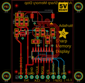
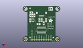
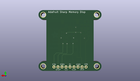
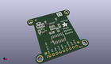

Contents
========

* [PROJ-ADAF-1393-STAN-01>Adafruit Sharp Memory Display PCBs](#proj-adaf-1393-stan-01adafruit-sharp-memory-display-pcbs)
	* [Images](#images)
	* [Interactive BOM](#interactive-bom)
	* [Tags](#tags)
  
![][im]
# PROJ-ADAF-1393-STAN-01>Adafruit Sharp Memory Display PCBs

- ID: PROJ-ADAF-1393-STAN-01
- Hex ID: PRA1393
- Name: Adafruit Sharp Memory Display PCBs
- Description: 

## Images
  
  

|eagleImage|kicadPcb3dFront|kicadPcb3dBack|kicadPcb3d|
| :---: | :---: | :---: | :---: |
|||||

## Interactive BOM

- Interactive BOM page: [ibom.html](kicad/bom/ibom.html)

## Tags

- hexID: PRA1393
- oompType: PROJ
- oompSize: ADAF
- oompColor: 1393
- oompDesc: STAN
- oompIndex: 01
- oompName: Adafruit Sharp Memory Display PCBs
- sources: All source files from https://github.com/adafruit/Adafruit-Sharp-Memory-Display-PCBs (source licence details in srcLicense.md)
- linkBuyPage: http://www.adafruit.com/products/1393

[im]: kicadPcb3d_450.png
