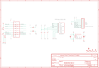

Contents
========

* [PRA1393 > Adafruit Sharp Memory Display PCBs](#pra1393--adafruit-sharp-memory-display-pcbs)
	* [Schematic](#schematic)
	* [PCB](#pcb)
	* [Interactive BOM](#interactive-bom)
	* [OOMP Parts](#oomp-parts)
	* [Images](#images)
	* [Tags](#tags)
  
![][im]
# PRA1393 > Adafruit Sharp Memory Display PCBs

- ID: PROJ-ADAF-1393-STAN-01
- Hex ID: PRA1393
- Name: Adafruit 1393
- Description: Adafruit 1393
- Long Link: [http://oom.lt/PROJ-ADAF-1393-STAN-01](http://oom.lt/PROJ-ADAF-1393-STAN-01)
- Short Link: [http://oom.lt/PRA1393](http://oom.lt/PRA1393)

## Schematic
  

## PCB
  

## Interactive BOM

- Interactive BOM page: [ibom.html](https://htmlpreview.github.io/?https://github.com/oomlout/oomlout_OOMP_projects/blob/main/PROJ-ADAF-1393-STAN-01/kicad/bom/ibom.html)

## OOMP Parts
  

|OOMP ID|Name|Identifier|
| :---: | :---: | :---: |
|CAPC-0805-X-UNMATCHED-01||C1, C2, C3, C4, C5|
|FERB-0805-X-UNMATCHED-01||FB1, FB2|
|UNMATCHED-UNMATCHED-X-UNMATCHED-01||IC1, U1|
|[HEAD-I01-X-PI09-01](https://github.com/oomlout/oomlout_OOMP_parts/tree/main/HEAD-I01-X-PI09-01/)|[2.54 mm 9 Pin Header](https://github.com/oomlout/oomlout_OOMP_parts/tree/main/HEAD-I01-X-PI09-01/)|[JP1](https://github.com/oomlout/oomlout_OOMP_parts/tree/main/HEAD-I01-X-PI09-01/)|
|[RESE-0805-X-O103-01](https://github.com/oomlout/oomlout_OOMP_parts/tree/main/RESE-0805-X-O103-01/)|[SMD (0805) 10k Ohm Resistor](https://github.com/oomlout/oomlout_OOMP_parts/tree/main/RESE-0805-X-O103-01/)|[R1, R2, R3](https://github.com/oomlout/oomlout_OOMP_parts/tree/main/RESE-0805-X-O103-01/)|
|UNMATCHED-SO235-X-UNMATCHED-01||U2|

## Images
  
  

|bominteractivefront|bominteractiveback|kicadPcb3d|kicadPcb3dFront|kicadPcb3dBack|kicadSchem|eagleImage|eagleSchemImage|pcbdraw|pcbdrawback|
| :---: | :---: | :---: | :---: | :---: | :---: | :---: | :---: | :---: | :---: |
|||||||||||

## Tags

- hexID: PRA1393
- oompType: PROJ
- oompSize: ADAF
- oompColor: 1393
- oompDesc: STAN
- oompIndex: 01
- oompName: Adafruit Sharp Memory Display PCBs
- sources: All source files from https://github.com/adafruit/Adafruit-Sharp-Memory-Display-PCBs (source licence details in srcLicense.md)
- linkBuyPage: http://www.adafruit.com/products/1393
- oompID: PROJ-ADAF-1393-STAN-01
- oompParts: C1,CAPC-0805-X-UNMATCHED-01
- oompParts: C2,CAPC-0805-X-UNMATCHED-01
- oompParts: C3,CAPC-0805-X-UNMATCHED-01
- oompParts: C4,CAPC-0805-X-UNMATCHED-01
- oompParts: C5,CAPC-0805-X-UNMATCHED-01
- oompParts: FB1,FERB-0805-X-UNMATCHED-01
- oompParts: FB2,FERB-0805-X-UNMATCHED-01
- oompParts: IC1,UNMATCHED-UNMATCHED-X-UNMATCHED-01
- oompParts: JP1,HEAD-I01-X-PI09-01
- oompParts: R1,RESE-0805-X-O103-01
- oompParts: R2,RESE-0805-X-O103-01
- oompParts: R3,RESE-0805-X-O103-01
- oompParts: U1,UNMATCHED-UNMATCHED-X-UNMATCHED-01
- oompParts: U2,UNMATCHED-SO235-X-UNMATCHED-01
- rawParts: C1,0.1µF,CAP_CERAMIC_0805,_0805,Ceramic Capacitors,,
- rawParts: C2,1µF,CAP_CERAMIC_0805,_0805,Ceramic Capacitors,,
- rawParts: C3,1µF,CAP_CERAMIC_0805,_0805,Ceramic Capacitors,,
- rawParts: C4,10µF,CAP_CERAMIC_0805,_0805,Ceramic Capacitors,,
- rawParts: C5,10µF,CAP_CERAMIC_0805,_0805,Ceramic Capacitors,,
- rawParts: FB1,,FERRITE_0805,_0805,Ferrite Bead,,
- rawParts: FB2,,FERRITE_0805,_0805,Ferrite Bead,,
- rawParts: FID1,FIDUCIAL,FIDUCIAL,FIDUCIAL_1MM,Fiducial Alignment Points,,
- rawParts: FID2,FIDUCIAL,FIDUCIAL,FIDUCIAL_1MM,Fiducial Alignment Points,,
- rawParts: FID3,FIDUCIAL,FIDUCIAL,FIDUCIAL_1MM,Fiducial Alignment Points,,
- rawParts: IC1,LS013B4DN04,SHARP_MEMORYLCD_10PIN,FPC_10PIN_52892-1095,Sharp Mono Memory LCD,,
- rawParts: JP1,,HEADER-1X970MIL,1X09_ROUND_70,PIN HEADER,,
- rawParts: R1,10K,RESISTOR_0805,_0805,Resistors,,
- rawParts: R2,10K,RESISTOR_0805,_0805,Resistors,,
- rawParts: R3,10K,RESISTOR_0805,_0805,Resistors,,
- rawParts: U$21,MOUNTINGHOLE3.0THIN,MOUNTINGHOLE3.0THIN,MOUNTINGHOLE_3.0_PLATEDTHIN,Mounting Hole,,
- rawParts: U$22,MOUNTINGHOLE3.0THIN,MOUNTINGHOLE3.0THIN,MOUNTINGHOLE_3.0_PLATEDTHIN,Mounting Hole,,
- rawParts: U$27,MOUNTINGHOLE3.0THIN,MOUNTINGHOLE3.0THIN,MOUNTINGHOLE_3.0_PLATEDTHIN,Mounting Hole,,
- rawParts: U$28,MOUNTINGHOLE3.0THIN,MOUNTINGHOLE3.0THIN,MOUNTINGHOLE_3.0_PLATEDTHIN,Mounting Hole,,
- rawParts: U1,74HC4050D,74HC4050D,SOIC16,6-channel level shifter,,
- rawParts: U2,MCP1824T-3302E/OT,VREG_SOT23-5,SOT23-5,SOT23-5 Fixed Voltage Regulators,,

[im]: kicadPcb3d_450.png
