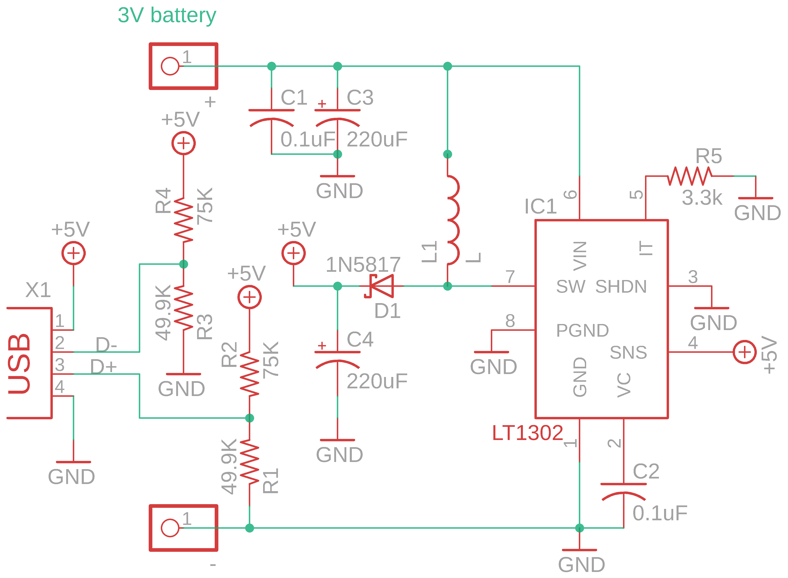

Contents
========

* [PRA14 > Adafruit_MintyBoost_PCB](#pra14--adafruit_mintyboost_pcb)
	* [Schematic](#schematic)
	* [PCB](#pcb)
	* [OOMP Parts](#oomp-parts)
	* [Images](#images)
	* [Tags](#tags)
  
![][im]
# PRA14 > Adafruit_MintyBoost_PCB

- ID: PROJ-ADAF-14-STAN-01
- Hex ID: PRA14
- Name: Adafruit
- Description: Adafruit
- Long Link: [http://oom.lt/PROJ-ADAF-14-STAN-01](http://oom.lt/PROJ-ADAF-14-STAN-01)
- Short Link: [http://oom.lt/PRA14](http://oom.lt/PRA14)

## Schematic
  

## PCB
  

## OOMP Parts
  

|OOMP Parts|
| :---: |
|HEAD-I01-X-PI01-01 +, -|
|CAPX-UNMATCHED-X-UF1D-01 C1, C2|
|CAPX-UNMATCHED-X-UF220-01 C3, C4|
|DIOD-UNMATCHED-X-UNMATCHED-01 D1|
|UNMATCHED-UNMATCHED-X-UNMATCHED-01 IC1, L1, X1|
|RESE-UNMATCHED-X-UNMATCHED-01 R1, R3, R5|
|RESE-UNMATCHED-X-O753-01 R2, R4|

## Images
  
  

|kicadPcb3d|kicadPcb3dFront|kicadPcb3dBack|eagleImage|eagleSchemImage|
| :---: | :---: | :---: | :---: | :---: |
||||||

## Tags

- hexID: PRA14
- oompType: PROJ
- oompSize: ADAF
- oompColor: 14
- oompDesc: STAN
- oompIndex: 01
- oompName: Adafruit_MintyBoost_PCB
- sources: All source files from https://github.com/adafruit/Adafruit_MintyBoost_PCB (source licence details in srcLicense.md)
- linkBuyPage: http://www.adafruit.com/products/14
- oompID: PROJ-ADAF-14-STAN-01
- oompParts: +,HEAD-I01-X-PI01-01
- oompParts: -,HEAD-I01-X-PI01-01
- oompParts: C1,CAPX-UNMATCHED-X-UF1D-01
- oompParts: C2,CAPX-UNMATCHED-X-UF1D-01
- oompParts: C3,CAPX-UNMATCHED-X-UF220-01
- oompParts: C4,CAPX-UNMATCHED-X-UF220-01
- oompParts: D1,DIOD-UNMATCHED-X-UNMATCHED-01
- oompParts: IC1,UNMATCHED-UNMATCHED-X-UNMATCHED-01
- oompParts: L1,UNMATCHED-UNMATCHED-X-UNMATCHED-01
- oompParts: R1,RESE-UNMATCHED-X-UNMATCHED-01
- oompParts: R2,RESE-UNMATCHED-X-O753-01
- oompParts: R3,RESE-UNMATCHED-X-UNMATCHED-01
- oompParts: R4,RESE-UNMATCHED-X-O753-01
- oompParts: R5,RESE-UNMATCHED-X-UNMATCHED-01
- oompParts: X1,UNMATCHED-UNMATCHED-X-UNMATCHED-01
- rawParts: +,,PINHD-1X1,1X01,PIN HEADER,,
- rawParts: -,,PINHD-1X1,1X01,PIN HEADER,,
- rawParts: C1,0.1uF,C-US025-025X050,C025-025X050,CAPACITOR, American symbol,,
- rawParts: C2,0.1uF,C-US025-025X050,C025-025X050,CAPACITOR, American symbol,,
- rawParts: C3,220uF,CPOL-USE2.5-5,E2,5-5,POLARIZED CAPACITOR, American symbol,,
- rawParts: C4,220uF,CPOL-USE2.5-5,E2,5-5,POLARIZED CAPACITOR, American symbol,,
- rawParts: D1,1N5817,SCHOTTKY-DIODEDO41-7,DO41-7,Schottky Diode,,
- rawParts: IC1,LT1302,LT1302,DIL08,,,
- rawParts: L1,L,L,6000,,,
- rawParts: R1,49.9K,R-US_0204/5,0204/5,RESISTOR, American symbol,,
- rawParts: R2,75K,R-US_0204/5,0204/5,RESISTOR, American symbol,,
- rawParts: R3,49.9K,R-US_0204/5,0204/5,RESISTOR, American symbol,,
- rawParts: R4,75K,R-US_0204/5,0204/5,RESISTOR, American symbol,,
- rawParts: R5,3.3k,R-US_0204/5,0204/5,RESISTOR, American symbol,,
- rawParts: X1,,PN87520,PN87520,BERG USB connector,,

[im]: kicadPcb3d_450.png
