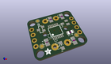
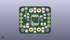
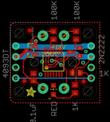
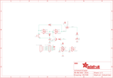

Contents
========

* [PRA1400 > Adafruit](#pra1400--adafruit)
	* [Images](#images)
	* [Tags](#tags)
  
![][im]
# PRA1400 > Adafruit

- ID: PROJ-ADAF-1400-STAN-01
- Hex ID: PRA1400
- Name: Adafruit
- Description: Adafruit

## Images
  
  

|kicadPcb3d|kicadPcb3dFront|kicadPcb3dBack|eagleImage|eagleSchemImage|
| :---: | :---: | :---: | :---: | :---: |
||||||

## Tags

- hexID: PRA1400
- oompType: PROJ
- oompSize: ADAF
- oompColor: 1400
- oompDesc: STAN
- oompIndex: 01
- oompName: Adafruit Push Button Power Switch PCB
- sources: All source files from https://github.com/adafruit/Adafruit-Push-Button-Power-Switch-PCB (source licence details in srcLicense.md)
- linkBuyPage: http://www.adafruit.com/products/1400
- oompID: PROJ-ADAF-1400-STAN-01
- oompParts: C1,UNMATCHED-UNMATCHED-UNMATCHED-UNMATCHED-UNMATCHED
- oompParts: CN1,UNMATCHED-UNMATCHED-UNMATCHED-UNMATCHED-UNMATCHED
- oompParts: CN2,UNMATCHED-UNMATCHED-UNMATCHED-UNMATCHED-UNMATCHED
- oompParts: IC1,UNMATCHED-UNMATCHED-UNMATCHED-UNMATCHED-UNMATCHED
- oompParts: LED,UNMATCHED-UNMATCHED-UNMATCHED-UNMATCHED-UNMATCHED
- oompParts: Q1,UNMATCHED-UNMATCHED-UNMATCHED-UNMATCHED-UNMATCHED
- oompParts: Q2,UNMATCHED-UNMATCHED-UNMATCHED-UNMATCHED-UNMATCHED
- oompParts: R1,UNMATCHED-UNMATCHED-UNMATCHED-UNMATCHED-UNMATCHED
- oompParts: R2,UNMATCHED-UNMATCHED-UNMATCHED-UNMATCHED-UNMATCHED
- oompParts: R3,UNMATCHED-UNMATCHED-UNMATCHED-UNMATCHED-UNMATCHED
- oompParts: R4,UNMATCHED-UNMATCHED-UNMATCHED-UNMATCHED-UNMATCHED
- oompParts: S1,UNMATCHED-UNMATCHED-UNMATCHED-UNMATCHED-UNMATCHED
- rawParts: C1,0.1uF,C-USC0805,C0805,CAPACITOR, American symbol,,
- rawParts: CN1,1X4-CLEANBIG,1X4-CLEANBIG,1X04-CLEANBIG,4-pin connector,,
- rawParts: CN2,1X4-CLEANBIG,1X4-CLEANBIG,1X04-CLEANBIG,4-pin connector,,
- rawParts: FID1,FIDUCIAL,FIDUCIAL,FIDUCIAL_1MM,Fiducial Alignment Points,EXCLUDE,
- rawParts: FID2,FIDUCIAL,FIDUCIAL,FIDUCIAL_1MM,Fiducial Alignment Points,EXCLUDE,
- rawParts: FID3,FIDUCIAL,FIDUCIAL,FIDUCIAL_1MM,Fiducial Alignment Points,EXCLUDE,
- rawParts: IC1,4093DT,4093DT,MC14093B-TSSOP14,Quad 2-input NAND schmitt trigger,,
- rawParts: LED,RED,LEDCHIP-LED0805,CHIP-LED0805,LED,,
- rawParts: Q1,2N2222,MMBT2222ALT1-NPN-SOT23-BEC,SOT23-BEC,NPN Transistror,,
- rawParts: Q2,POWER PFET,MOSFET-PWIDE,SOT23-WIDE,P-Channel Mosfet,,
- rawParts: R1,1K,R-US_R0805,R0805,RESISTOR, American symbol,,
- rawParts: R2,100K,R-US_R0805,R0805,RESISTOR, American symbol,,
- rawParts: R3,100K,R-US_R0805,R0805,RESISTOR, American symbol,,
- rawParts: R4,1K,R-US_R0805,R0805,RESISTOR, American symbol,,
- rawParts: S1,,40-XX-ROUND,B3F-40XX-ROUND,OMRON SWITCH,,

[im]: kicadPcb3d_450.png
