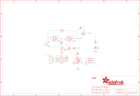

Contents
========

* [PRA1400 > Adafruit Push Button Power Switch PCB](#pra1400--adafruit-push-button-power-switch-pcb)
	* [Schematic](#schematic)
	* [PCB](#pcb)
	* [Interactive BOM](#interactive-bom)
	* [OOMP Parts](#oomp-parts)
	* [Images](#images)
	* [Tags](#tags)
  
![][im]
# PRA1400 > Adafruit Push Button Power Switch PCB

- ID: PROJ-ADAF-1400-STAN-01
- Hex ID: PRA1400
- Name: Adafruit 1400
- Description: Adafruit 1400
- Long Link: [http://oom.lt/PROJ-ADAF-1400-STAN-01](http://oom.lt/PROJ-ADAF-1400-STAN-01)
- Short Link: [http://oom.lt/PRA1400](http://oom.lt/PRA1400)

## Schematic
  

## PCB
  

## Interactive BOM

- Interactive BOM page: [ibom.html](https://htmlpreview.github.io/?https://github.com/oomlout/oomlout_OOMP_projects/blob/main/PROJ-ADAF-1400-STAN-01/kicad/bom/ibom.html)

## OOMP Parts
  

|OOMP ID|Name|Identifier|
| :---: | :---: | :---: |
|[CAPC-0805-X-NF100-V50](https://github.com/oomlout/oomlout_OOMP_parts/tree/main/CAPC-0805-X-NF100-V50/)|[SMD (0805) 100 nF Capacitor (Ceramic) 50v](https://github.com/oomlout/oomlout_OOMP_parts/tree/main/CAPC-0805-X-NF100-V50/)|[C1](https://github.com/oomlout/oomlout_OOMP_parts/tree/main/CAPC-0805-X-NF100-V50/)|
|UNMATCHED-UNMATCHED-X-UNMATCHED-01||CN1, CN2, IC1, S1|
|[LEDS-0805-R-STAN-01](https://github.com/oomlout/oomlout_OOMP_parts/tree/main/LEDS-0805-R-STAN-01/)|[SMD (0805) Red LED](https://github.com/oomlout/oomlout_OOMP_parts/tree/main/LEDS-0805-R-STAN-01/)|[LED](https://github.com/oomlout/oomlout_OOMP_parts/tree/main/LEDS-0805-R-STAN-01/)|
|UNMATCHED-SO23-X-UNMATCHED-01||Q1|
|MOSP-SO23-X-UNMATCHED-01||Q2|
|[RESE-0805-X-O102-01](https://github.com/oomlout/oomlout_OOMP_parts/tree/main/RESE-0805-X-O102-01/)|[SMD (0805) 1k Ohm Resistor](https://github.com/oomlout/oomlout_OOMP_parts/tree/main/RESE-0805-X-O102-01/)|[R1, R4](https://github.com/oomlout/oomlout_OOMP_parts/tree/main/RESE-0805-X-O102-01/)|
|RESE-0805-X-O1003-01||R2, R3|

## Images
  
  

|bominteractivefront|bominteractiveback|kicadPcb3d|kicadPcb3dFront|kicadPcb3dBack|kicadSchem|eagleImage|eagleSchemImage|pcbdraw|pcbdrawback|
| :---: | :---: | :---: | :---: | :---: | :---: | :---: | :---: | :---: | :---: |
|||||||||||

## Tags

- hexID: PRA1400
- oompType: PROJ
- oompSize: ADAF
- oompColor: 1400
- oompDesc: STAN
- oompIndex: 01
- oompName: Adafruit Push Button Power Switch PCB
- sources: All source files from https://github.com/adafruit/Adafruit-Push-Button-Power-Switch-PCB (source licence details in srcLicense.md)
- linkBuyPage: http://www.adafruit.com/products/1400
- oompID: PROJ-ADAF-1400-STAN-01
- oompParts: C1,CAPC-0805-X-NF100-V50
- oompParts: CN1,UNMATCHED-UNMATCHED-X-UNMATCHED-01
- oompParts: CN2,UNMATCHED-UNMATCHED-X-UNMATCHED-01
- oompParts: IC1,UNMATCHED-UNMATCHED-X-UNMATCHED-01
- oompParts: LED,LEDS-0805-R-STAN-01
- oompParts: Q1,UNMATCHED-SO23-X-UNMATCHED-01
- oompParts: Q2,MOSP-SO23-X-UNMATCHED-01
- oompParts: R1,RESE-0805-X-O102-01
- oompParts: R2,RESE-0805-X-O1003-01
- oompParts: R3,RESE-0805-X-O1003-01
- oompParts: R4,RESE-0805-X-O102-01
- oompParts: S1,UNMATCHED-UNMATCHED-X-UNMATCHED-01
- rawParts: C1,0.1uF,C-USC0805,C0805,CAPACITOR, American symbol,,
- rawParts: CN1,1X4-CLEANBIG,1X4-CLEANBIG,1X04-CLEANBIG,4-pin connector,,
- rawParts: CN2,1X4-CLEANBIG,1X4-CLEANBIG,1X04-CLEANBIG,4-pin connector,,
- rawParts: FID1,FIDUCIAL,FIDUCIAL,FIDUCIAL_1MM,Fiducial Alignment Points,EXCLUDE,
- rawParts: FID2,FIDUCIAL,FIDUCIAL,FIDUCIAL_1MM,Fiducial Alignment Points,EXCLUDE,
- rawParts: FID3,FIDUCIAL,FIDUCIAL,FIDUCIAL_1MM,Fiducial Alignment Points,EXCLUDE,
- rawParts: IC1,4093DT,4093DT,MC14093B-TSSOP14,Quad 2-input NAND schmitt trigger,,
- rawParts: LED,RED,LEDCHIP-LED0805,CHIP-LED0805,LED,,
- rawParts: Q1,2N2222,MMBT2222ALT1-NPN-SOT23-BEC,SOT23-BEC,NPN Transistror,,
- rawParts: Q2,POWER PFET,MOSFET-PWIDE,SOT23-WIDE,P-Channel Mosfet,,
- rawParts: R1,1K,R-US_R0805,R0805,RESISTOR, American symbol,,
- rawParts: R2,100K,R-US_R0805,R0805,RESISTOR, American symbol,,
- rawParts: R3,100K,R-US_R0805,R0805,RESISTOR, American symbol,,
- rawParts: R4,1K,R-US_R0805,R0805,RESISTOR, American symbol,,
- rawParts: S1,,40-XX-ROUND,B3F-40XX-ROUND,OMRON SWITCH,,

[im]: kicadPcb3d_450.png
