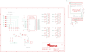

Contents
========

* [PRA1411 > Adafruit 16 channel PWM Servo Shield](#pra1411--adafruit-16-channel-pwm-servo-shield)
	* [Schematic](#schematic)
	* [PCB](#pcb)
	* [Interactive BOM](#interactive-bom)
	* [OOMP Parts](#oomp-parts)
	* [Images](#images)
	* [Tags](#tags)
  
![][im]
# PRA1411 > Adafruit 16 channel PWM Servo Shield

- ID: PROJ-ADAF-1411-STAN-01
- Hex ID: PRA1411
- Name: Adafruit
- Description: Adafruit
- Long Link: [http://oom.lt/PROJ-ADAF-1411-STAN-01](http://oom.lt/PROJ-ADAF-1411-STAN-01)
- Short Link: [http://oom.lt/PRA1411](http://oom.lt/PRA1411)

## Schematic
  

## PCB
  

## Interactive BOM

- Interactive BOM page: [ibom.html](https://htmlpreview.github.io/?https://github.com/oomlout/oomlout_OOMP_projects/blob/main/PROJ-ADAF-1411-STAN-01/kicad/bom/ibom.html)

## OOMP Parts
  

|OOMP ID|Name|Identifier|
| :---: | :---: | :---: |
|[CAPC-0805-X-UF10-V10](https://github.com/oomlout/oomlout_OOMP_parts/tree/main/CAPC-0805-X-UF10-V10/)|[SMD (0805) 10 uF Capacitor (Ceramic) 10v](https://github.com/oomlout/oomlout_OOMP_parts/tree/main/CAPC-0805-X-UF10-V10/)|[C1](https://github.com/oomlout/oomlout_OOMP_parts/tree/main/CAPC-0805-X-UF10-V10/)|
|CAPX-UNMATCHED-X-UNMATCHED-V63D||C2|
|[TERS-35D-L-PI02-01](https://github.com/oomlout/oomlout_OOMP_parts/tree/main/TERS-35D-L-PI02-01/)|[3.5 mm 2 Pin Blue Screw Terminal](https://github.com/oomlout/oomlout_OOMP_parts/tree/main/TERS-35D-L-PI02-01/)|[J1](https://github.com/oomlout/oomlout_OOMP_parts/tree/main/TERS-35D-L-PI02-01/)|
|HEAD-I01-X-UNMATCHED-01||JP1, JP2, JP5, JP6|
|[HEAD-I01-X-PI08-01](https://github.com/oomlout/oomlout_OOMP_parts/tree/main/HEAD-I01-X-PI08-01/)|[2.54 mm 8 Pin Header](https://github.com/oomlout/oomlout_OOMP_parts/tree/main/HEAD-I01-X-PI08-01/)|[JP3, JP4](https://github.com/oomlout/oomlout_OOMP_parts/tree/main/HEAD-I01-X-PI08-01/)|
|[HEAD-I01-X-PI10-01](https://github.com/oomlout/oomlout_OOMP_parts/tree/main/HEAD-I01-X-PI10-01/)|[2.54 mm 10 Pin Header](https://github.com/oomlout/oomlout_OOMP_parts/tree/main/HEAD-I01-X-PI10-01/)|[JP7](https://github.com/oomlout/oomlout_OOMP_parts/tree/main/HEAD-I01-X-PI10-01/)|
|[HEAD-I01-X-PI06-01](https://github.com/oomlout/oomlout_OOMP_parts/tree/main/HEAD-I01-X-PI06-01/)|[2.54 mm 6 Pin Header](https://github.com/oomlout/oomlout_OOMP_parts/tree/main/HEAD-I01-X-PI06-01/)|[JP8](https://github.com/oomlout/oomlout_OOMP_parts/tree/main/HEAD-I01-X-PI06-01/)|
|[LEDS-0805-R-STAN-01](https://github.com/oomlout/oomlout_OOMP_parts/tree/main/LEDS-0805-R-STAN-01/)|[SMD (0805) Red LED](https://github.com/oomlout/oomlout_OOMP_parts/tree/main/LEDS-0805-R-STAN-01/)|[LED1](https://github.com/oomlout/oomlout_OOMP_parts/tree/main/LEDS-0805-R-STAN-01/)|
|[LEDS-0805-G-STAN-01](https://github.com/oomlout/oomlout_OOMP_parts/tree/main/LEDS-0805-G-STAN-01/)|[SMD (0805) Green LED](https://github.com/oomlout/oomlout_OOMP_parts/tree/main/LEDS-0805-G-STAN-01/)|[LED2](https://github.com/oomlout/oomlout_OOMP_parts/tree/main/LEDS-0805-G-STAN-01/)|
|MOSP-SO23-X-K6401-01||Q1|
|[RESA-06038-X-O103X4-01](https://github.com/oomlout/oomlout_OOMP_parts/tree/main/RESA-06038-X-O103X4-01/)|[SMD (0603-8) 10k Ohm (x4) Resistor Array](https://github.com/oomlout/oomlout_OOMP_parts/tree/main/RESA-06038-X-O103X4-01/)|[R1, R2](https://github.com/oomlout/oomlout_OOMP_parts/tree/main/RESA-06038-X-O103X4-01/)|
|[RESE-0805-X-O103-01](https://github.com/oomlout/oomlout_OOMP_parts/tree/main/RESE-0805-X-O103-01/)|[SMD (0805) 10k Ohm Resistor](https://github.com/oomlout/oomlout_OOMP_parts/tree/main/RESE-0805-X-O103-01/)|[R3, R4, R7](https://github.com/oomlout/oomlout_OOMP_parts/tree/main/RESE-0805-X-O103-01/)|
|[RESE-0805-X-O471-01](https://github.com/oomlout/oomlout_OOMP_parts/tree/main/RESE-0805-X-O471-01/)|[SMD (0805) 470 Ohm Resistor](https://github.com/oomlout/oomlout_OOMP_parts/tree/main/RESE-0805-X-O471-01/)|[R5, R10](https://github.com/oomlout/oomlout_OOMP_parts/tree/main/RESE-0805-X-O471-01/)|
|RESA-06038-X-O221X4-01||R11, R12, R13, R14|
|[BUTA-6060-X-STAN-01](https://github.com/oomlout/oomlout_OOMP_parts/tree/main/BUTA-6060-X-STAN-01/)|[SMD (6060) Pushbutton (Tactile)](https://github.com/oomlout/oomlout_OOMP_parts/tree/main/BUTA-6060-X-STAN-01/)|[SW1](https://github.com/oomlout/oomlout_OOMP_parts/tree/main/BUTA-6060-X-STAN-01/)|
|UNMATCHED-UNMATCHED-X-UNMATCHED-01||U$44, U1|

## Images
  
  

|bominteractivefront|bominteractiveback|kicadPcb3d|kicadPcb3dFront|kicadPcb3dBack|kicadSchem|eagleImage|eagleSchemImage|pcbdraw|pcbdrawback|
| :---: | :---: | :---: | :---: | :---: | :---: | :---: | :---: | :---: | :---: |
|||||||||||

## Tags

- hexID: PRA1411
- oompType: PROJ
- oompSize: ADAF
- oompColor: 1411
- oompDesc: STAN
- oompIndex: 01
- oompName: Adafruit 16 channel PWM Servo Shield
- sources: All source files from https://github.com/adafruit/Adafruit-16-channel-PWM-Servo-Shield (source licence details in srcLicense.md)
- linkBuyPage: http://www.adafruit.com/products/1411
- oompID: PROJ-ADAF-1411-STAN-01
- oompParts: C1,CAPC-0805-X-UF10-V10
- oompParts: C2,CAPX-UNMATCHED-X-UNMATCHED-V63D
- oompParts: J1,TERS-35D-L-PI02-01
- oompParts: JP1,HEAD-I01-X-UNMATCHED-01
- oompParts: JP2,HEAD-I01-X-UNMATCHED-01
- oompParts: JP3,HEAD-I01-X-PI08-01
- oompParts: JP4,HEAD-I01-X-PI08-01
- oompParts: JP5,HEAD-I01-X-UNMATCHED-01
- oompParts: JP6,HEAD-I01-X-UNMATCHED-01
- oompParts: JP7,HEAD-I01-X-PI10-01
- oompParts: JP8,HEAD-I01-X-PI06-01
- oompParts: LED1,LEDS-0805-R-STAN-01
- oompParts: LED2,LEDS-0805-G-STAN-01
- oompParts: Q1,MOSP-SO23-X-K6401-01
- oompParts: R1,RESA-06038-X-O103X4-01
- oompParts: R2,RESA-06038-X-O103X4-01
- oompParts: R3,RESE-0805-X-O103-01
- oompParts: R4,RESE-0805-X-O103-01
- oompParts: R5,RESE-0805-X-O471-01
- oompParts: R7,RESE-0805-X-O103-01
- oompParts: R10,RESE-0805-X-O471-01
- oompParts: R11,RESA-06038-X-O221X4-01
- oompParts: R12,RESA-06038-X-O221X4-01
- oompParts: R13,RESA-06038-X-O221X4-01
- oompParts: R14,RESA-06038-X-O221X4-01
- oompParts: SW1,BUTA-6060-X-STAN-01
- oompParts: U$44,UNMATCHED-UNMATCHED-X-UNMATCHED-01
- oompParts: U1,UNMATCHED-UNMATCHED-X-UNMATCHED-01
- rawParts: C1,10uF,CAP_CERAMIC0805,0805,Ceramic Capacitors,,
- rawParts: C2,1000uF+ 6.3V,CPOL-USE3.5-10,E3,5-10,POLARIZED CAPACITOR, American symbol,,
- rawParts: FID1,FIDUCIAL,FIDUCIAL,FIDUCIAL_1MM,Fiducial Alignment Points,,
- rawParts: FID2,FIDUCIAL,FIDUCIAL,FIDUCIAL_1MM,Fiducial Alignment Points,,
- rawParts: FID3,FIDUCIAL,FIDUCIAL,FIDUCIAL_1MM,Fiducial Alignment Points,,
- rawParts: J1,TERMBLOCK_1X2-3.5MM,TERMBLOCK_1X2-3.5MM,1X2-3.5MM,3.5mm Terminal block,,
- rawParts: JP1,,HEADER-3X04,3X04,,,
- rawParts: JP2,,HEADER-3X04,3X04,,,
- rawParts: JP3,,PINHD-1X8CLEANBIG,1X08-CLEANBIG,PIN HEADER,,
- rawParts: JP4,,PINHD-1X8CLEANBIG,1X08-CLEANBIG,PIN HEADER,,
- rawParts: JP5,,HEADER-3X04,3X04,,,
- rawParts: JP6,,HEADER-3X04,3X04,,,
- rawParts: JP7,,HEADER-1X1070MIL,1X10_ROUND70,PIN HEADER,,
- rawParts: JP8,,PINHD-1X6CB,1X06-CLEANBIG,PIN HEADER,,
- rawParts: LED1,RED,LED0805,CHIPLED_0805,LED,,
- rawParts: LED2,GREEN,LED0805,CHIPLED_0805,LED,,
- rawParts: Q1,IRLML6401,MOSFET-PWIDE,SOT23-WIDE,P-Channel Mosfet,,
- rawParts: R1,10K,RESISTOR_4PACK,RESPACK_4X0603,Resistor Packs (4 resistors),,
- rawParts: R2,10K,RESISTOR_4PACK,RESPACK_4X0603,Resistor Packs (4 resistors),,
- rawParts: R3,10K,RESISTOR0805,0805,Resistors,,
- rawParts: R4,10K,RESISTOR0805,0805,Resistors,,
- rawParts: R5,470,RESISTOR0805,0805,Resistors,,
- rawParts: R7,10K,RESISTOR0805,0805,Resistors,,
- rawParts: R10,470,RESISTOR0805,0805,Resistors,,
- rawParts: R11,220,RESISTOR_4PACK,RESPACK_4X0603,Resistor Packs (4 resistors),,
- rawParts: R12,220,RESISTOR_4PACK,RESPACK_4X0603,Resistor Packs (4 resistors),,
- rawParts: R13,220,RESISTOR_4PACK,RESPACK_4X0603,Resistor Packs (4 resistors),,
- rawParts: R14,220,RESISTOR_4PACK,RESPACK_4X0603,Resistor Packs (4 resistors),,
- rawParts: SJ1,,SOLDERJUMPER_2WAY,SOLDERJUMPER_2WAY_OPEN_NOPASTE,2-Way Solder Jumper,,
- rawParts: SJ_A0,,SOLDERJUMPERREFLOW_NOPASTE,SOLDERJUMPER_REFLOW_NOPASTE,SMD Solder JUMPER,,
- rawParts: SJ_A1,,SOLDERJUMPERREFLOW_NOPASTE,SOLDERJUMPER_REFLOW_NOPASTE,SMD Solder JUMPER,,
- rawParts: SJ_A2,,SOLDERJUMPERREFLOW_NOPASTE,SOLDERJUMPER_REFLOW_NOPASTE,SMD Solder JUMPER,,
- rawParts: SJ_A3,,SOLDERJUMPERREFLOW_NOPASTE,SOLDERJUMPER_REFLOW_NOPASTE,SMD Solder JUMPER,,
- rawParts: SJ_A4,,SOLDERJUMPERREFLOW_NOPASTE,SOLDERJUMPER_REFLOW_NOPASTE,SMD Solder JUMPER,,
- rawParts: SJ_A5,,SOLDERJUMPERREFLOW_NOPASTE,SOLDERJUMPER_REFLOW_NOPASTE,SMD Solder JUMPER,,
- rawParts: SW1,SPST_TACT-EVQQ2,SPST_TACT-EVQQ2,EVQ-Q2,SMT 6mm switch, EVQQ2 series,,
- rawParts: TP1,,TESTPOINTROUND2MM,TESTPOINT_ROUND_2MM,Test Point,,
- rawParts: TP2,,TESTPOINTROUND2MM,TESTPOINT_ROUND_2MM,Test Point,,
- rawParts: TP3,,TESTPOINTROUND2MM,TESTPOINT_ROUND_2MM,Test Point,,
- rawParts: TP4,,TESTPOINTROUND2MM,TESTPOINT_ROUND_2MM,Test Point,,
- rawParts: TP5,,TESTPOINTROUND2MM,TESTPOINT_ROUND_2MM,Test Point,,
- rawParts: TP6,,TESTPOINTROUND2MM,TESTPOINT_ROUND_2MM,Test Point,,
- rawParts: U$44,ARDUINO_R3_ICSP,ARDUINO_R3_ICSP,ARDUINOR3_ICSP,,,
- rawParts: U1,PCA9685,PCA9685,TSSOP28,PCA9685 - 16 Channel 12-Bit I2C PWM Controller,,

[im]: kicadPcb3d_450.png
