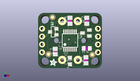

Contents
========

* [PROJ-ADAF-1411-STAN-01>Adafruit 16 channel PWM Servo Shield](#proj-adaf-1411-stan-01adafruit-16-channel-pwm-servo-shield)
	* [Images](#images)
	* [Interactive BOM](#interactive-bom)
	* [OOMP Parts](#oomp-parts)
	* [Tags](#tags)
  
![][im]
# PROJ-ADAF-1411-STAN-01>Adafruit 16 channel PWM Servo Shield

- ID: PROJ-ADAF-1411-STAN-01
- Hex ID: PRA1411
- Name: Adafruit 16 channel PWM Servo Shield
- Description: 

## Images
  
  

|eagleImage|kicadPcb3dFront|kicadPcb3dBack|kicadPcb3d|
| :---: | :---: | :---: | :---: |
|||||

## Interactive BOM

- Interactive BOM page: [ibom.html](kicad/bom/ibom.html)

## OOMP Parts
  

|OOMP Parts|
| :---: |
|CAPE-0805-X-UNMATCHED-01, C1, 27.2415, 26.114499968, 180,C1, 10uF, 0805, microbuilder, (1.0725, 1.02812992), R180|
|ERROR, C2 1000uF+ 6.3V, 0, 0, 0,C2, 1000uF+, 6.3V, E3,5-10, adafruit, (0.695, 1.055), R0|
|UNMATCHED-UNMATCHED-X-UNMATCHED-01, J1, 3.6829999999999994, 25.780999999999995, 270,J1, TERMBLOCK_1X2-3.5MM, 1X2-3.5MM, microbuilder, (0.145, 1.015), R270|
|UNMATCHED-UNMATCHED-X-UNMATCHED-01, JP1, 27.94, 12.827, 180,JP1, 3X04, microbuilder, (1.1, 0.505), R180|
|UNMATCHED-UNMATCHED-X-UNMATCHED-01, JP2, 15.239999999999998, 12.827, 180,JP2, 3X04, microbuilder, (0.6, 0.505), R180|
|UNMATCHED-UNMATCHED-X-UNMATCHED-01, JP3, 36.83, 6.095999999999999, 180,JP3, 1X08-CLEANBIG, adafruit, (1.45, 0.24), R180|
|UNMATCHED-UNMATCHED-X-UNMATCHED-01, JP4, 54.60999999999999, 47.244, 0,JP4, 1X08-CLEANBIG, adafruit, (2.15, 1.86), R0|
|UNMATCHED-UNMATCHED-X-UNMATCHED-01, JP5, 55.88, 12.827, 180,JP5, 3X04, microbuilder, (2.2, 0.505), R180|
|UNMATCHED-UNMATCHED-X-UNMATCHED-01, JP6, 43.18, 12.827, 180,JP6, 3X04, microbuilder, (1.7, 0.505), R180|
|UNMATCHED-UNMATCHED-X-UNMATCHED-01, JP7, 30.225999999999996, 47.244, 0,JP7, 1X10_ROUND70, microbuilder, (1.19, 1.86), R0|
|UNMATCHED-UNMATCHED-X-UNMATCHED-01, JP8, 57.15, 6.095999999999999, 180,JP8, 1X06-CLEANBIG, adafruit, (2.25, 0.24), R180|
|UNMATCHED-0805-X-UNMATCHED-01, LED1, 2.794, 16.256, 180,LED1, RED, CHIPLED_0805, microbuilder, (0.11, 0.64), R180|
|UNMATCHED-0805-X-UNMATCHED-01, LED2, 2.794, 12.191999999999998, 180,LED2, GREEN, CHIPLED_0805, microbuilder, (0.11, 0.48), R180|
|UNMATCHED-UNMATCHED-X-UNMATCHED-01, Q1, 11.417000026, 23.810999876, 90,Q1, IRLML6401, SOT23-WIDE, microbuilder, (0.44948819, 0.93744094), R90|
|RESE-UNMATCHED-X-O103-01, R1, 47.370999999999995, 24.637999999999998, 0,R1, 10K, RESPACK_4X0603, microbuilder, (1.865, 0.97), R0|
|RESE-UNMATCHED-X-O103-01, R2, 51.56199999999999, 24.637999999999998, 0,R2, 10K, RESPACK_4X0603, microbuilder, (2.03, 0.97), R0|
|<table><tr><td></td><td> R3</td><td>[RESE-0805-X-O103-01 SMD (0805) 10k Ohm Resistor](https://github.com/oomlout/oomlout_OOMP_parts/tree/main/RESE-0805-X-O103-01/)</td><td>[R85103](https://github.com/oomlout/oomlout_OOMP_parts/tree/main/RESE-0805-X-O103-01/)</td></tr></table>|
|<table><tr><td></td><td> R4</td><td>[RESE-0805-X-O103-01 SMD (0805) 10k Ohm Resistor](https://github.com/oomlout/oomlout_OOMP_parts/tree/main/RESE-0805-X-O103-01/)</td><td>[R85103](https://github.com/oomlout/oomlout_OOMP_parts/tree/main/RESE-0805-X-O103-01/)</td></tr></table>|
|RESE-0805-X-UNMATCHED-01, R5, 5.842, 12.191999999999998, 90,R5, 470, 0805, microbuilder, (0.23, 0.48), R90|
|<table><tr><td></td><td> R7</td><td>[RESE-0805-X-O103-01 SMD (0805) 10k Ohm Resistor](https://github.com/oomlout/oomlout_OOMP_parts/tree/main/RESE-0805-X-O103-01/)</td><td>[R85103](https://github.com/oomlout/oomlout_OOMP_parts/tree/main/RESE-0805-X-O103-01/)</td></tr></table>|
|RESE-0805-X-UNMATCHED-01, R10, 5.842, 16.256, 90,R10, 470, 0805, microbuilder, (0.23, 0.64), R90|
|RESE-UNMATCHED-X-O221-01, R11, 27.686, 19.685, 180,R11, 220, RESPACK_4X0603, microbuilder, (1.09, 0.775), R180|
|RESE-UNMATCHED-X-O221-01, R12, 55.75299999999999, 19.939, 180,R12, 220, RESPACK_4X0603, microbuilder, (2.195, 0.785), R180|
|RESE-UNMATCHED-X-O221-01, R13, 14.985999999999999, 19.939, 180,R13, 220, RESPACK_4X0603, microbuilder, (0.59, 0.785), R180|
|RESE-UNMATCHED-X-O221-01, R14, 42.925999999999995, 19.558, 180,R14, 220, RESPACK_4X0603, microbuilder, (1.69, 0.77), R180|
|UNMATCHED-UNMATCHED-X-UNMATCHED-01, SJ1, 22.479, 6.095999999999999, 180,SJ1, SOLDERJUMPER_2WAY_OPEN_NOPASTE, microbuilder, (0.885, 0.24), R180|
|UNMATCHED-UNMATCHED-X-UNMATCHED-01, SJ_A0, 55.117999999999995, 29.686000063999998, 270,SJ_A0, SOLDERJUMPER_REFLOW_NOPASTE, microbuilder, (2.17, 1.16874016), R270|
|UNMATCHED-UNMATCHED-X-UNMATCHED-01, SJ_A1, 52.577999999999996, 29.686000063999998, 270,SJ_A1, SOLDERJUMPER_REFLOW_NOPASTE, microbuilder, (2.07, 1.16874016), R270|
|UNMATCHED-UNMATCHED-X-UNMATCHED-01, SJ_A2, 50.038, 29.686000063999998, 270,SJ_A2, SOLDERJUMPER_REFLOW_NOPASTE, microbuilder, (1.97, 1.16874016), R270|
|UNMATCHED-UNMATCHED-X-UNMATCHED-01, SJ_A3, 47.498, 29.686000063999998, 270,SJ_A3, SOLDERJUMPER_REFLOW_NOPASTE, microbuilder, (1.87, 1.16874016), R270|
|UNMATCHED-UNMATCHED-X-UNMATCHED-01, SJ_A4, 44.958, 29.686000063999998, 270,SJ_A4, SOLDERJUMPER_REFLOW_NOPASTE, microbuilder, (1.77, 1.16874016), R270|
|UNMATCHED-UNMATCHED-X-UNMATCHED-01, SJ_A5, 42.418, 29.686000063999998, 270,SJ_A5, SOLDERJUMPER_REFLOW_NOPASTE, microbuilder, (1.67, 1.16874016), R270|
|UNMATCHED-UNMATCHED-X-UNMATCHED-01, SW1, 6.095999999999999, 4.699, 180,SW1, SPST_TACT-EVQQ2, EVQ-Q2, adafruit, (0.24, 0.185), R180|
|UNMATCHED-UNMATCHED-X-UNMATCHED-01, TP1, 55.117999999999995, 29.590999999999998, M0,TP1, TESTPOINT_ROUND_2MM, microbuilder, (2.17, 1.165), MR0|
|UNMATCHED-UNMATCHED-X-UNMATCHED-01, TP2, 52.577999999999996, 29.590999999999998, M270,TP2, TESTPOINT_ROUND_2MM, microbuilder, (2.07, 1.165), MR270|
|UNMATCHED-UNMATCHED-X-UNMATCHED-01, TP3, 50.038, 29.590999999999998, M270,TP3, TESTPOINT_ROUND_2MM, microbuilder, (1.97, 1.165), MR270|
|UNMATCHED-UNMATCHED-X-UNMATCHED-01, TP4, 47.498, 29.590999999999998, M270,TP4, TESTPOINT_ROUND_2MM, microbuilder, (1.87, 1.165), MR270|
|UNMATCHED-UNMATCHED-X-UNMATCHED-01, TP5, 44.958, 29.590999999999998, M270,TP5, TESTPOINT_ROUND_2MM, microbuilder, (1.77, 1.165), MR270|
|UNMATCHED-UNMATCHED-X-UNMATCHED-01, TP6, 42.418, 29.590999999999998, M270,TP6, TESTPOINT_ROUND_2MM, microbuilder, (1.67, 1.165), MR270|
|UNMATCHED-UNMATCHED-X-UNMATCHED-01, U1, 34.671, 23.622, 270,U1, PCA9685, TSSOP28, microbuilder, (1.365, 0.93), R270|

## Tags

- hexID: PRA1411
- oompType: PROJ
- oompSize: ADAF
- oompColor: 1411
- oompDesc: STAN
- oompIndex: 01
- oompName: Adafruit 16 channel PWM Servo Shield
- sources: All source files from https://github.com/adafruit/Adafruit-16-channel-PWM-Servo-Shield (source licence details in srcLicense.md)
- linkBuyPage: http://www.adafruit.com/products/1411
- oompPart: CAPE-0805-X-UNMATCHED-01, C1, 27.2415, 26.114499968, 180
- oompPart: ERROR, C2 1000uF+ 6.3V, 0, 0, 0
- oompPart: SKIP-UNMATCHED-X-UNMATCHED-01, FID1, 65.51700002999999, 4.2860000639999996, 0
- oompPart: SKIP-UNMATCHED-X-UNMATCHED-01, FID2, 6.603000002, 51.916000054, 0
- oompPart: SKIP-UNMATCHED-X-UNMATCHED-01, FID3, 13.97, 7.112, 0
- oompPart: UNMATCHED-UNMATCHED-X-UNMATCHED-01, J1, 3.6829999999999994, 25.780999999999995, 270
- oompPart: UNMATCHED-UNMATCHED-X-UNMATCHED-01, JP1, 27.94, 12.827, 180
- oompPart: UNMATCHED-UNMATCHED-X-UNMATCHED-01, JP2, 15.239999999999998, 12.827, 180
- oompPart: UNMATCHED-UNMATCHED-X-UNMATCHED-01, JP3, 36.83, 6.095999999999999, 180
- oompPart: UNMATCHED-UNMATCHED-X-UNMATCHED-01, JP4, 54.60999999999999, 47.244, 0
- oompPart: UNMATCHED-UNMATCHED-X-UNMATCHED-01, JP5, 55.88, 12.827, 180
- oompPart: UNMATCHED-UNMATCHED-X-UNMATCHED-01, JP6, 43.18, 12.827, 180
- oompPart: UNMATCHED-UNMATCHED-X-UNMATCHED-01, JP7, 30.225999999999996, 47.244, 0
- oompPart: UNMATCHED-UNMATCHED-X-UNMATCHED-01, JP8, 57.15, 6.095999999999999, 180
- oompPart: UNMATCHED-0805-X-UNMATCHED-01, LED1, 2.794, 16.256, 180
- oompPart: UNMATCHED-0805-X-UNMATCHED-01, LED2, 2.794, 12.191999999999998, 180
- oompPart: UNMATCHED-UNMATCHED-X-UNMATCHED-01, Q1, 11.417000026, 23.810999876, 90
- oompPart: RESE-UNMATCHED-X-O103-01, R1, 47.370999999999995, 24.637999999999998, 0
- oompPart: RESE-UNMATCHED-X-O103-01, R2, 51.56199999999999, 24.637999999999998, 0
- oompPart: RESE-0805-X-O103-01, R3, 12.827, 47.879, 180
- oompPart: RESE-0805-X-O103-01, R4, 12.827, 45.974, 180
- oompPart: RESE-0805-X-UNMATCHED-01, R5, 5.842, 12.191999999999998, 90
- oompPart: RESE-0805-X-O103-01, R7, 41.8465, 25.273, 0
- oompPart: RESE-0805-X-UNMATCHED-01, R10, 5.842, 16.256, 90
- oompPart: RESE-UNMATCHED-X-O221-01, R11, 27.686, 19.685, 180
- oompPart: RESE-UNMATCHED-X-O221-01, R12, 55.75299999999999, 19.939, 180
- oompPart: RESE-UNMATCHED-X-O221-01, R13, 14.985999999999999, 19.939, 180
- oompPart: RESE-UNMATCHED-X-O221-01, R14, 42.925999999999995, 19.558, 180
- oompPart: UNMATCHED-UNMATCHED-X-UNMATCHED-01, SJ1, 22.479, 6.095999999999999, 180
- oompPart: UNMATCHED-UNMATCHED-X-UNMATCHED-01, SJ_A0, 55.117999999999995, 29.686000063999998, 270
- oompPart: UNMATCHED-UNMATCHED-X-UNMATCHED-01, SJ_A1, 52.577999999999996, 29.686000063999998, 270
- oompPart: UNMATCHED-UNMATCHED-X-UNMATCHED-01, SJ_A2, 50.038, 29.686000063999998, 270
- oompPart: UNMATCHED-UNMATCHED-X-UNMATCHED-01, SJ_A3, 47.498, 29.686000063999998, 270
- oompPart: UNMATCHED-UNMATCHED-X-UNMATCHED-01, SJ_A4, 44.958, 29.686000063999998, 270
- oompPart: UNMATCHED-UNMATCHED-X-UNMATCHED-01, SJ_A5, 42.418, 29.686000063999998, 270
- oompPart: UNMATCHED-UNMATCHED-X-UNMATCHED-01, SW1, 6.095999999999999, 4.699, 180
- oompPart: UNMATCHED-UNMATCHED-X-UNMATCHED-01, TP1, 55.117999999999995, 29.590999999999998, M0
- oompPart: UNMATCHED-UNMATCHED-X-UNMATCHED-01, TP2, 52.577999999999996, 29.590999999999998, M270
- oompPart: UNMATCHED-UNMATCHED-X-UNMATCHED-01, TP3, 50.038, 29.590999999999998, M270
- oompPart: UNMATCHED-UNMATCHED-X-UNMATCHED-01, TP4, 47.498, 29.590999999999998, M270
- oompPart: UNMATCHED-UNMATCHED-X-UNMATCHED-01, TP5, 44.958, 29.590999999999998, M270
- oompPart: UNMATCHED-UNMATCHED-X-UNMATCHED-01, TP6, 42.418, 29.590999999999998, M270
- oompPart: SKIP-UNMATCHED-X-UNMATCHED-01, U$44, 0.0, 0.0, 0
- oompPart: UNMATCHED-UNMATCHED-X-UNMATCHED-01, U1, 34.671, 23.622, 270
- rawPart: C1, 10uF, 0805, microbuilder, (1.0725, 1.02812992), R180
- rawPart: C2, 1000uF+, 6.3V, E3,5-10, adafruit, (0.695, 1.055), R0
- rawPart: FID1, FIDUCIAL, FIDUCIAL_1MM, microbuilder, (2.57940945, 0.16874016), R0
- rawPart: FID2, FIDUCIAL, FIDUCIAL_1MM, microbuilder, (0.25996063, 2.04393701), R0
- rawPart: FID3, FIDUCIAL, FIDUCIAL_1MM, microbuilder, (0.55, 0.28), R0
- rawPart: J1, TERMBLOCK_1X2-3.5MM, 1X2-3.5MM, microbuilder, (0.145, 1.015), R270
- rawPart: JP1, 3X04, microbuilder, (1.1, 0.505), R180
- rawPart: JP2, 3X04, microbuilder, (0.6, 0.505), R180
- rawPart: JP3, 1X08-CLEANBIG, adafruit, (1.45, 0.24), R180
- rawPart: JP4, 1X08-CLEANBIG, adafruit, (2.15, 1.86), R0
- rawPart: JP5, 3X04, microbuilder, (2.2, 0.505), R180
- rawPart: JP6, 3X04, microbuilder, (1.7, 0.505), R180
- rawPart: JP7, 1X10_ROUND70, microbuilder, (1.19, 1.86), R0
- rawPart: JP8, 1X06-CLEANBIG, adafruit, (2.25, 0.24), R180
- rawPart: LED1, RED, CHIPLED_0805, microbuilder, (0.11, 0.64), R180
- rawPart: LED2, GREEN, CHIPLED_0805, microbuilder, (0.11, 0.48), R180
- rawPart: Q1, IRLML6401, SOT23-WIDE, microbuilder, (0.44948819, 0.93744094), R90
- rawPart: R1, 10K, RESPACK_4X0603, microbuilder, (1.865, 0.97), R0
- rawPart: R2, 10K, RESPACK_4X0603, microbuilder, (2.03, 0.97), R0
- rawPart: R3, 10K, 0805, microbuilder, (0.505, 1.885), R180
- rawPart: R4, 10K, 0805, microbuilder, (0.505, 1.81), R180
- rawPart: R5, 470, 0805, microbuilder, (0.23, 0.48), R90
- rawPart: R7, 10K, 0805, microbuilder, (1.6475, 0.995), R0
- rawPart: R10, 470, 0805, microbuilder, (0.23, 0.64), R90
- rawPart: R11, 220, RESPACK_4X0603, microbuilder, (1.09, 0.775), R180
- rawPart: R12, 220, RESPACK_4X0603, microbuilder, (2.195, 0.785), R180
- rawPart: R13, 220, RESPACK_4X0603, microbuilder, (0.59, 0.785), R180
- rawPart: R14, 220, RESPACK_4X0603, microbuilder, (1.69, 0.77), R180
- rawPart: SJ1, SOLDERJUMPER_2WAY_OPEN_NOPASTE, microbuilder, (0.885, 0.24), R180
- rawPart: SJ_A0, SOLDERJUMPER_REFLOW_NOPASTE, microbuilder, (2.17, 1.16874016), R270
- rawPart: SJ_A1, SOLDERJUMPER_REFLOW_NOPASTE, microbuilder, (2.07, 1.16874016), R270
- rawPart: SJ_A2, SOLDERJUMPER_REFLOW_NOPASTE, microbuilder, (1.97, 1.16874016), R270
- rawPart: SJ_A3, SOLDERJUMPER_REFLOW_NOPASTE, microbuilder, (1.87, 1.16874016), R270
- rawPart: SJ_A4, SOLDERJUMPER_REFLOW_NOPASTE, microbuilder, (1.77, 1.16874016), R270
- rawPart: SJ_A5, SOLDERJUMPER_REFLOW_NOPASTE, microbuilder, (1.67, 1.16874016), R270
- rawPart: SW1, SPST_TACT-EVQQ2, EVQ-Q2, adafruit, (0.24, 0.185), R180
- rawPart: TP1, TESTPOINT_ROUND_2MM, microbuilder, (2.17, 1.165), MR0
- rawPart: TP2, TESTPOINT_ROUND_2MM, microbuilder, (2.07, 1.165), MR270
- rawPart: TP3, TESTPOINT_ROUND_2MM, microbuilder, (1.97, 1.165), MR270
- rawPart: TP4, TESTPOINT_ROUND_2MM, microbuilder, (1.87, 1.165), MR270
- rawPart: TP5, TESTPOINT_ROUND_2MM, microbuilder, (1.77, 1.165), MR270
- rawPart: TP6, TESTPOINT_ROUND_2MM, microbuilder, (1.67, 1.165), MR270
- rawPart: U$44, ARDUINO_R3_ICSP, ARDUINOR3_ICSP, adafruit, (0, 0), R0
- rawPart: U1, PCA9685, TSSOP28, microbuilder, (1.365, 0.93), R270

[im]: kicadPcb3d_450.png
