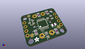

Contents
========

* [PRA1411 > Adafruit](#pra1411--adafruit)
	* [Schematic](#schematic)
	* [Interactive BOM](#interactive-bom)
	* [OOMP Parts](#oomp-parts)
	* [Images](#images)
	* [Tags](#tags)
  
![][im]
# PRA1411 > Adafruit

- ID: PROJ-ADAF-1411-STAN-01
- Hex ID: PRA1411
- Name: Adafruit
- Description: Adafruit
- Long Link: [http://oom.lt/PROJ-ADAF-1411-STAN-01](http://oom.lt/PROJ-ADAF-1411-STAN-01)
- Short Link: [http://oom.lt/PRA1411](http://oom.lt/PRA1411)

## Schematic
  

## Interactive BOM

- Interactive BOM page: [ibom.html](https://htmlpreview.github.io/?https://github.com/oomlout/oomlout_OOMP_projects/blob/main/PROJ-ADAF-1411-STAN-01/kicad/bom/ibom.html)

## OOMP Parts
  

|OOMP Parts|
| :---: |
|C1,UNMATCHED-UNMATCHED-UNMATCHED-UNMATCHED-UNMATCHED,C1,10uF,CAP_CERAMIC0805,0805,Ceramic Capacitors,,|
|C2,UNMATCHED-UNMATCHED-UNMATCHED-UNMATCHED-UNMATCHED,C2,1000uF+ 6.3V,CPOL-USE3.5-10,E3,5-10,POLARIZED CAPACITOR, American symbol,,|
|J1,UNMATCHED-UNMATCHED-UNMATCHED-UNMATCHED-UNMATCHED,FID1,FIDUCIAL,FIDUCIAL,FIDUCIAL_1MM,Fiducial Alignment Points,,|
|JP1,UNMATCHED-UNMATCHED-UNMATCHED-UNMATCHED-UNMATCHED,FID2,FIDUCIAL,FIDUCIAL,FIDUCIAL_1MM,Fiducial Alignment Points,,|
|JP2,UNMATCHED-UNMATCHED-UNMATCHED-UNMATCHED-UNMATCHED,FID3,FIDUCIAL,FIDUCIAL,FIDUCIAL_1MM,Fiducial Alignment Points,,|
|JP3,UNMATCHED-UNMATCHED-UNMATCHED-UNMATCHED-UNMATCHED,J1,TERMBLOCK_1X2-3.5MM,TERMBLOCK_1X2-3.5MM,1X2-3.5MM,3.5mm Terminal block,,|
|JP4,UNMATCHED-UNMATCHED-UNMATCHED-UNMATCHED-UNMATCHED,JP1,,HEADER-3X04,3X04,,,|
|JP5,UNMATCHED-UNMATCHED-UNMATCHED-UNMATCHED-UNMATCHED,JP2,,HEADER-3X04,3X04,,,|
|JP6,UNMATCHED-UNMATCHED-UNMATCHED-UNMATCHED-UNMATCHED,JP3,,PINHD-1X8CLEANBIG,1X08-CLEANBIG,PIN HEADER,,|
|JP7,UNMATCHED-UNMATCHED-UNMATCHED-UNMATCHED-UNMATCHED,JP4,,PINHD-1X8CLEANBIG,1X08-CLEANBIG,PIN HEADER,,|
|JP8,UNMATCHED-UNMATCHED-UNMATCHED-UNMATCHED-UNMATCHED,JP5,,HEADER-3X04,3X04,,,|
|LED1,UNMATCHED-UNMATCHED-UNMATCHED-UNMATCHED-UNMATCHED,JP6,,HEADER-3X04,3X04,,,|
|LED2,UNMATCHED-UNMATCHED-UNMATCHED-UNMATCHED-UNMATCHED,JP7,,HEADER-1X1070MIL,1X10_ROUND70,PIN HEADER,,|
|Q1,UNMATCHED-UNMATCHED-UNMATCHED-UNMATCHED-UNMATCHED,JP8,,PINHD-1X6CB,1X06-CLEANBIG,PIN HEADER,,|
|R1,UNMATCHED-UNMATCHED-UNMATCHED-UNMATCHED-UNMATCHED,LED1,RED,LED0805,CHIPLED_0805,LED,,|
|R2,UNMATCHED-UNMATCHED-UNMATCHED-UNMATCHED-UNMATCHED,LED2,GREEN,LED0805,CHIPLED_0805,LED,,|
|R3,UNMATCHED-UNMATCHED-UNMATCHED-UNMATCHED-UNMATCHED,Q1,IRLML6401,MOSFET-PWIDE,SOT23-WIDE,P-Channel Mosfet,,|
|R4,UNMATCHED-UNMATCHED-UNMATCHED-UNMATCHED-UNMATCHED,R1,10K,RESISTOR_4PACK,RESPACK_4X0603,Resistor Packs (4 resistors),,|
|R5,UNMATCHED-UNMATCHED-UNMATCHED-UNMATCHED-UNMATCHED,R2,10K,RESISTOR_4PACK,RESPACK_4X0603,Resistor Packs (4 resistors),,|
|R7,UNMATCHED-UNMATCHED-UNMATCHED-UNMATCHED-UNMATCHED,R3,10K,RESISTOR0805,0805,Resistors,,|
|R10,UNMATCHED-UNMATCHED-UNMATCHED-UNMATCHED-UNMATCHED,R4,10K,RESISTOR0805,0805,Resistors,,|
|R11,UNMATCHED-UNMATCHED-UNMATCHED-UNMATCHED-UNMATCHED,R5,470,RESISTOR0805,0805,Resistors,,|
|R12,UNMATCHED-UNMATCHED-UNMATCHED-UNMATCHED-UNMATCHED,R7,10K,RESISTOR0805,0805,Resistors,,|
|R13,UNMATCHED-UNMATCHED-UNMATCHED-UNMATCHED-UNMATCHED,R10,470,RESISTOR0805,0805,Resistors,,|
|R14,UNMATCHED-UNMATCHED-UNMATCHED-UNMATCHED-UNMATCHED,R11,220,RESISTOR_4PACK,RESPACK_4X0603,Resistor Packs (4 resistors),,|
|SJ1,UNMATCHED-UNMATCHED-UNMATCHED-UNMATCHED-UNMATCHED,R12,220,RESISTOR_4PACK,RESPACK_4X0603,Resistor Packs (4 resistors),,|
|SJ_A0,UNMATCHED-UNMATCHED-UNMATCHED-UNMATCHED-UNMATCHED,R13,220,RESISTOR_4PACK,RESPACK_4X0603,Resistor Packs (4 resistors),,|
|SJ_A1,UNMATCHED-UNMATCHED-UNMATCHED-UNMATCHED-UNMATCHED,R14,220,RESISTOR_4PACK,RESPACK_4X0603,Resistor Packs (4 resistors),,|
|SJ_A2,UNMATCHED-UNMATCHED-UNMATCHED-UNMATCHED-UNMATCHED,SJ1,,SOLDERJUMPER_2WAY,SOLDERJUMPER_2WAY_OPEN_NOPASTE,2-Way Solder Jumper,,|
|SJ_A3,UNMATCHED-UNMATCHED-UNMATCHED-UNMATCHED-UNMATCHED,SJ_A0,,SOLDERJUMPERREFLOW_NOPASTE,SOLDERJUMPER_REFLOW_NOPASTE,SMD Solder JUMPER,,|
|SJ_A4,UNMATCHED-UNMATCHED-UNMATCHED-UNMATCHED-UNMATCHED,SJ_A1,,SOLDERJUMPERREFLOW_NOPASTE,SOLDERJUMPER_REFLOW_NOPASTE,SMD Solder JUMPER,,|
|SJ_A5,UNMATCHED-UNMATCHED-UNMATCHED-UNMATCHED-UNMATCHED,SJ_A2,,SOLDERJUMPERREFLOW_NOPASTE,SOLDERJUMPER_REFLOW_NOPASTE,SMD Solder JUMPER,,|
|SW1,UNMATCHED-UNMATCHED-UNMATCHED-UNMATCHED-UNMATCHED,SJ_A3,,SOLDERJUMPERREFLOW_NOPASTE,SOLDERJUMPER_REFLOW_NOPASTE,SMD Solder JUMPER,,|
|TP1,UNMATCHED-UNMATCHED-UNMATCHED-UNMATCHED-UNMATCHED,SJ_A4,,SOLDERJUMPERREFLOW_NOPASTE,SOLDERJUMPER_REFLOW_NOPASTE,SMD Solder JUMPER,,|
|TP2,UNMATCHED-UNMATCHED-UNMATCHED-UNMATCHED-UNMATCHED,SJ_A5,,SOLDERJUMPERREFLOW_NOPASTE,SOLDERJUMPER_REFLOW_NOPASTE,SMD Solder JUMPER,,|
|TP3,UNMATCHED-UNMATCHED-UNMATCHED-UNMATCHED-UNMATCHED,SW1,SPST_TACT-EVQQ2,SPST_TACT-EVQQ2,EVQ-Q2,SMT 6mm switch, EVQQ2 series,,|
|TP4,UNMATCHED-UNMATCHED-UNMATCHED-UNMATCHED-UNMATCHED,TP1,,TESTPOINTROUND2MM,TESTPOINT_ROUND_2MM,Test Point,,|
|TP5,UNMATCHED-UNMATCHED-UNMATCHED-UNMATCHED-UNMATCHED,TP2,,TESTPOINTROUND2MM,TESTPOINT_ROUND_2MM,Test Point,,|
|TP6,UNMATCHED-UNMATCHED-UNMATCHED-UNMATCHED-UNMATCHED,TP3,,TESTPOINTROUND2MM,TESTPOINT_ROUND_2MM,Test Point,,|
|U$44,UNMATCHED-UNMATCHED-UNMATCHED-UNMATCHED-UNMATCHED,TP4,,TESTPOINTROUND2MM,TESTPOINT_ROUND_2MM,Test Point,,|
|U1,UNMATCHED-UNMATCHED-UNMATCHED-UNMATCHED-UNMATCHED,TP5,,TESTPOINTROUND2MM,TESTPOINT_ROUND_2MM,Test Point,,|

## Images
  
  

|kicadPcb3d|kicadPcb3dFront|kicadPcb3dBack|eagleImage|eagleSchemImage|
| :---: | :---: | :---: | :---: | :---: |
||||||

## Tags

- hexID: PRA1411
- oompType: PROJ
- oompSize: ADAF
- oompColor: 1411
- oompDesc: STAN
- oompIndex: 01
- oompName: Adafruit 16 channel PWM Servo Shield
- sources: All source files from https://github.com/adafruit/Adafruit-16-channel-PWM-Servo-Shield (source licence details in srcLicense.md)
- linkBuyPage: http://www.adafruit.com/products/1411
- oompID: PROJ-ADAF-1411-STAN-01
- oompParts: C1,UNMATCHED-UNMATCHED-UNMATCHED-UNMATCHED-UNMATCHED
- oompParts: C2,UNMATCHED-UNMATCHED-UNMATCHED-UNMATCHED-UNMATCHED
- oompParts: J1,UNMATCHED-UNMATCHED-UNMATCHED-UNMATCHED-UNMATCHED
- oompParts: JP1,UNMATCHED-UNMATCHED-UNMATCHED-UNMATCHED-UNMATCHED
- oompParts: JP2,UNMATCHED-UNMATCHED-UNMATCHED-UNMATCHED-UNMATCHED
- oompParts: JP3,UNMATCHED-UNMATCHED-UNMATCHED-UNMATCHED-UNMATCHED
- oompParts: JP4,UNMATCHED-UNMATCHED-UNMATCHED-UNMATCHED-UNMATCHED
- oompParts: JP5,UNMATCHED-UNMATCHED-UNMATCHED-UNMATCHED-UNMATCHED
- oompParts: JP6,UNMATCHED-UNMATCHED-UNMATCHED-UNMATCHED-UNMATCHED
- oompParts: JP7,UNMATCHED-UNMATCHED-UNMATCHED-UNMATCHED-UNMATCHED
- oompParts: JP8,UNMATCHED-UNMATCHED-UNMATCHED-UNMATCHED-UNMATCHED
- oompParts: LED1,UNMATCHED-UNMATCHED-UNMATCHED-UNMATCHED-UNMATCHED
- oompParts: LED2,UNMATCHED-UNMATCHED-UNMATCHED-UNMATCHED-UNMATCHED
- oompParts: Q1,UNMATCHED-UNMATCHED-UNMATCHED-UNMATCHED-UNMATCHED
- oompParts: R1,UNMATCHED-UNMATCHED-UNMATCHED-UNMATCHED-UNMATCHED
- oompParts: R2,UNMATCHED-UNMATCHED-UNMATCHED-UNMATCHED-UNMATCHED
- oompParts: R3,UNMATCHED-UNMATCHED-UNMATCHED-UNMATCHED-UNMATCHED
- oompParts: R4,UNMATCHED-UNMATCHED-UNMATCHED-UNMATCHED-UNMATCHED
- oompParts: R5,UNMATCHED-UNMATCHED-UNMATCHED-UNMATCHED-UNMATCHED
- oompParts: R7,UNMATCHED-UNMATCHED-UNMATCHED-UNMATCHED-UNMATCHED
- oompParts: R10,UNMATCHED-UNMATCHED-UNMATCHED-UNMATCHED-UNMATCHED
- oompParts: R11,UNMATCHED-UNMATCHED-UNMATCHED-UNMATCHED-UNMATCHED
- oompParts: R12,UNMATCHED-UNMATCHED-UNMATCHED-UNMATCHED-UNMATCHED
- oompParts: R13,UNMATCHED-UNMATCHED-UNMATCHED-UNMATCHED-UNMATCHED
- oompParts: R14,UNMATCHED-UNMATCHED-UNMATCHED-UNMATCHED-UNMATCHED
- oompParts: SJ1,UNMATCHED-UNMATCHED-UNMATCHED-UNMATCHED-UNMATCHED
- oompParts: SJ_A0,UNMATCHED-UNMATCHED-UNMATCHED-UNMATCHED-UNMATCHED
- oompParts: SJ_A1,UNMATCHED-UNMATCHED-UNMATCHED-UNMATCHED-UNMATCHED
- oompParts: SJ_A2,UNMATCHED-UNMATCHED-UNMATCHED-UNMATCHED-UNMATCHED
- oompParts: SJ_A3,UNMATCHED-UNMATCHED-UNMATCHED-UNMATCHED-UNMATCHED
- oompParts: SJ_A4,UNMATCHED-UNMATCHED-UNMATCHED-UNMATCHED-UNMATCHED
- oompParts: SJ_A5,UNMATCHED-UNMATCHED-UNMATCHED-UNMATCHED-UNMATCHED
- oompParts: SW1,UNMATCHED-UNMATCHED-UNMATCHED-UNMATCHED-UNMATCHED
- oompParts: TP1,UNMATCHED-UNMATCHED-UNMATCHED-UNMATCHED-UNMATCHED
- oompParts: TP2,UNMATCHED-UNMATCHED-UNMATCHED-UNMATCHED-UNMATCHED
- oompParts: TP3,UNMATCHED-UNMATCHED-UNMATCHED-UNMATCHED-UNMATCHED
- oompParts: TP4,UNMATCHED-UNMATCHED-UNMATCHED-UNMATCHED-UNMATCHED
- oompParts: TP5,UNMATCHED-UNMATCHED-UNMATCHED-UNMATCHED-UNMATCHED
- oompParts: TP6,UNMATCHED-UNMATCHED-UNMATCHED-UNMATCHED-UNMATCHED
- oompParts: U$44,UNMATCHED-UNMATCHED-UNMATCHED-UNMATCHED-UNMATCHED
- oompParts: U1,UNMATCHED-UNMATCHED-UNMATCHED-UNMATCHED-UNMATCHED
- rawParts: C1,10uF,CAP_CERAMIC0805,0805,Ceramic Capacitors,,
- rawParts: C2,1000uF+ 6.3V,CPOL-USE3.5-10,E3,5-10,POLARIZED CAPACITOR, American symbol,,
- rawParts: FID1,FIDUCIAL,FIDUCIAL,FIDUCIAL_1MM,Fiducial Alignment Points,,
- rawParts: FID2,FIDUCIAL,FIDUCIAL,FIDUCIAL_1MM,Fiducial Alignment Points,,
- rawParts: FID3,FIDUCIAL,FIDUCIAL,FIDUCIAL_1MM,Fiducial Alignment Points,,
- rawParts: J1,TERMBLOCK_1X2-3.5MM,TERMBLOCK_1X2-3.5MM,1X2-3.5MM,3.5mm Terminal block,,
- rawParts: JP1,,HEADER-3X04,3X04,,,
- rawParts: JP2,,HEADER-3X04,3X04,,,
- rawParts: JP3,,PINHD-1X8CLEANBIG,1X08-CLEANBIG,PIN HEADER,,
- rawParts: JP4,,PINHD-1X8CLEANBIG,1X08-CLEANBIG,PIN HEADER,,
- rawParts: JP5,,HEADER-3X04,3X04,,,
- rawParts: JP6,,HEADER-3X04,3X04,,,
- rawParts: JP7,,HEADER-1X1070MIL,1X10_ROUND70,PIN HEADER,,
- rawParts: JP8,,PINHD-1X6CB,1X06-CLEANBIG,PIN HEADER,,
- rawParts: LED1,RED,LED0805,CHIPLED_0805,LED,,
- rawParts: LED2,GREEN,LED0805,CHIPLED_0805,LED,,
- rawParts: Q1,IRLML6401,MOSFET-PWIDE,SOT23-WIDE,P-Channel Mosfet,,
- rawParts: R1,10K,RESISTOR_4PACK,RESPACK_4X0603,Resistor Packs (4 resistors),,
- rawParts: R2,10K,RESISTOR_4PACK,RESPACK_4X0603,Resistor Packs (4 resistors),,
- rawParts: R3,10K,RESISTOR0805,0805,Resistors,,
- rawParts: R4,10K,RESISTOR0805,0805,Resistors,,
- rawParts: R5,470,RESISTOR0805,0805,Resistors,,
- rawParts: R7,10K,RESISTOR0805,0805,Resistors,,
- rawParts: R10,470,RESISTOR0805,0805,Resistors,,
- rawParts: R11,220,RESISTOR_4PACK,RESPACK_4X0603,Resistor Packs (4 resistors),,
- rawParts: R12,220,RESISTOR_4PACK,RESPACK_4X0603,Resistor Packs (4 resistors),,
- rawParts: R13,220,RESISTOR_4PACK,RESPACK_4X0603,Resistor Packs (4 resistors),,
- rawParts: R14,220,RESISTOR_4PACK,RESPACK_4X0603,Resistor Packs (4 resistors),,
- rawParts: SJ1,,SOLDERJUMPER_2WAY,SOLDERJUMPER_2WAY_OPEN_NOPASTE,2-Way Solder Jumper,,
- rawParts: SJ_A0,,SOLDERJUMPERREFLOW_NOPASTE,SOLDERJUMPER_REFLOW_NOPASTE,SMD Solder JUMPER,,
- rawParts: SJ_A1,,SOLDERJUMPERREFLOW_NOPASTE,SOLDERJUMPER_REFLOW_NOPASTE,SMD Solder JUMPER,,
- rawParts: SJ_A2,,SOLDERJUMPERREFLOW_NOPASTE,SOLDERJUMPER_REFLOW_NOPASTE,SMD Solder JUMPER,,
- rawParts: SJ_A3,,SOLDERJUMPERREFLOW_NOPASTE,SOLDERJUMPER_REFLOW_NOPASTE,SMD Solder JUMPER,,
- rawParts: SJ_A4,,SOLDERJUMPERREFLOW_NOPASTE,SOLDERJUMPER_REFLOW_NOPASTE,SMD Solder JUMPER,,
- rawParts: SJ_A5,,SOLDERJUMPERREFLOW_NOPASTE,SOLDERJUMPER_REFLOW_NOPASTE,SMD Solder JUMPER,,
- rawParts: SW1,SPST_TACT-EVQQ2,SPST_TACT-EVQQ2,EVQ-Q2,SMT 6mm switch, EVQQ2 series,,
- rawParts: TP1,,TESTPOINTROUND2MM,TESTPOINT_ROUND_2MM,Test Point,,
- rawParts: TP2,,TESTPOINTROUND2MM,TESTPOINT_ROUND_2MM,Test Point,,
- rawParts: TP3,,TESTPOINTROUND2MM,TESTPOINT_ROUND_2MM,Test Point,,
- rawParts: TP4,,TESTPOINTROUND2MM,TESTPOINT_ROUND_2MM,Test Point,,
- rawParts: TP5,,TESTPOINTROUND2MM,TESTPOINT_ROUND_2MM,Test Point,,
- rawParts: TP6,,TESTPOINTROUND2MM,TESTPOINT_ROUND_2MM,Test Point,,
- rawParts: U$44,ARDUINO_R3_ICSP,ARDUINO_R3_ICSP,ARDUINOR3_ICSP,,,
- rawParts: U1,PCA9685,PCA9685,TSSOP28,PCA9685 - 16 Channel 12-Bit I2C PWM Controller,,

[im]: kicadPcb3d_450.png
