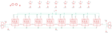

Contents
========

* [PRA1426 > Adafruit](#pra1426--adafruit)
	* [Schematic](#schematic)
	* [Interactive BOM](#interactive-bom)
	* [OOMP Parts](#oomp-parts)
	* [Images](#images)
	* [Tags](#tags)
  
![][im]
# PRA1426 > Adafruit

- ID: PROJ-ADAF-1426-STAN-01
- Hex ID: PRA1426
- Name: Adafruit
- Description: Adafruit
- Long Link: [http://oom.lt/PROJ-ADAF-1426-STAN-01](http://oom.lt/PROJ-ADAF-1426-STAN-01)
- Long Link: [http://oom.lt/PRA1426](http://oom.lt/PRA1426)

## Schematic
  
![][schem]
## Interactive BOM

- Interactive BOM page: [ibom.html](https://htmlpreview.github.io/?https://github.com/oomlout/oomlout_OOMP_projects/blob/main/PROJ-ADAF-1426-STAN-01/kicad/bom/ibom.html)

## OOMP Parts
  

|OOMP Parts|
| :---: |
|C1,UNMATCHED-UNMATCHED-UNMATCHED-UNMATCHED-UNMATCHED,C1,,C-USC0805K,C0805K,CAPACITOR, American symbol,,|
|C2,UNMATCHED-UNMATCHED-UNMATCHED-UNMATCHED-UNMATCHED,C2,,C-USC0805K,C0805K,CAPACITOR, American symbol,,|
|C3,UNMATCHED-UNMATCHED-UNMATCHED-UNMATCHED-UNMATCHED,C3,,C-USC0805K,C0805K,CAPACITOR, American symbol,,|
|C4,UNMATCHED-UNMATCHED-UNMATCHED-UNMATCHED-UNMATCHED,C4,,C-USC0805K,C0805K,CAPACITOR, American symbol,,|
|C5,UNMATCHED-UNMATCHED-UNMATCHED-UNMATCHED-UNMATCHED,C5,,C-USC0805K,C0805K,CAPACITOR, American symbol,,|
|C6,UNMATCHED-UNMATCHED-UNMATCHED-UNMATCHED-UNMATCHED,C6,,C-USC0805K,C0805K,CAPACITOR, American symbol,,|
|C7,UNMATCHED-UNMATCHED-UNMATCHED-UNMATCHED-UNMATCHED,C7,,C-USC0805K,C0805K,CAPACITOR, American symbol,,|
|C8,UNMATCHED-UNMATCHED-UNMATCHED-UNMATCHED-UNMATCHED,C8,,C-USC0805K,C0805K,CAPACITOR, American symbol,,|
|CN1,UNMATCHED-UNMATCHED-UNMATCHED-UNMATCHED-UNMATCHED,CN1,1X4SMT,1X4SMT,1X4-SMT,4-pin connector,,|
|CN2,UNMATCHED-UNMATCHED-UNMATCHED-UNMATCHED-UNMATCHED,CN2,1X4SMT,1X4SMT,1X4-SMT,4-pin connector,,|
|LED1,UNMATCHED-UNMATCHED-UNMATCHED-UNMATCHED-UNMATCHED,FID1,FIDUCIAL,FIDUCIAL,FIDUCIAL_1MM,Fiducial Alignment Points,EXCLUDE,|
|LED2,UNMATCHED-UNMATCHED-UNMATCHED-UNMATCHED-UNMATCHED,FID3,FIDUCIAL,FIDUCIAL,FIDUCIAL_1MM,Fiducial Alignment Points,EXCLUDE,|
|LED3,UNMATCHED-UNMATCHED-UNMATCHED-UNMATCHED-UNMATCHED,LED1,WS28115050,WS28115050,WS28115050,,,|
|LED4,UNMATCHED-UNMATCHED-UNMATCHED-UNMATCHED-UNMATCHED,LED2,WS28115050,WS28115050,WS28115050,,,|
|LED5,UNMATCHED-UNMATCHED-UNMATCHED-UNMATCHED-UNMATCHED,LED3,WS28115050,WS28115050,WS28115050,,,|
|LED6,UNMATCHED-UNMATCHED-UNMATCHED-UNMATCHED-UNMATCHED,LED4,WS28115050,WS28115050,WS28115050,,,|
|LED7,UNMATCHED-UNMATCHED-UNMATCHED-UNMATCHED-UNMATCHED,LED5,WS28115050,WS28115050,WS28115050,,,|
|LED8,UNMATCHED-UNMATCHED-UNMATCHED-UNMATCHED-UNMATCHED,LED6,WS28115050,WS28115050,WS28115050,,,|
|U$2,UNMATCHED-UNMATCHED-UNMATCHED-UNMATCHED-UNMATCHED,LED7,WS28115050,WS28115050,WS28115050,,,|
|U$3,UNMATCHED-UNMATCHED-UNMATCHED-UNMATCHED-UNMATCHED,LED8,WS28115050,WS28115050,WS28115050,,,|

## Images
  
  

|kicadPcb3d|kicadPcb3dFront|kicadPcb3dBack|eagleImage|eagleSchemImage|
| :---: | :---: | :---: | :---: | :---: |
||||||

## Tags

- hexID: PRA1426
- oompType: PROJ
- oompSize: ADAF
- oompColor: 1426
- oompDesc: STAN
- oompIndex: 01
- oompName: NeoPixel Sticks
- sources: All source files from https://github.com/adafruit/NeoPixel-Sticks (source licence details in srcLicense.md)
- linkBuyPage: http://www.adafruit.com/products/1426
- oompID: PROJ-ADAF-1426-STAN-01
- oompParts: C1,UNMATCHED-UNMATCHED-UNMATCHED-UNMATCHED-UNMATCHED
- oompParts: C2,UNMATCHED-UNMATCHED-UNMATCHED-UNMATCHED-UNMATCHED
- oompParts: C3,UNMATCHED-UNMATCHED-UNMATCHED-UNMATCHED-UNMATCHED
- oompParts: C4,UNMATCHED-UNMATCHED-UNMATCHED-UNMATCHED-UNMATCHED
- oompParts: C5,UNMATCHED-UNMATCHED-UNMATCHED-UNMATCHED-UNMATCHED
- oompParts: C6,UNMATCHED-UNMATCHED-UNMATCHED-UNMATCHED-UNMATCHED
- oompParts: C7,UNMATCHED-UNMATCHED-UNMATCHED-UNMATCHED-UNMATCHED
- oompParts: C8,UNMATCHED-UNMATCHED-UNMATCHED-UNMATCHED-UNMATCHED
- oompParts: CN1,UNMATCHED-UNMATCHED-UNMATCHED-UNMATCHED-UNMATCHED
- oompParts: CN2,UNMATCHED-UNMATCHED-UNMATCHED-UNMATCHED-UNMATCHED
- oompParts: LED1,UNMATCHED-UNMATCHED-UNMATCHED-UNMATCHED-UNMATCHED
- oompParts: LED2,UNMATCHED-UNMATCHED-UNMATCHED-UNMATCHED-UNMATCHED
- oompParts: LED3,UNMATCHED-UNMATCHED-UNMATCHED-UNMATCHED-UNMATCHED
- oompParts: LED4,UNMATCHED-UNMATCHED-UNMATCHED-UNMATCHED-UNMATCHED
- oompParts: LED5,UNMATCHED-UNMATCHED-UNMATCHED-UNMATCHED-UNMATCHED
- oompParts: LED6,UNMATCHED-UNMATCHED-UNMATCHED-UNMATCHED-UNMATCHED
- oompParts: LED7,UNMATCHED-UNMATCHED-UNMATCHED-UNMATCHED-UNMATCHED
- oompParts: LED8,UNMATCHED-UNMATCHED-UNMATCHED-UNMATCHED-UNMATCHED
- oompParts: U$2,UNMATCHED-UNMATCHED-UNMATCHED-UNMATCHED-UNMATCHED
- oompParts: U$3,UNMATCHED-UNMATCHED-UNMATCHED-UNMATCHED-UNMATCHED
- rawParts: C1,,C-USC0805K,C0805K,CAPACITOR, American symbol,,
- rawParts: C2,,C-USC0805K,C0805K,CAPACITOR, American symbol,,
- rawParts: C3,,C-USC0805K,C0805K,CAPACITOR, American symbol,,
- rawParts: C4,,C-USC0805K,C0805K,CAPACITOR, American symbol,,
- rawParts: C5,,C-USC0805K,C0805K,CAPACITOR, American symbol,,
- rawParts: C6,,C-USC0805K,C0805K,CAPACITOR, American symbol,,
- rawParts: C7,,C-USC0805K,C0805K,CAPACITOR, American symbol,,
- rawParts: C8,,C-USC0805K,C0805K,CAPACITOR, American symbol,,
- rawParts: CN1,1X4SMT,1X4SMT,1X4-SMT,4-pin connector,,
- rawParts: CN2,1X4SMT,1X4SMT,1X4-SMT,4-pin connector,,
- rawParts: FID1,FIDUCIAL,FIDUCIAL,FIDUCIAL_1MM,Fiducial Alignment Points,EXCLUDE,
- rawParts: FID3,FIDUCIAL,FIDUCIAL,FIDUCIAL_1MM,Fiducial Alignment Points,EXCLUDE,
- rawParts: LED1,WS28115050,WS28115050,WS28115050,,,
- rawParts: LED2,WS28115050,WS28115050,WS28115050,,,
- rawParts: LED3,WS28115050,WS28115050,WS28115050,,,
- rawParts: LED4,WS28115050,WS28115050,WS28115050,,,
- rawParts: LED5,WS28115050,WS28115050,WS28115050,,,
- rawParts: LED6,WS28115050,WS28115050,WS28115050,,,
- rawParts: LED7,WS28115050,WS28115050,WS28115050,,,
- rawParts: LED8,WS28115050,WS28115050,WS28115050,,,
- rawParts: U$2,MOUNTINGHOLE2.0,MOUNTINGHOLE2.0,MOUNTINGHOLE_2.0_PLATED,Mounting Hole,,
- rawParts: U$3,MOUNTINGHOLE2.0,MOUNTINGHOLE2.0,MOUNTINGHOLE_2.0_PLATED,Mounting Hole,,

[im]: kicadPcb3d_450.png
[schem]: eagleSchemImage.png
